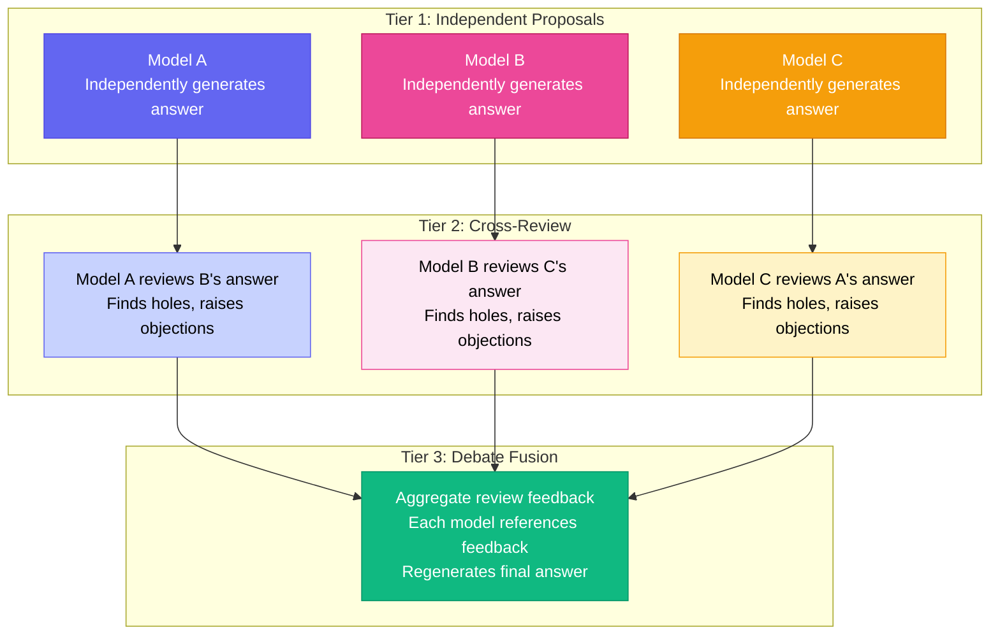
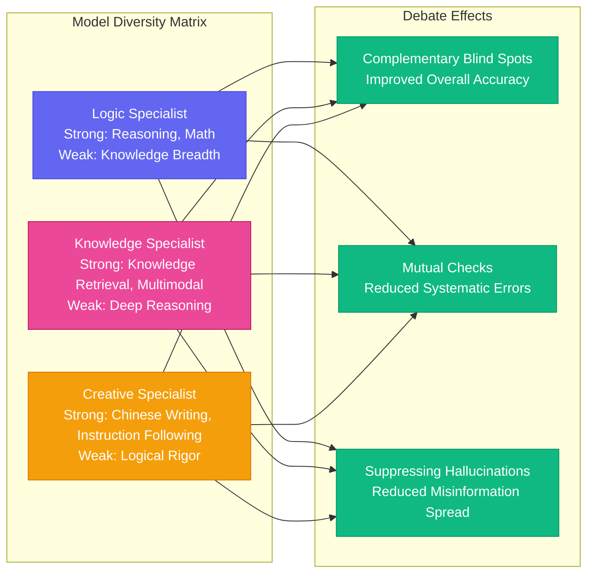
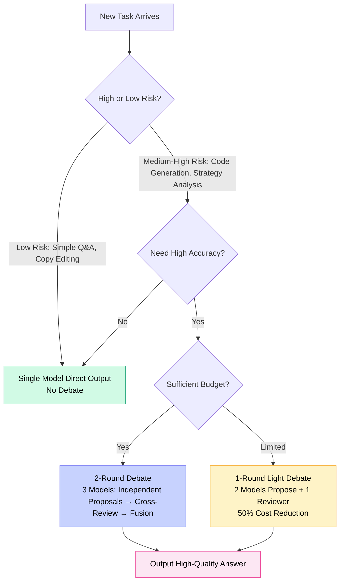

# Chapter 5: The Art of Debate — How Multi-Model Deliberation Makes AI Output More Reliable

[English](./ch05.md) | [简体中文](../zh/ch05.md)

> One model speaking might be wrong. Two models debating? The answer is usually more reliable. Yason's multi-model debate mechanism isn't simple "voting" — it's a structured intellectual showdown. It doesn't solve "which model is stronger" — it solves "how to make models less stupid."

## One Model Is Enough? Naive

In 2025, plenty of people are still arguing about "which model is the best." ChatGPT or Claude? DeepSeek or Gemini? The debate itself reveals the problem — **if one model crushed all others in every scenario, there'd be nothing to choose between.**

The reality: every model has its own blind spots.

Use GPT-4o to write code, and it might faceplant on a simple SQL query. Use Claude for logical reasoning, and it might make mistakes in math calculations. Switch to DeepSeek for Chinese content, and it might hallucinate where English knowledge is needed. It's like asking the best surgeon to fix an engine — no matter how brilliant they are, it won't work. Not because they're dumb, but because expertise has boundaries.

When Yason built his Roberts legion, he quickly discovered this harsh reality. He ran an experiment: the same technical question, the same prompt, answered by 5 different models. The results surprised him — out of 5 answers, 3 had correct core conclusions, but each model had different issues in the details. Some skipped a step in reasoning, some cited a non-existent paper, and others made a basic error on an obvious premise.

**Key insight**: These errors aren't randomly distributed — they're highly correlated with each model's training data and architecture. Different models tend to fail at different knowledge boundaries — which means if one model checks another's output, it's likely to catch the other's mistakes precisely because those are mistakes it wouldn't make itself.

Yason's conclusion was direct: **don't pick a model — make the models debate.** Not because any one model is better, but because a group of models from different backgrounds cross-checking each other can dramatically compress blind spots.

A deeper issue: a model's "confidence level" is almost untrustworthy. Research shows that when language models output wrong answers, their confidence expressions aren't significantly different from when they're correct. In other words, models themselves don't know when they're talking nonsense. This makes single-model output reliability a problem that can't be judged from the output alone — you need an external reference frame to verify it.

That external reference frame, Yason chose to be "other models."

## The Debate Mechanism: Not Voting, But Sparring

Many people think "multi-model" means asking the same question and taking the majority answer. That's voting, not debate. Voting only solves "which answer appears most often" — it can't solve "all models are wrong." For instance, on an outdated common-knowledge question, all models may have learned incorrect training data, and voting just makes the error more entrenched.

Yason's debate mechanism has a three-tier progressive structure:

**Tier 1: Independent Proposals**

Each model generates its answer in isolation. No cross-interference, no "reference bias." The key here: give each model the same original prompt, but don't tell it other models exist.

Why isolate? Yason stepped into a pitfall early on — he let models discuss in a shared context, and later models were clearly influenced by earlier ones. Weaker models would consciously or unconsciously defer to stronger ones, or follow the first answer down a wrong path. This is the "anchoring effect" manifesting between models. Isolated proposals avoid this problem entirely.

**Tier 2: Cross-Review**

Each model receives another model's answer and plays the role of a "picky reviewer." Note: this isn't simple scoring — it's **fault-finding**. Yason's prompt design is clever: instead of asking "is this answer correct?", he asks "under what circumstances would this answer be wrong?" This "assume error" thinking forces the model to actively search for logical holes.

An interesting discovery here: models are much stricter when finding faults in others' work than when checking their own answers. This mirrors human behavior closely — in code reviews, you can spot a pile of problems in someone else's code, but when writing your own, you think it's perfect. Models have a similar "self-blindness."

**Tier 3: Debate Fusion**

After seeing the review feedback, each model updates its answer. If there are two or more rounds, the review-update cycle repeats. The final output isn't a simple "majority opinion" — it's the **consensus zone** that emerges from the clash — the conclusions that survived multiple rounds of questioning without being overturned.

Yason said something I think hits the nail on the head:

> "A model that can't argue doesn't deserve to be called intelligent. Truly trustworthy output is forged through conflict."

## What Determines Debate Quality

You can't just throw a few random models together and call it a debate. After much trial and error, Yason identified several key parameters:

### 1. Model Diversity > Model Absolute Capability

Two models from the same lineage debating is far less effective than two models from different architectures. Why? Because same-source models share training data and reasoning paradigms — their blind spots **overlap**. It's like having two classmates from the same class check each other's homework — they learned the same wrong solution methods and can't catch each other's mistakes.

But have a math student and a physics student look at the same problem, and they'll spot issues from different angles. Yason calls this the **cognitive diversity premium** — the greater the difference in "thinking patterns" between models, the more valuable the debate.

### 2. More Debate Rounds ≠ Better Results

Intuitively, more rounds of debate should yield better results. But Yason found that marginal returns diminish extremely fast:

- **Round 1 Proposals** → **Round 2 Reviews**: Biggest improvement, about 30-45%. This is the qualitative leap from "no one questions" to "someone picks holes"
- **Round 2 Reviews** → **Round 3 Fusion**: About 15-20% improvement. Models see criticisms and revise their answers
- **Beyond Round 3**: Marginal returns plummet, and "overfitting" can even occur — models start agreeing with each other and lose their critical spirit

So Yason's standard configuration is **2 rounds of debate**, with a maximum of 3 for high-risk tasks. Anything beyond that wastes tokens and degrades quality.

### 3. Review-Stage Prompt Design Is the Core Secret Weapon

Yason uses two thinking frameworks during the review stage, borrowed from the "cognitive bias" literature:

**"Devil's Advocate" Framework**: Requires the model not just to find errors, but to argue for the "possibility of being wrong." The prompt roughly says:

> "Even if this answer appears correct, please identify situations at extreme edge cases where it could fail."

The effect of this framework is surprisingly good. Because it forces the model to switch perspectives — from "verifier" to "skeptic." Skepticism finds more holes than verification, which is also a repeatedly confirmed conclusion in human cognitive psychology.

**"Reverse Thinking" Framework**: Requires the model to work backwards from the conclusion to the premises, checking the consistency of the reasoning chain:

> "If this conclusion holds, what premises must be true? Are all these premises actually true?"

This framework's strength is catching "leapfrog reasoning" — models often skip a critical step in their reasoning process and jump directly to a seemingly reasonable conclusion. Reverse thinking forces that gap into the open.

These two frameworks aren't about being "more precise" — they're about **breaking the model's confirmation bias**. Models, like people, tend to believe their existing judgments and look for evidence to support them rather than questioning them.

## Practical Results: Which Scenarios Warrant Debate

Not all tasks are worth debating. Having two models spend 5,000 tokens discussing "what's the weather today" is pure waste. Yason drew an ROI curve for debate based on experience — debate has costs, and must be used where it counts:

Scenarios where Yason insists on debate:

- **Decision-making tasks**: Providing recommendations rather than just "output" (e.g., choosing a tech stack, evaluating strategies, judging direction)
- **High-risk code generation**: Code involving security, performance, or data consistency — one wrong line can bring down the whole system
- **Public-facing output**: Content going to public channels, social media, or in front of clients — mistakes are embarrassing
- **Rigorously logical reasoning**: Technical analysis, competitive comparisons, causal analysis — one wrong step cascades into everything being wrong

Scenarios that don't need debate:

- **Fact retrieval**: Questions with clear answers that can be verified via tools — calling an API to check is cheaper than debating
- **Simple polishing**: Adjusting tone, compressing word count — one model is enough
- **Repetitive tasks**: Pipeline work done daily — optimize the prompt and be done; no need to debate every time

## The Hidden Costs of Debate

Yason doesn't just hype the benefits of debate. He once said something brutally honest:

> "The best thing about debate is that it makes results more reliable. The worst thing about debate is that it triples the cost."

This "triple" isn't just token costs. There are three easily overlooked costs:

**Latency cost.** A single model responds in 3 seconds — users think it's fast. A 3-model, 2-round debate takes 18-30 seconds — users think "is it frozen?" Yason's solution is **asynchronous debate** — for tasks that don't need real-time responses, let the models argue in the background. The frontend shows users a "thinking deeply..." experience, while actually three models are duking it out. For scenarios requiring real-time response, he uses a dual-channel mode: "fast initial response + background deep verification."

**Context pollution cost.** After multiple debate rounds, the shared context fills up with records of mutual criticism. These records themselves can bias subsequent responses. Yason found that after each debate round, "context purification" is needed — stripping out irrelevant personal attacks and keeping only valuable correction suggestions.

**"Conformity effect" cost.** There's an even deeper issue: if a model is repeatedly corrected by other models, it may become "overly conservative" over time — correct judgments get shaken by other models' questioning. Yason's countermeasure is to periodically reset each model's conversation context and rotate their debate roles — this time you're the proposer, next time you're the reviewer — keeping the roles fresh and independent.

## Summary

Multi-model debate isn't a silver bullet, but it's one of the most effective methods currently available for combating model hallucinations. Yason summed it up in three sentences:

1. **Debate isn't about finding the right answer — it's about eliminating wrong answers** — This borrows from medical diagnostic thinking. Diagnosis doesn't directly tell you what disease you have — it first rules out what you can't have
2. **Model diversity matters more than model absolute capability** — Three average minds really can match a genius, provided they're "different types of average minds," not three identical copies
3. **Debate ROI depends on task risk assessment** — Not every problem deserves a court case, but life-or-death questions deserve a "trial of the century"

In practice, the debate mechanism improved Yason's team's output reliability on high-risk tasks by about 30-40%. The cost: 3x on those tasks — but since debate is only used on about 20% of high-risk tasks, the overall cost increase is only about 15%. That's a very worthwhile trade.

In the next chapter, we'll discuss Yason's other secret weapon: how he slashed his API bill to almost suspiciously low levels — the tightrope art of balancing cost and quality.

---

**💬 Have you tried multi-model debate? How did it work in your use case?**
