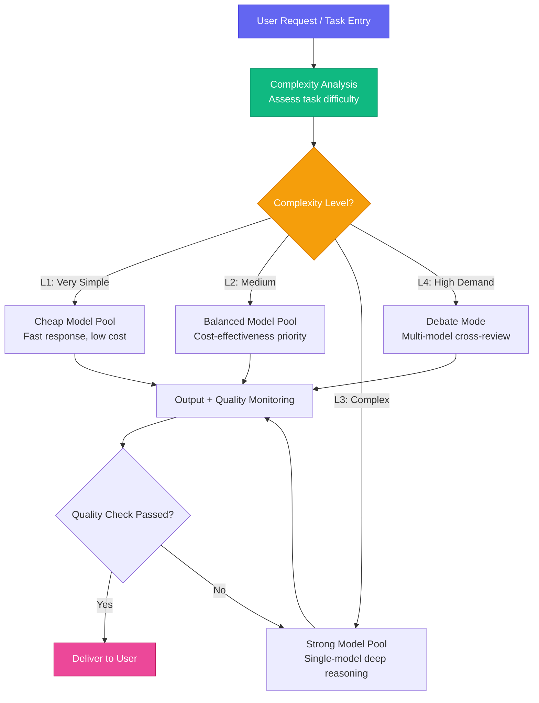
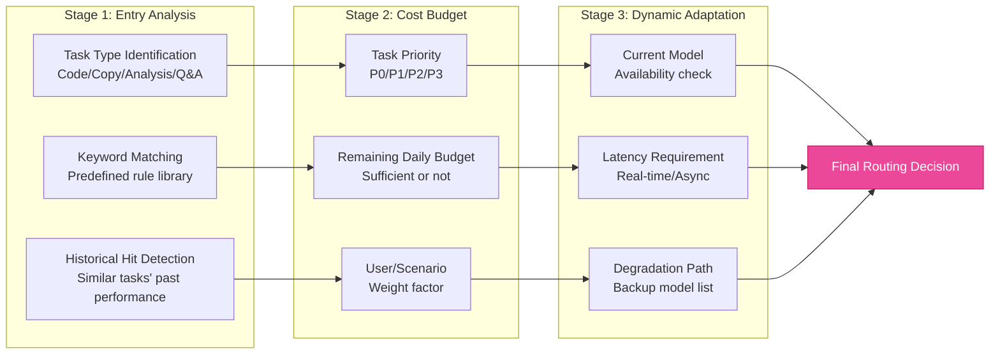
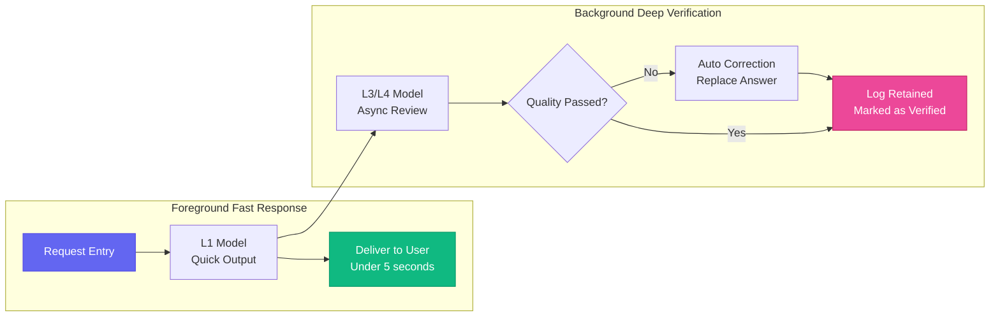
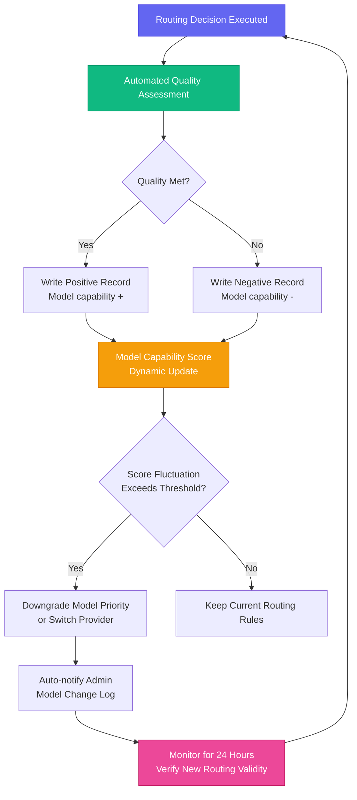

# Chapter 6: Walking the Cost-Quality Tightrope — Squeezing Every Penny with Routing Economics

[English](./ch06.md) | [简体中文](../zh/ch06.md)

> Many people assume "multi-model" means burning money. Yason's logic is the exact opposite: precisely because he uses multiple models, his bill gets slashed to levels that almost feel wrong. Not because the models are cheaper, but because — every model does what it's best at and cheapest at.

## The Biggest Waste Isn't Money — It's Using a Great Model for Crap Work

The pricing landscape of large model APIs is already highly stratified. The cheapest models cost just a few cents per million tokens. The most expensive flagship models can cost dozens or even hundreds of times more. Faced with this reality, most people pick the simplest strategy: either stubbornly stick with cheap models and make do, or just go straight to the most expensive one for peace of mind.

But Yason saw a different problem:

**The same requirement can be solved with 5 different models. The key is — can you pick the most appropriate tool based on the real demands of the task?**

Take writing a simple email reply: if you use a flagship model, it'll write it beautifully, but the cost is dozens of times higher than an entry-level model. The question is — can the recipient tell? No. For the vast majority of routine tasks, a cheap model's quality is already good enough.

On the flip side, consider a technical design review that requires deep reasoning: if you use the cheapest model, it might produce a proposal that looks polished on the surface but is riddled with logical holes — and if you execute on it, the cost of the bugs, rework, and fixes will be hundreds of times more than the API price difference.

Yason's core insight: **The biggest cost of wrong model selection isn't the API bill — it's the downstream "repair cost."** The rework, customer complaints, and data fixes caused by one wrong decision far exceed that little API price difference.

## The Routing Engine: Deciding "Who Should Do This Job"

Yason's Roberts legion has a core component — the routing engine. Its job is simple: **determine which model should handle a given request**.

But "simple" doesn't mean "easy." The routing engine needs to answer three questions:

1. **How powerful a model does this task need?** — Complexity assessment
2. **How much is this task worth spending?** — Budget matching
3. **What if the most suitable model is unavailable?** — Degradation strategy



This tiering wasn't something Yason pulled out of thin air. He spent two weeks doing a three-dimensional "model-cost-quality" analysis on thousands of historical tasks. The method was straightforward: use the "best model" answer for each task as the baseline, then have other models answer the same question and see how much the quality differed.

The results were fascinating:

- **About 45% of tasks** — the quality difference between the cheapest and most expensive models was < 5%. These tasks could absolutely go to cheap models.
- **About 30% of tasks** — cheap models had noticeable defects (15-25% quality gap), requiring mid-tier models.
- **About 20% of tasks** — only strong models could produce acceptable answers.
- **About 5% of tasks** — even a single strong model wasn't enough; debate mode was required.

These 5% debate-tier tasks, while small in number, accounted for about 45% of total API spending. Yason calls this "asymmetric cost distribution" — a minority of high-demand tasks consume the majority of the budget.

## The Core of Routing Strategy: The Three-Stage Funnel

Yason's routing isn't a simple one-shot decision. He designed a **three-stage funnel**, where each request goes through three rounds of judgment to progressively confirm the appropriate model tier:



**Stage 1: Entry Analysis** — This isn't simple keyword matching. Yason built a "task fingerprint" system: after each historical task is executed, it records the relationship between task characteristics (length, domain, instruction complexity) and the actual model level required. When a new task comes in, it first calculates its "fingerprint" and finds the most similar historical task.

**Stage 2: Cost Budget** — Each task carries a "priority" tag. P0 tasks (direct user requests, core product flows) have no budget limit and go straight to the highest tier. P1 tasks (important background analysis) have a reasonable budget. P2 tasks (routine maintenance, batch processing) are strictly throttled. P3 tasks (experimental, disposable) only use the cheapest resources.

**Stage 3: Dynamic Adaptation** — This is the most practical layer. Because API instability, model unavailability, and response timeouts are everyday occurrences. The dynamic adaptation layer maintains a "model health" table, recording each model's recent success rate and latency. If a model fails 3 times in a row, it automatically degrades to a backup.

## The Degradation Chain: Gracefully Saving Even More Money

One of Yason's proudest designs is the **degradation chain**. Every high-level task has a default degradation path that triggers automatically when budget is insufficient or a model is unavailable:

```plaintext
L4 (Debate) → L3 (Single strong model) → L2 (Balanced model) → L1 (Cheap model) → Failure alert
```

It looks like quality keeps getting worse, but Yason added a clever design: **notify downstream when degrading**.

When a task is degraded from L4 to L2 due to insufficient budget, the routing engine annotates the task context with "This task has been degraded; confidence is lower. Downstream, please use with caution." This way, the agent or person receiving the result knows: this answer might not be good enough and needs extra verification.

Yason has another trick up his sleeve: **degrade first, remediate later**. For non-real-time tasks, first use an L2 model to quickly produce an answer so the pipeline doesn't stall. Then in the background, use an L3 or even L4 model to review that answer — if major issues are found, automatically trigger a correction workflow.



## Budget Management: Making Costs Predictable

Every team has budget pressure. Yason's management group has a saying: **"Runaway AI costs are the #1 killer of AI adoption."** It's not that the models aren't strong enough — it's that the skyrocketing bills make the boss panic.

Yason's budget management system has three core mechanisms:

**Daily budget hard cap.** Every model, every agent, every day's API consumption has an upper limit. When the limit is reached, the routing engine automatically degrades all requests for that model to the next tier. This isn't a "suggestion" — it's a hard cutoff.

**Differentiated budgets by scenario.** External customer interactions get the highest budget, because customer experience directly impacts revenue. Internal tools come next. Experimental and exploratory tasks get the lowest budget.

**Elastic budget pool.** Unused daily budget from each model flows into a shared pool. If a high-priority task runs short on budget today, it can borrow from the pool. But the pool resets at month-end — "unspent budget isn't money saved, it's money wasted."

## A Real Cost Case Study

Before introducing the routing engine and debate mechanism, Yason's Roberts legion consumed about 100 "cost base units" per day. After implementing tiered routing, that number dropped to about 40 units.

Breakdown of the reduction:

| Optimization Method | Cost Reduction |
|-|-|
| Routing complex tasks to appropriate models (no more "using a sledgehammer to crack a nut") | -25% |
| Routing all simple tasks to cheap models | -30% |
| Precise use of debate mode (only for ~5% high-demand tasks) | -5% |
| Degradation chain and "degrade first, remediate later" mechanism | -10% |
| **Total** | **Approximately -60%** |

More importantly, quality didn't noticeably decline. Yason uses an automated evaluation system to continuously monitor output quality, and key metrics fluctuate within ±5%, which is perfectly acceptable.

Yason's distilled wisdom in one sentence: **"Saving money isn't about using less — it's about using it smart."**

## The Routing Engine's Evolution

The routing engine isn't Yason's final form. He's upgrading to the second generation — **adaptive routing**. The core change is adding a feedback loop:



The first-generation routing was "static rules + historical fingerprints." The advantage was stability; the disadvantage was potential misjudgment on novel tasks.

The second-generation routing adds two new mechanisms:

**Real-time quality feedback**: Every task's output quality is automatically assessed. If a model's recent output quality declines, the routing engine automatically lowers its priority.

**Dynamic routing experiments**: For uncertain tasks, the routing engine runs A/B tests — sending the task to two models at different tiers simultaneously and comparing output quality. If it discovers that a cheaper model can achieve the same quality, it writes the "new fingerprint" into the routing rule library.

## Summary: Economic Thinking Is the Ultimate Weapon

Yason's routing economics is fundamentally not a technical problem — it's an **economics problem**. Its core is two principles:

1. **Diminishing marginal utility**: The same money spent on different tasks produces different quality improvements. The routing engine's job is to spend money where the "marginal utility is highest."
2. **Opportunity cost thinking**: The opportunity cost of a premium model handling a simple task equals the quality loss of the complex task it couldn't handle as a result.

**In the Roberts legion, the smartest one isn't the most expensive model — it's the router that knows "when to call whom."**

Next chapter preview: Yason discovers his Roberts have started writing prompts for each other — which raises a more interesting question: should collaboration between AI agents be "each to their own" or "mutually reshaping"?

---

**💬 Have you ever calculated how much of your API bill is "sledgehammer-to-crack-a-nut" waste?**
