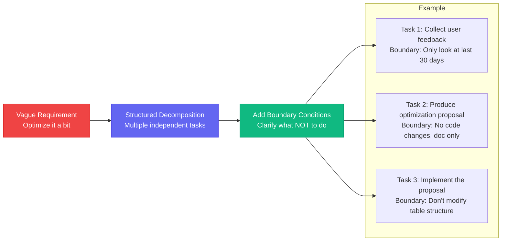

# Chapter 7: Assigning Work to the Roberts — Task Decomposition & Tracking

[English](./ch07.md) | [简体中文](../zh/ch07.md)

> **Core insight: Throwing a vague requirement at an AI Agent is like telling a brilliant employee to just "figure it out" with no clear instructions — the result usually isn't that they're too dumb, but that they're too smart. So smart that they interpret your "just tweak it a bit" as "refactor the entire system."**

## Yason's Hard-Learned Lesson

Yason once made a classic mistake.

It was a Tuesday afternoon. He'd received a customer email saying a product feature "didn't feel quite right to use." Yason casually @'d Kai in the group chat: "Kai, optimize that XX feature the user reported."

Half an hour later, he received Kai's reply — a completely refactored new version.

The interface had changed, the interaction logic was rewritten, even the underlying data structures were swapped out. Yason stared at the brand-new interface for ten seconds in silence, then slowly typed:

"I just wanted you to change a button color."

Anyone who's ever collaborated with an AI Agent will smile at this scene. AI doesn't ask "do you really want me to change it this much?" — it does one thing: **execute the instruction**. And a vague instruction like "optimize it a bit" translates to "unleash your imagination" in AI's eyes.

## The Real Problem: AI Has No Sense of Boundaries

Human employees have a natural advantage — **contextual understanding**. When you tell a colleague "help me optimize that feature," they automatically assess:

1. How much "optimization" is appropriate (change the color? change the logic? or refactor?)
2. What known constraints exist (customer budget? timeline? technical debt?)
3. What's off-limits (core architecture? database table structure?)

AI Agents don't have this ability. They're like a precision machine that lacks common sense — hand it the steering wheel, and it really will drive the car anywhere it can reach.

This was the first major pitfall Yason stumbled into: **task decomposition isn't the AI's job — it's the human's job.**

## Stage 1: From "One Sentence" to "Three Steps"

Yason later developed a "three-step decomposition method":

**Step 1: The raw requirement in plain language (human language)**

> "Help me optimize that feature the user reported"

**Step 2: Break it into multiple independent tasks (structured description)**

**Step 3: Add boundary conditions to each task (constraint description)**

> Task 2: Don't touch code until the proposal is approved — only output a design doc
> Task 3: Do not modify the user table structure; do not modify core API routes
> Task 4: Regression test coverage must reach 85% or above

The core logic of this method: **You don't need to tell the AI how to do something — but you must tell it what NOT to do.**



## Stage 2: The Checkpoint Mechanism — Keeping the Process Under Control

Decomposing tasks is only the first step. Yason found that even with finely decomposed tasks, AI would still "drift" during execution. The reason is simple: **AI's "attention window" is limited** — it remembers "don't touch the database" from five minutes ago, but gets so absorbed in writing code that it forgets.

The solution is the **Checkpoint mechanism**.

Yason inserted Checkpoint nodes into each task — these aren't for the AI, they're for the human (Yason himself). Each Checkpoint requires the AI to output its current progress and wait for Yason's confirmation before continuing.

Take the "produce optimization proposal" task for example:

```plaintext
Checkpoint 1: Collected 30 days of feedback, here's the user pain point summary → Wait for confirmation
Checkpoint 2: Produced 2 optimization proposals, with pros and cons → Wait for confirmation
Checkpoint 3: Selected Proposal A, starting implementation → Wait for confirmation
```

This mechanism transformed Yason from "discovering problems after the fact" to "steering the direction during the process." AI won't slack off, but it will drift. Checkpoints are like chasing after the AI saying "hey, take a look — is this right?"

## Stage 3: Tracking Progress — Not Tracking Means Letting Your Reports Slack Off

Yason has another habit that makes his reports "suffer": **tracking progress**.

But not the meaningless nagging of "Is it done yet?" "Not yet" "Hurry up." Yason's progress tracking follows a fixed rhythm:

1. **Set the cadence when assigning work**: "Give me a progress update in 3 hours"
2. **Proactively check in when due**: "How's it going? Where are you stuck?"
3. **Provide solutions when blocked**: Not nagging — helping

The logic behind this rhythm: **AI Agents have no "sense of time."** They don't feel like they're "running late," because they're always processing the task — they might just be spending two hours on an irrelevant detail. Someone needs to give them the signal that "it's time to deliver."

Yason established an iron rule in the Roberts legion: **Proactively check progress every 3-4 hours until the task is complete.**

It sounds like "managing" the AI, but it's really managing yourself — **AI doesn't need managing, but asynchronous collaboration does.** When your teammate doesn't sit next to you and you don't know what it's doing, only proactive follow-up can ensure tasks don't fall through the cracks.

## Practice Case: A Complete Task Decomposition

Once, Yason needed Kai to research a technical solution. He used the full three-step method:

**Original requirement:**

> "Help me research which LLM we should use for knowledge base retrieval"

**After decomposition:**

```plaintext
Task 1: List the current mainstream knowledge base retrieval solutions (limit to 5 or fewer)
  → Checkpoint: Wait for confirmation on the solution list before continuing

Task 2: Compare each solution's cost, performance, and maintenance difficulty
  → Checkpoint: Produce comparison table, wait for confirmation before going deeper

Task 3: Based on our use case, recommend the optimal solution
  → Boundary: No closed-source models; prioritize domestic models
```

The result? Kai finished the proposal in two hours. No drifting, no over-engineering — stopped at every Checkpoint and waited for Yason's confirmation. The whole process was as smooth as an assembly line.

## Closing Thoughts

A very counterintuitive truth: **The stronger the AI, the more important task decomposition becomes.**

With weak AI, you don't dare let it do too much — instructions must be extremely detailed, like teaching a child step by step. But strong AI is different — it has strong comprehension, strong execution, and strong creativity. This means if you give it a vague requirement, it can really go very far in the wrong direction.

The stronger the tool, the clearer the boundaries need to be.

This is also the core philosophy of Yason's management: **It's not that the AI doesn't listen — it's that you didn't make yourself clear.**

---

**💬 Do you know what else AI Agents can't manage? Share your "disaster stories" of collaborating with AI in the comments.**
