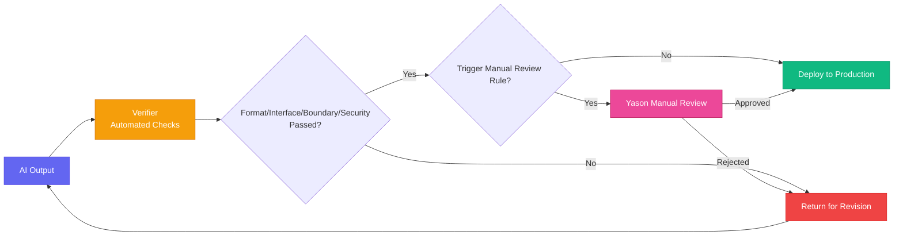

# Chapter 8: Who Audits the Roberts? — Quality Review & Acceptance Mechanisms

[English](./ch08.md) | [简体中文](../zh/ch08.md)

> **Core insight: An AI Agent's output isn't a binary of "usable" vs. "unusable" — it's a gradual spectrum. A good review mechanism takes you from "sweating every single output" to "confidently trusting the results with your eyes closed."**

## Yason's Hard-Learned Lesson

One day, Yason asked Kai to write a user registration API endpoint.

Kai finished it in an hour, and it ran without issues. Yason looked at the code structure — clean, well-organized, comments clearer than anything he'd write himself. He was satisfied and deployed it straight to production.

The next day, user feedback rolled in: registration succeeded but login failed; login succeeded but data disappeared; data didn't disappear but email notifications fired twice.

Yason spent the entire day investigating, and finally found the problem in Kai's code: data consistency wasn't the issue, but the endpoint's behavior was exactly misaligned with what the frontend expected — the frontend sent `email`, Kai received `user_email`; the frontend expected a 200, Kai returned a 201.

Each issue was trivial on its own, but together they were a disaster.

Yason later distilled a painful lesson: **AI-written code looks right but breaks in practice.** It's like a new hire who aces every exam but has never worked a day in their life — plenty of knowledge, zero practical alignment.

## The Problem: AI's "Hallucinations" Go Beyond Content

When people talk about AI, they often mention "hallucinations" — the model fabricating nonexistent knowledge. But after working with AI Agents for a while, Yason realized that AI's "hallucinations" extend beyond content into engineering and logic:

- **Interface hallucinations**: The code runs, but the field names, response codes, and error formats in the interface contract are all mismatched
- **Boundary hallucinations**: The happy path works, but edge cases (timeouts, null values, concurrency) are completely unhandled
- **Context hallucinations**: It thinks it remembers you saying "use PostgreSQL" five minutes ago, but writes MySQL syntax

These aren't signs that AI isn't smart enough — they're signs that AI lacks **"project-level consistency."** It can see your current task, but it can't see the entire project's "unwritten rules."

Yason's conclusion: **AI output must have a review mechanism. This has nothing to do with whether you trust AI — it's engineering discipline.**

## The Verifier Mechanism: Let Machines Audit Machines

Yason built a component in the Roberts legion called the **Verifier**. Its job is simple: after an AI produces something, it doesn't go straight to Yason — it goes through the Verifier first.

The Verifier checks:

1. **Format check**: Code style, naming conventions, comment formatting
2. **Interface consistency check**: Field names, response codes, request methods — do they match the contract?
3. **Boundary coverage check**: Null values, exceptions, concurrency scenarios — are they handled?
4. **Security scan**: Hardcoded secrets, SQL injection risks, permission exposure

Many of these checks are automated rules that don't need AI involvement. But some require "human" judgment:

**Semantic consistency check**: For instance, does "user info" on the frontend mean the same thing as "user info" on the backend?

For these, Yason's approach is: **have another model do the review.**

He'll assign two different AIs to the same task — one to do the work, one to review. Kai writes code, Rex reviews the code; one designs an architecture proposal, the other picks apart the proposal's flaws.

This isn't "distrust" — it's engineering **redundancy**. Just like aircraft flight control systems have triple redundancy — not to prevent crashes, but to prevent the unthinkable.



## Manual Review Nodes: When Humans Need to Step In

Automated review can solve 80% of problems, but the remaining 20% requires Yason's personal attention.

Yason defined a "manual review trigger rule":

**Scenarios that MUST have manual review:**

- Changes involving payment/money logic
- Designs affecting customer data security
- Outbound marketing content
- Architecture-level major changes

**Scenarios that CAN be auto-reviewed:**

- Routine code commits
- API documentation updates
- Test case additions
- Logging and monitoring configuration

"I don't slack off on what I need to review, and I don't waste time on what I don't." Yason's principle is simple: **Let AI do what AI can do, but ceiling-level decisions must be made by humans.**

## The Harness System: Quality Assurance in a Sandbox

Besides the Verifier, Yason also built a **Harness system** — a sandbox environment specifically for testing the Roberts' output.

The Harness system's logic:

1. After a Robert completes a task, the output doesn't go to production
2. Run automated tests in the Harness sandbox
3. Tests pass → push to staging environment
4. Staging verification passes → go through manual review node (if triggered by rules)
5. Everything passes → deploy to production

This process looks cumbersome, but Yason found that after implementing it, production incidents dropped by about 90%.

The reason is simple: **AI Agents don't get tired, but they also don't learn their lesson.** They won't remember "I made this mistake last time, so I shouldn't do it again" — unless you encode the review mechanism into rules. You're not teaching it "don't make mistakes" — you're making it so that "mistakes get caught."

## Practice: A Complete Review Workflow

Once, Yason had Kai write a data export feature. The normal flow went like this:

```plaintext
Kai finishes code → Verifier auto-check passes →
Harness sandbox runs tests, passes →
Triggers "involves user data" manual review rule →
Yason manual review →
Confirmed no issues → Deploy to production
```

Throughout this entire process, Yason only intervened at one point — the final manual review. Every step before that was automated, taking less than 10 minutes total. Without this mechanism, Yason might have spent an entire day troubleshooting after something broke in production.

## Closing Thoughts

An interesting phenomenon: **The more mature the AI team, the stricter their review mechanisms.** Not because they don't trust AI, but because they know AI too well.

Beginners think "AI can write code, that's enough." Veterans ask "who reviews the AI's code?"

Yason says: "Trust is good, but trust with verification is better."

---

**💬 How does your team handle quality review of AI output? Fully automated, fully manual, or a hybrid approach?**
