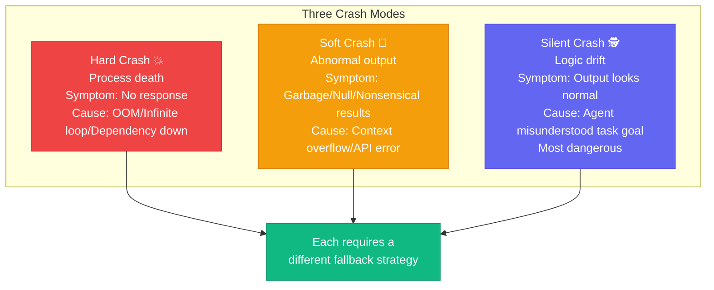

# Chapter 10: What Happens When the Roberts Crash — Fault Recovery & Fallback

[English](./ch10.md) | [简体中文](../zh/ch10.md)

> **Core insight: AI Agents don't get "tired," but they do "crash." They won't complain, won't call in sick, but they will suddenly deliver a "silent gut punch" when you least expect it — the process dies, the output is empty, or worse: the output looks correct but is actually complete nonsense.**

## Yason's Hard-Learned Lesson

It was 3 AM on a Saturday.

Yason was jolted awake by his phone vibrating — not an alarm, but a monitoring alert. He groggily opened his phone and saw a message that instantly woke him up:

"Trace Collector has stopped responding. No span data received for 4 hours."

The Trace Collector was the distributed tracing system Yason had built to collect all the Roberts' work logs. It being down meant that for the past 4 hours, all work records from every Robert were lost.

Yason immediately logged into the server to investigate. The process was indeed dead — not killed externally, but crashed on its own. The last entry in the logs was an out-of-memory error.

"4 hours. What were my Roberts doing? No idea. What did they do? No idea either."

He spent two hours restoring the service, then another hour reviewing logs, trying to piece together what had happened during those 4 hours. He finally discovered: Kai had executed a large task that consumed massive memory and blew up the Collector.

"My Roberts team had industrial-grade output, but not industrial-grade fault tolerance. Like a steam engine without a safety valve — it can work, but it could blow up at any moment."

## The Problem: AI Systems' "Silent Crashes"

When a human team has a problem, someone shouts "something's wrong!" When an AI Agent has a problem, it says nothing — it just quietly stops, or worse: quietly does the wrong thing.

Yason categorized three ways AI Agents "crash":



**1. Process Death (Hard Crash)**

- Symptom: Process is dead, no response
- Cause: Out of memory, infinite loop, dependency service down
- Consequence: Task interrupted, requires manual restart

**2. Abnormal Output (Soft Crash)**

- Symptom: Process is still running, but outputting garbage, null values, or absurd results
- Cause: Context overflow, model output anomaly, API returning wrong format
- Consequence: More dangerous — looks normal but is actually wrong

**3. Logic Drift (Silent Crash)**

- Symptom: Output looks fine, but the direction is completely wrong
- Cause: The Agent "misunderstood" the task objective
- Consequence: Most dangerous — might not be discovered until downstream catches the problem

Each crash type requires a different fallback strategy.

## Fallback Strategy 1: The Fallback Chain

Yason designed a **Fallback Chain** for the Roberts legion — not simply "if A doesn't work, use B," but a prioritized degradation path:

```plaintext
First choice: Coordinator
  ↓ Unavailable
Second choice: Code Agent
  ↓ Unavailable
Third choice: General Agent
  ↓ Unavailable
Fourth choice: Notify Yason for manual intervention
```

The logic of this chain: **the higher up, the smarter but more fragile; the lower down, the more stable but less suited for complex tasks.**

Yason doesn't run the entire chain for every task — that would be too slow. He only rapidly degrades when the first choice fails, keeping the degradation process under 3 seconds.

## Fallback Strategy 2: Circuit Breaker

The Fallback Chain solves the problem of Agents being down, but it can't solve the problem of "the Agent is up but keeps doing the wrong thing" — that is, soft crashes and silent crashes.

For these, Yason designed **circuit breakers**:

- **Time circuit breaker**: A task takes N times longer than expected without completing → auto-interrupt, report to Yason
- **Quality circuit breaker**: Verifier fails 3 consecutive checks → auto-interrupt; not retry, but stop and analyze the cause
- **Cost circuit breaker**: Single task exceeds budget → auto-interrupt, wait for Yason's confirmation

Circuit breaking isn't "failure" — it's a "safe landing." Just like when an aircraft engine catches fire, you don't keep flying — you find the nearest place to make an emergency landing.

Yason says: "Telling a Robert 'don't stop until you're done' is wrong. You should tell it 'if you hit a problem you can't solve, stop, and tell me why you stopped.'"

## Fallback Strategy 3: State Recovery

After an Agent crashes, the hardest part isn't restarting — it's **recovering state**.

Say Kai is executing a multi-step task: download data → clean data → analyze data → generate report. It crashes at the "clean data" step. After restarting, should it:

- (A) Start from the beginning
- (B) Start from the "clean data" step
- (C) First check the data state, then decide which step to resume from

Yason chose (C).

His approach: **before each task execution, record a state snapshot (State Snapshot), marking "which steps are completed, which are still pending."** After an Agent restarts, it first reads the Checkpoint, assesses the current state, and picks up where it left off.

Checkpoint files are tiny — just a few dozen bytes — but their impact is enormous. Without them, an Agent crash is a disaster. With them, an Agent crash is just a "hiccup."

```yaml
task: data-pipeline-2026-05-21
status: in_progress
completed_steps:
  - download_data (OK, output: /tmp/raw/2026-05-21.csv)
  - clean_data (OK, output: /tmp/cleaned/2026-05-21.csv)
current_step: analyze_data (in_progress, started_at: 14:32:15)
```

## Auto-Recovery vs. Manual Intervention

Yason set different recovery strategies for different types of failures:

**Auto-recovery (no human intervention needed):**

- Process crashed → auto-restart, read Checkpoint and continue
- API timeout → auto-retry (max 3 times)
- Transient error → wait 30 seconds then retry

**Requires human notification:**

- 3 consecutive auto-recovery failures
- Cost circuit breaker triggered
- Failure involving security issues
- No progress update for over 30 minutes

Yason's philosophy: **Auto-recover what can be auto-recovered; call for humans when it can't.** Machines handle common problems; humans handle exceptional cases.

## Closing Thoughts

Yason was once chatting with a friend about AI Agent reliability, and he said something particularly sharp:

**"When a human team has a bug, someone will proactively say 'I messed up.' AI won't — it'll just quietly mess up the next command too."**

So fault recovery isn't an add-on feature for AI Agents — it's standard equipment. You don't need a system that never fails. You need a system that can recover quickly when it does fail.

---

**💬 What's the most unexpected "crash" your AI Agent has pulled on you? How did you handle the fallback?**
