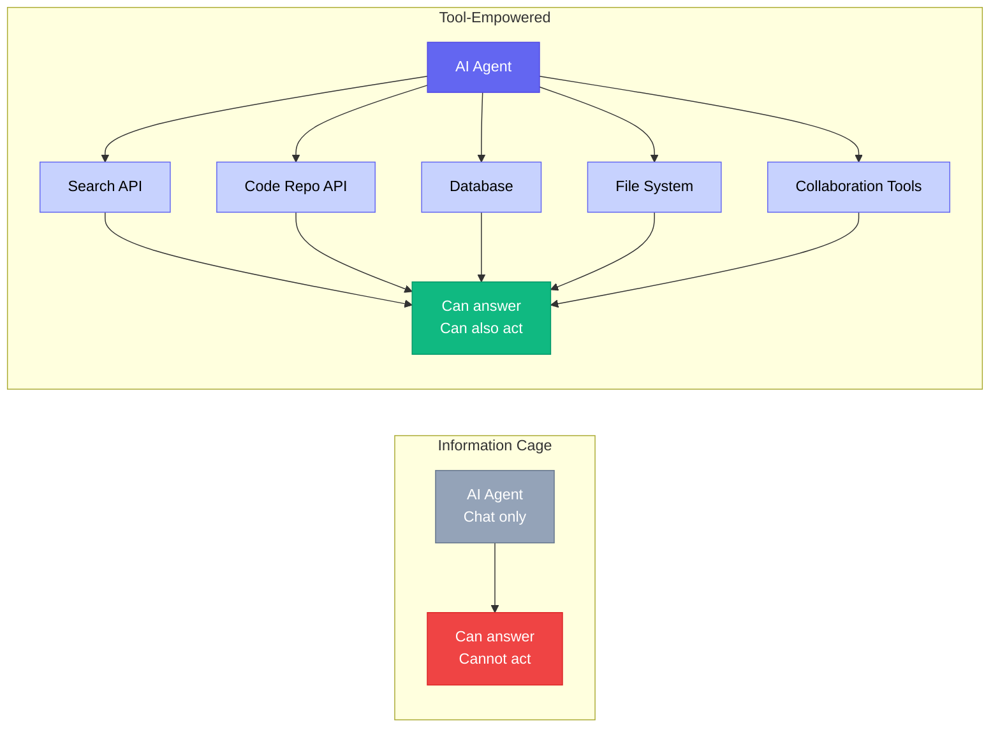
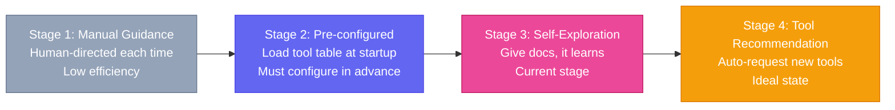

# Chapter 11: Good Tools — Ecosystem & API Integration

[English](./ch11.md) | [简体中文](../zh/ch11.md)

> **Core insight: An AI Agent that can only chat is like a gun without bullets — it looks impressive, but when you actually need to use it, you'll find it can't do anything. The real value of Roberts isn't how smart they are, but how many tools they can call.**

## Yason's Hard-Learned Lesson

Early on, when Yason was collaborating with his Roberts, he ran into an embarrassing problem.

He asked Kai to "check how many unresolved bugs are in the code repo." Kai said, "Sure, I'm checking." Then after 30 seconds, Kai said, "I've checked, but I can only tell you — please open your browser and look yourself."

Yason was stunned.

He realized something: **Kai was just a talking brain with no hands or feet.** It could reason, analyze, and give advice, but it couldn't perform any actual operations — it couldn't send HTTP requests, read or write files, or execute shell commands. It was trapped inside the chat box.

Like a top-tier programmer locked in a room with no computer — ask them any technical question and they'll answer flawlessly, but tell them to "fix this bug" and all they can do is shrug.

Yason later joked: "I hired an 'armchair strategist' Robert — it knows everything, but can't do anything."

## The Problem: AI's "Information Cage"

Most AI Agents share one trait: **they live in the era of their training data and don't know what's happening in the real world right now.** Ask them "what's the weather today" and they can only tell you the last time they saw the word "weather" in their training data.

This isn't because they're dumb — it's their **information boundary**. Without external input, they can only "guess" based on their training data.

There's only one way to break out of this cage: **connect the Agent to external tools.**

- Connect a search API → it knows the latest news
- Connect a code repo API → it can operate on code
- Connect a database → it can query business data
- Connect a file system → it can read and write files
- Connect team collaboration tools → it can send messages

Each "wire" expands the Robert's capability boundary.



## Tool Registry: Giving Roberts a "Map"

Yason's early approach was to manually tell Kai in every task, "You can use these tools." Later he realized this was silly — repeating it every time, and potentially missing things.

He built something called a **Tool Registry**. It's essentially a configuration file listing all the tools a Robert can use:

```yaml
tools:
  - name: code_repo_api
    description: "Access code repo Issues, PRs, and code"
    endpoint: "https://api.example.com"
    auth: "token"
    methods: ["GET", "POST"]
    rate_limit: 5000/hour

  - name: file_manager
    description: "Read, write, and manage local files"
    scope: "/home/kai/workspace"
    operations: ["read", "write", "list", "delete"]
    max_size: "100MB"

  - name: shell_exec
    description: "Execute Linux commands"
    allowlist: ["python3", "node", "git", "ls", "cat", "grep"]
    timeout: 30s

  - name: team_messaging
    description: "Send team messages"
    scope: "channels: #general, #dev-team"
    methods: ["send_message", "read_thread"]
```

This registry is the Robert's "tool map." They no longer need to be told "what you can use" in every task — instead, it's loaded automatically at startup, and they choose the right tools based on task requirements.

## API Integration: Teaching Roberts to "Make Phone Calls"

The tool registry is just a directory. The real power comes from **API integration**.

Yason discovered that the Robert's most powerful capability isn't reasoning — it's **orchestration**. Like a symphony conductor, it can chain multiple API calls together to complete a composite task.

A typical multi-step task:

```plaintext
→ Call code repo API to get the issue list
→ Call database API to look up the customers associated with each issue
→ Call team collaboration API to send notifications to customers
→ Call messaging API to update progress in the team channel
```

For the Robert, the whole process is simply: call a few APIs in sequence, using the output of one as the input for the next. No single step requires "brilliance," but combined, they produce real productivity.

Yason said: "A Robert's value isn't in how hard a question it can answer, but in the fact that it can do the work of three people by itself — and it doesn't need meetings."

## The Evolution of Tool Learning

The way Yason's Roberts use tools evolved through four stages:



**Stage 1: Manual Guidance (Level Zero)** — "Kai, use the API to check issues, use this token, request this URL..." → Low efficiency, requires human guidance every time

**Stage 2: Pre-configured Tools (Beginner)** — Kai loads the tool registry at startup and knows which tools it can use → No human guidance needed, but must be configured in advance

**Stage 3: Self-Exploration (Intermediate)** — Roberts can discover and understand new tools during task execution → Give it an API doc link and it can learn to call it on its own

**Stage 4: Tool Recommendation (Advanced)** — Roberts automatically recommend tools they need based on task context → The ideal state, but requires robust safety policies as a backstop

Yason is currently stuck at Stage 3 — Roberts can learn new tools, but they won't proactively tell Yason "I need a new tool." This isn't a technical problem; it's a design problem: **AI won't ask for things. You need to proactively give them.**

## In Practice: A Complete Tool Chain Call

Once, Yason asked Kai to "compile today's new user registration info and post it to the team channel."

Kai's execution process:

```plaintext
1. Call database API → Query today's registration records (returned 47 entries)
2. Call data processing script → Calculate: new user count, source channel distribution, registration completion rate
3. Call team collaboration API → Post the compiled report to the ops channel
4. Call messaging API → Post an English version to the overseas team channel too
```

The whole process took less than 5 minutes. All operations were automated — Kai just called 4 APIs in sequence. No step required "thinking," but it completed work that would take a person half a day.

This is the power tools give Roberts: **not relying on smarts, but on ecosystem.**

## Closing

Yason once said something during a retrospective that really stuck with me:

**"Don't ask what AI can do — ask what tools you can give it. One AI + one tool = one employee. One AI + ten tools = a whole team."**

Is your Robert lazy, dumb, or inefficient? Chances are it's not the Robert's problem — you just haven't given it enough tools.

---

**💬 What tools has your AI Agent been connected to? What's your most-used toolbox?**
