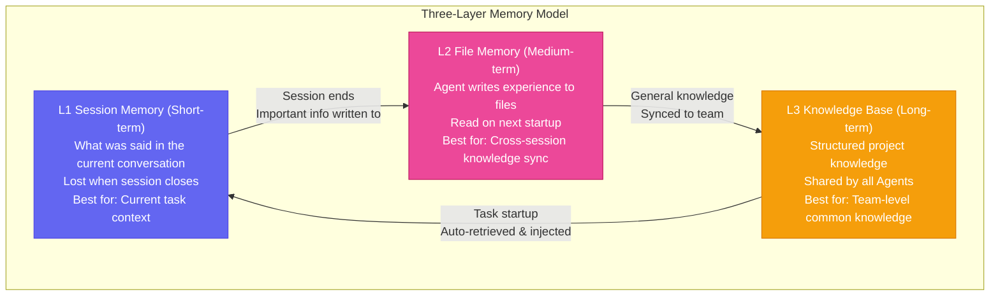

# Chapter 12: The Brain — Knowledge Base & Memory Upgrade

[English](./ch12.md) | [简体中文](../zh/ch12.md)

> **Core insight: A Robert's capability ceiling isn't determined by what model it uses, but by how strong its memory system is. An AI Agent without a knowledge base is like someone who's read ten thousand books but lost their memory — they've learned everything, but remember nothing.**

## Yason's Hard-Learned Lesson

Yason used to teach Kai the same thing over and over.

The first time, he told Kai: "Our project's API style is RESTful, URL paths use kebab-case, and the response format is always `{code, data, message}`."

Kai said, "Got it." Then it wrote code conforming to the spec for a whole week.

The second week, Yason asked Kai to write a new endpoint. The code Kai produced had a completely different style — camelCase URLs, `{success, result}` response format. Yason asked, "Did you forget the spec I told you about last week?"

Kai said, "I didn't forget, but this task's description didn't mention the spec, so I used the default style."

Yason lost it.

What Yason told Kai was "you know this," but what Kai understood was "you know this for this task" — cross-task knowledge transfer doesn't happen by default for AI. Every task is a new world; it doesn't automatically carry over the "common knowledge" it learned in the last one.

This is the **memory gap problem** Yason encountered: AI Agents perform perfectly within a single session, but across sessions, it's like meeting for the first time.

## The Problem: AI's Memory Layers

Yason later drew a diagram, dividing Robert memory into three layers:



Early on, Yason only had L1 — which is why Kai "lost his memory every week." Later he added L2 — file memory — and Kai could finally remember last week's API spec. But it still wasn't enough, because each Agent only remembered its own files. What Kai remembered, Rex didn't know. What Rex remembered, Kai didn't know.

It was only when he finally built the L3 knowledge base that the problem was truly solved.

## File Memory: Letting Roberts "Take Notes"

Yason gave each Robert a "diary" — a structured memory file stored in the Robert's workspace.

The memory file's contents:

```yaml
# Kai's memory file
last_session: 2026-05-21
projects:
  - name: user-api
    status: active
    api_style: RESTful, kebab-case, {code, data, message}
    current_tasks: []
  - name: data-pipeline
    status: done
    output: /data/processed/2026-05-21.csv
learnings:
  - "Don't use camelCase for the email field in user registration flow"
  - "Database connection pool default of 10 isn't enough, set it to 20"
```

At the start of every session, the Robert reads this file. At the end of every session, the Robert updates it.

This mechanism transformed Kai from a "weekly amnesiac" into an "engineer with work notes." It doesn't need to relearn the project context, because it's already "noted it down."

## Knowledge Base: Letting the Whole Team Share Memory

File memory solved "single Agent cross-session amnesia," but it didn't solve "knowledge silos between multiple Agents."

Kai discovered a great model tuning technique and wrote it in his own memory file. Rex didn't know about it and stepped into the same trap the next month.

Yason's solution was a **team knowledge base** — a shared storage space independent of any Agent, readable and writable by all Roberts.

The knowledge base structure:

```plaintext
wiki/
├── api-standards.md        # API specs
├── deployment-guide.md     # Deployment guide
├── model-benchmarks/       # Model benchmarks
│   ├── 2026-05-01.md
│   └── 2026-05-15.md
└── runbooks/               # Operations manuals
    ├── restart-server.md
    └── rollback-release.md
```

Core design principles of the knowledge base:

1. **Anyone can write**: Any Robert that discovers new knowledge writes it directly to the knowledge base
2. **Anyone can read**: Any Robert starting a task automatically retrieves relevant knowledge
3. **Version control**: Every update is a Git commit — traceable and reversible

This knowledge base eventually became the Robert legion's "collective brain." What Kai learned yesterday, Rex can use directly today. No more "knowledge silos."

## Retrieval Augmentation: Making Knowledge "Surface Proactively"

After building the knowledge base, Yason discovered a new problem: **Roberts don't know when they should consult the knowledge base.**

When writing an API, it won't proactively look up the API spec document. Unless you explicitly say "first check api-standards.md" in the task.

Yason's solution was **automatic retrieval**:

1. A Robert receives a task
2. The system automatically extracts task keywords
3. It searches the knowledge base for the 3-5 most relevant records
4. It injects the search results as context into the Robert's prompt
5. The Robert begins executing the task

This process is transparent to the Robert — it doesn't need to "remember to check," because the knowledge has already been laid out in front of it.

Yason said: "The knowledge base is like an automated colleague who always puts the materials you need on your desk in advance. You don't have to go looking — it's already there."

## In Practice: A Memory-System-Driven Task

Yason asked Kai to "write a new data export endpoint."

The system automatically executed:

```plaintext
1. Read Kai's memory file (L2)
   → Found "last project's data table structure"
2. Search the knowledge base (L3)
   → Found API specs, export format standards, related code examples
3. Inject into prompt
   → Kai's prompt already contains all the needed context
4. Kai starts writing code
   → Proper API style, correct data format, standard error handling
```

The whole process required no manual context input from Yason. The memory system automatically handled "getting what you know to where it's needed."

## Closing

Yason later summed it up in one sentence:

**"The model determines a Robert's floor; the memory system determines its ceiling. Give me a mid-tier model with a perfect memory system, and it'll be ten times stronger than a top-tier model with blank memory."**

This isn't a metaphor. An AI that knows what it should do is far stronger than an AI that can do everything but doesn't know where to start.

---

**💬 Does your AI Agent have a memory system? File memory, knowledge base, or both?**
