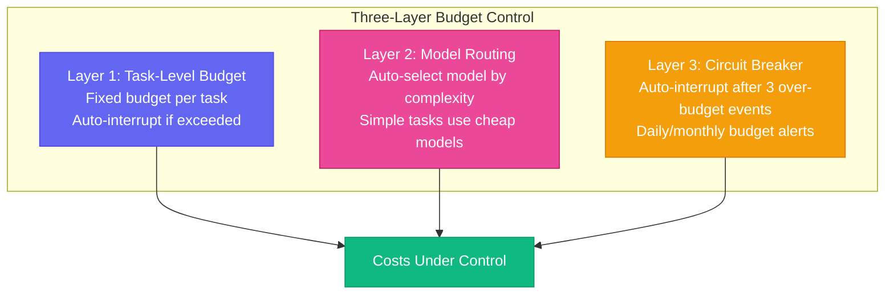

# Chapter 14: Stop Burning Money — Budget & Cost Control

[English](./ch14.md) | [简体中文](../zh/ch14.md)

> **Core insight: Using a top-tier model to write a "hello" email is like delivering takeout with a space shuttle — it'll get there, but it's completely unnecessary. Cost control for your Robert legion isn't about "saving money" — it's about "spending every cent in the right place."**

## Yason's Hard-Learned Lesson

At the end of the month, Yason received the API bill.

He glanced at the number and thought he'd misread it. He looked again — nope, he hadn't misread it. Then he quietly opened a spreadsheet and started crunching numbers.

The biggest line items on the bill:

1. A top-tier model ran millions of tokens one day — but the task that day was just "organize product documentation"
2. During an off-peak period, three different Roberts simultaneously called the same premium model for nearly identical tasks
3. A model kept calling itself in a meaningless loop, burning through massive amounts of tokens

Yason stared at the bill for ten minutes and said: "I'm not managing Roberts. I'm burning money."

He thought back to how these expenses came about:

- "Organize product documentation" — he launched the task with default settings, didn't specify model priority
- "Three Roberts calling simultaneously" — he started three parallel tasks without model sharing
- "Meaningless loop" — a task got stuck, and the model kept retrying the same operation

The core problem was one thing: **he hadn't set cost budgets for the Roberts, and the Roberts had no idea how much money they were "spending."**

## Cost Awareness: Roberts Don't Have It — You Must

AI Agents differ from humans in one major way: **humans instinctively know whether what they're doing is "worth it."**

Ask a human employee to "write an email" and they won't think about using the most expensive pen and paper. They have a natural "cost intuition" — what's worth spending time on, and what isn't.

AI Agents don't have this intuition. They'll use the best model to write the simplest email, because "the best" and "the most appropriate" are two different concepts to an AI. AI doesn't know costs exist unless you tell it.

Yason later summed it up: **"Roberts won't save you money. You need to save money for the Roberts."**

## Three-Layer Budget Control

Yason designed a three-layer budget system for the Robert legion:



### Layer 1: Task-Level Budget

Each task gets a fixed budget:

```plaintext
Task: Organize product documentation
Budget: 100K tokens or minimal cost
Model: Prefer free models
Strategy: Auto-interrupt if budget exceeded, do not continue
```

### Layer 2: Model Routing

Yason built a **model routing table** that automatically selects models based on task complexity:

| Task Type | Recommended Model Tier | Relative Cost |
|-|-|-|
| Simple replies, text formatting | Free model | Very low |
| Regular coding, content generation | Mid-tier model | Medium |
| Deep reasoning, architecture design | Top-tier model | Higher |
| Technical review | Multi-model hybrid | Varies |

The routing table's logic is simple: **assign simple tasks to cheap models, complex tasks to expensive models.** No waste.

### Layer 3: Circuit Breaker

When spending exceeds expectations, don't keep running — stop:

```plaintext
If single task consumption > budget × 2 → Auto-interrupt, notify Yason
If daily total consumption > daily budget → Pause all non-critical tasks
If monthly total consumption > 80% of monthly budget → Warning alert
```

Circuit breaking isn't "out of money" — it's "time to check why we're spending so much."

## The Frugal Guide: How to Use Free Models

Yason discovered that free models offer much better value than he'd imagined. For many daily tasks, free models are perfectly adequate.

His experience:

- **Simple tasks (~80%)**: Free models are enough — replying to emails, organizing docs, simple coding
- **Medium tasks (~15%)**: Use affordable mid-tier models — content creation, code review, data analysis
- **Complex tasks (~5%)**: Only then do you need top-tier models — architecture design, deep reasoning, strategic analysis

Yason said: "80% of tasks should be solved with free models. Not because free is better, but because those 80% of tasks aren't worth spending a single cent on."

## In Practice: A Cost Optimization Case

Yason noticed his API bill climbing every month, so he did an audit:

**Before optimization:**

- High daily token consumption
- ~80% running on top-tier models
- Monthly bill: High

**After optimization:**

- Even higher daily token consumption (more tasks)
- ~15% on top-tier models, 70% free models, 15% mid-tier models
- Monthly bill: Dropped to about 1/5 of the original

Cost dropped by ~80%, while output actually increased — because the savings were reinvested into more free-model tasks.

Yason said: "Saving money isn't the goal. The goal is to make Roberts do more work with the same money."

## Closing

Yason later distilled budget management into an iron rule, posted on the wall:

**"Before assigning any task to a Robert, ask yourself: how much is this task worth?"**

If you're willing to pay $1 for a task, use a $1 model. If you're only willing to pay one cent, find a free solution. AI won't complain about low wages — but your bill will.

---

**💬 How much is your API bill per month? Have you ever discovered a "space shuttle delivering takeout" task?**
