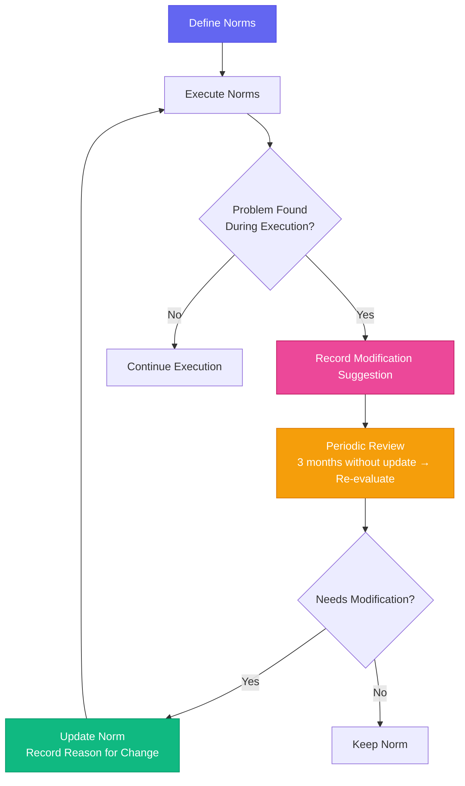

# Chapter 15: Culture Building — Norms & Code of Conduct

[English](./ch15.md) | [简体中文](../zh/ch15.md)

> **Core insight: AI Agents don't need corporate culture, but they do need behavioral norms. Don't call it "culture" — call it "constraints." But you have to admit, a good constraint system is the "corporate culture" of the AI era.**

## Yason's Hard-Learned Lesson

Yason's Robert team started out with no "rules."

Each Robert behaved differently. Kai liked to write everything in one long markdown file. Rex preferred splitting things into separate files, directories, and annotations. Another Robert had yet another output style — it habitually added emojis after every paragraph.

At first, Yason thought, "That's personality — it's fine." Two weeks later, he was pulling his hair out:

- Looking up Kai's history meant digging through 10 markdown files
- Looking up Rex's history meant slowly crawling through a folder tree
- Reading the other Robert's reports meant navigating a screen full of emojis

And the more serious problem: when Kai and Rex needed to collaborate — Kai couldn't understand Rex's directory structure, and Rex couldn't parse Kai's summary style. They were individually efficient, but completely unaligned on a "common language."

Yason later reflected: "I gave the Roberts personalities, but I didn't give them a shared 'grammar.'"

## Norm 1: Output Format Standardization

The first thing Yason did was establish a set of output format standards for all Roberts.

**Report structure:**

```plaintext
## Task Overview
- Task name: [name]
- Execution time: [time]
- Status: [Complete / In Progress / Failed]

## Execution Process
[Steps, in chronological order]

## Output Results
[Core output]

## Notes
[Exceptions, findings, suggestions]
```

**File naming convention:**

```plaintext
YYYY-MM-DD_task-name_v1.md
YYYY-MM-DD_task-name_v2.md
```

**Communication norms:**

- Reporting problems: State the symptom first, then the cause, then the recommendation
- Requesting confirmation: Explicitly write "Need your confirmation: yes/no"
- Progress updates: Only state "what's done" and "what's blocked"

Yason didn't spend time teaching Roberts "what good output style is." He simply wrote a standards document, placed it in the knowledge base, and had every Robert auto-load it at startup.

The effect was immediate — Kai and Rex's output formats were unified, and Yason no longer needed to "translate" between different formats.

## Norm 2: Naming Philosophy — Making Names Meaningful

Yason's Robert names had meanings, but he discovered the Roberts themselves didn't understand those meanings.

"Kai" — Dev (the "Kai" in developer) "Rex" — QA (quality and testing) "Max" — Ops (maximum/highest)

Yason added a rule to the norms: **every Robert must state its area of responsibility when introducing itself.** This way, when Kai and Rex collaborate, Kai knows Rex handles QA and testing tasks, and won't mistakenly assign code review work to Rex.

It sounds simple, but Yason found that this "self-introduction" mechanism solved a lot of collaboration chaos — once Roberts knew "who does what," task misassignment dropped by about 60%.

## Norm 3: Feedback Loops — Letting Norms Evolve Themselves

What surprised Yason the most: **the norms themselves also need to be normed.**

He set up an output format standard, and after a month, found many parts no longer applicable. He revised it. Another month passed, and it needed revising again.

Later, he added this rule: **every norm comes with a "last updated date" and a "reason for change."** If a norm hasn't been updated in over 3 months, the system automatically proposes re-evaluating whether it should be kept.

Roberts themselves can also suggest norm changes — if a Robert finds a norm unreasonable during task execution, it's allowed to record a "norm modification suggestion."



Yason's norm system eventually became a living thing — not a static set of rules, but a "team constitution" that continuously evolved with practice.

## Closing

Yason was once asked, "Do AI Agents need corporate culture?" He thought for a moment and said:

**"AI Agents don't need corporate culture — they need executable norms. But if you ask me whether I'd tell the Roberts about 'our mission and vision' — no. They don't need faith. They need to know how to do things."**

---

**💬 Do your AI Agents have unified behavioral norms? Or does each one do its own thing?**
