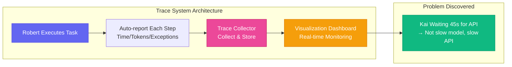

# Chapter 16: See Through Roberts — Observability & Monitoring

[English](./ch16.md) | [简体中文](../zh/ch16.md)

> **Core insight: An AI system whose internal state you can't see is like a black box — you know what went in and what came out, but you have no idea what happened in between. When it breaks, you can only guess.**

## Yason's Hard-Learned Lesson

One day, Yason noticed that Kai's "efficiency" seemed to have dropped recently.

Tasks that used to take 30 minutes were now taking an hour. Yason asked Kai: "Have you been slowing down lately?"

Kai answered: "No, I've been working normally."

Yason pressed further: "Then why did this task take 60 minutes?"

Kai said: "I'm not sure. My time perception isn't accurate."

Yason realized he'd fallen into a classic dilemma: **he wanted to troubleshoot the problem, but had no data.** No logs, no metrics, no trace chains. He only knew things were "slower," but didn't know whether it was because:

- The model was slower (increased API latency)?
- The task was more complex (longer prompts)?
- System load was higher (other tasks competing for resources)?
- Or Kai was stuck on some particular step?

Without data, every hypothesis was just a guess.

## The Problem: AI's "Observability Black Hole"

Traditional software systems have logs, metrics, and traces. When something goes wrong, you check the logs, look at the monitoring dashboards, examine the call chain — you can pinpoint the issue in minutes.

AI Agent systems don't work that way. An Agent's "work process" happens inside the model's black box — what it thought, how many reasoning steps it took, where it hesitated — if you don't proactively record this information, it's lost forever.

Yason later described it: "Traditional software is like a glass house — you can see what's happening in every room. An AI Agent is like a mysterious black box — you can only knock on the door and ask 'are you done yet?'"

## The Trace System: Installing a "Dashcam" on Roberts

Yason built a **Trace system** — its core function is recording every step a Robert takes when executing a task.

What the Trace records:

- Start time and end time of each task
- Which model was called at each step, and how many tokens were used
- Time elapsed from one step to the next
- Any exceptions or errors

This system is like an airplane's black box — it doesn't interfere with the flight, but it records everything, so you can replay it when something goes wrong.

Yason used an open-source distributed tracing tool for this. Each Robert, when executing a task, automatically sends a "trace" of every step to a Collector. The Collector stores the data and feeds it into a visualization dashboard.

In the very first week after installing the Trace system, Yason discovered a problem: Kai was waiting an average of 45 seconds on a particular step — not because Kai was thinking, but because it was waiting for an external API to return. The issue wasn't the model; it was the API being slow.

Without the Trace system, Yason might have spent a week tuning model parameters, when the real problem was the API call.



## Health Checks: Taking Roberts' "Temperature"

Besides Traces, Yason also built a health check system — periodically checking whether a Robert is "alive" and "healthy."

Health check metrics:

- **Liveness check**: Is the process running?
- **Responsiveness check**: Can it receive and reply to messages normally?
- **Performance check**: Is task completion time within the normal range?
- **Quality check**: Have recent outputs shown abnormal patterns?

If any check fails three times in a row, the system automatically triggers a recovery process — restart first, then notify Yason. If Yason doesn't respond, send a text message.

Yason said: "Roberts don't need physicals, but they need monitoring. They won't tell you they're not feeling well — they'll just quietly break."

## Dashboard: One Glance at the Whole Team's Status

Trace and health check data all flow into a **monitoring dashboard**. Every morning, Yason opens the dashboard and scans the team's status in 30 seconds:

```plaintext
Kai      ● Normal  | 5 tasks completed today | Avg time 12 min
Rex      ● Normal  | 2 tasks completed today | Avg time 28 min
Workflow  ● Normal  | Pipeline running 7 hours
Collector ● Normal  | Storage usage 45%
```

**Green** = Everything's fine, no action needed
**Yellow** = Anomaly detected but auto-recovered, take a look
**Red** = Problem requiring manual intervention

This dashboard transformed Yason from "reactive" to "proactive." He no longer waits for Roberts to come to him with problems — he scans the status every day and stays informed.

## Closing

Yason later summed up "observability" quite simply:

**"If you can't see a Robert's internal state, you're not managing a team — you're keeping an inscrutable pet."**

It might be highly capable, or it might be slacking off — and you'd never know.

---

**💬 Do you monitor your AI Agents? Or do you just assign tasks and ignore the process?**
