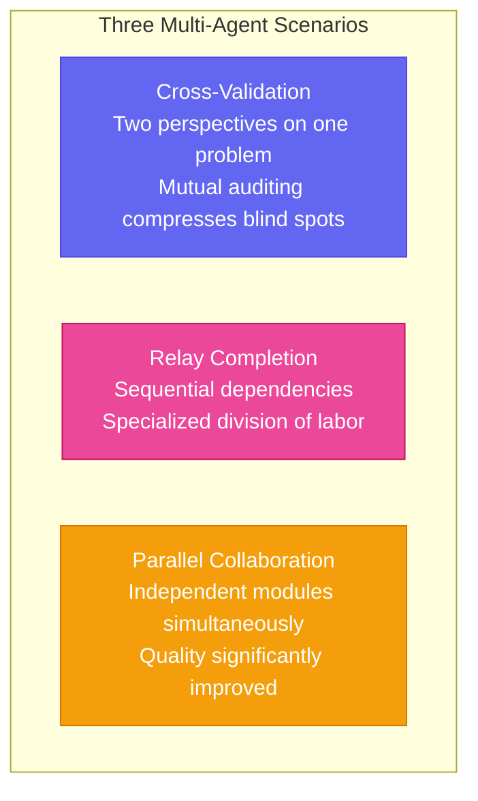
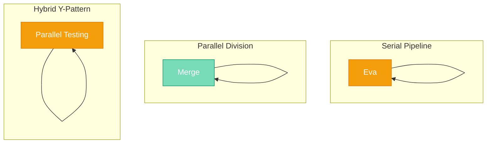

# Chapter 17: Roberts' "Avengers" — Multi-Agent Collaboration

[English](./ch17.md) | [简体中文](../zh/ch17.md)

Yason made a bold decision — let Kai and Rex work on the same project simultaneously. Disaster struck on day one.

Here's what happened: Yason took on a SaaS backend + frontend project. Figuring two Roberts working together would double efficiency, he assigned Kai to handle the backend API and Rex to handle quality verification and testing. The plan was crystal clear. He went to sleep that night feeling smug.

The next morning he woke up and checked the code repository — oh boy. Kai had written a user authentication endpoint that returned `{user_id: 123, token: "xxx"}`, while Rex's test suite was expecting `{id: 123, accessToken: "xxx"}`. The field names didn't match. The API calls couldn't go through. And that wasn't all — Kai named the user status field `status` in the database, while Rex's tests were checking for `userState`. The two Roberts had each gone their own way with zero communication.

Yason had an epiphany right then: throwing multiple Agents together doesn't make them "collaborate." That's a brawl, not teamwork.

## Three Scenarios Where One Agent Won't Cut It

Let's be clear: when do you actually need multiple Agents? Yason identified three scenarios that demand multi-Agent setups.

**First, cross-validation.** Say you need to write financial trading code. Kai writes the logic, then Rex audits it. Same requirement, two Agents interpreting it independently and checking each other's work. This isn't just code review — it's validating the same problem from different angles. An Agent will always think its own output is correct — it lacks the capacity to "doubt itself."

**Second, relay completion.** The classic example: Kai writes a data cleaning script that transforms raw data into structured format, then Rex takes that data for analysis and visualization. These two steps have a clear dependency, but they require different expertise. Kai knows data engineering; Rex knows quality verification and data presentation. It's hard for one Agent to excel in both domains.

**Third, parallel collaboration.** Yason's biggest trap was having one Agent handle both frontend and backend simultaneously. It's not impossible, but as the context grows, things start bleeding together — frontend code imports backend modules, backend code starts doing DOM manipulation. Assign different responsibilities to different Agents, each focused on their own domain, and quality improves dramatically.



## Communication Protocol: How Agents Talk to Each Other

The first problem with multi-Agent setups: how do they even know the other exists?

Yason tried the first approach — **direct communication**. Let Kai finish its work and send Rex a message saying "I'm done, the API returns format xxx." Sounds natural, right? In practice, it was a disaster. Kai says "The API is ready," Rex asks "What are the parameters?", Kai says "Look at the code yourself," Rex says "I can't understand your code" — the two Agents went back and forth for a dozen rounds, and Yason eventually realized they were arguing about a problem that didn't even exist.

The problem with direct communication: there's an inherent "trust but verify" tension between Agents. Kai says "I tested it" — should Rex trust that? Trusting it might lead to bugs; not trusting it means spending time verifying, and verifying takes time. Plus, the quality of Agent-to-Agent conversation is highly unpredictable. You never know what strange direction two LLMs might wander off to.

Yason eventually switched to **middleware-based communication**.

What's middleware? Simply put, a shared message bus. When Kai finishes a task, it writes the result as a structured message and publishes it to the middleware without specifying a recipient. Rex subscribes to the messages it needs from the middleware. Neither side talks directly to the other — they both talk to the middleware.

```plaintext
Kai completes API development → publishes message {type: "api.ready", schema: {...}} → Middleware
Rex subscribes to "api.*" → receives message → generates test cases based on schema
```

The beauty of this pattern: decoupling. Kai doesn't need to know Rex exists, and Rex doesn't need to know Kai. They only need to follow the same message protocol. When something goes wrong, it's easy to debug — just check the middleware's message log to see which step deviated.

Yason defined the simplest possible message protocol, just four fields:

```json
{
  "event": "task.completed",
  "task_id": "user-auth-api",
  "output": { ... },
  "schema": { ... }
}
```

Nothing more. Just enough. Complex protocols only confuse Agents.

## Shared Context: Letting Kai Know What Rex Is Doing

The communication protocol solves "how to talk." Shared context solves "what everyone knows."

The first thing Yason did: **created a shared "fact sheet."** This file isn't some detailed design document — it's just a Markdown file, a few lines, recording the current project's key decisions:

```plaintext
# Project Context v3
- User auth endpoint path: /api/v1/auth/login
- Return fields: {id, email, token}
- User status field name: status (values: active/inactive/suspended)
- Frontend: React + Tailwind
- Database: PostgreSQL
```

Every Agent reads this file at startup. Every time a key decision is made, this file gets updated. Everyone treats this file as the source of truth.

You might think — isn't this too primitive? Yes, primitive but effective. Yason tried more sophisticated approaches: storing context in databases, using vector retrieval, auto-summarization... he tried them all. In the end, he found that Agents have limited ability to understand complex systems. Give them a complex context system, and they'll spend more time figuring out "how to use the context system" than actually doing work.

Simplicity taken to the extreme is reliability.

There's another crucial piece in shared context: **the current task dependency graph.** Yason maintains a simple DAG (Directed Acyclic Graph) that tells each Agent the order of current tasks:

```plaintext
User Login API ← User DB Design ← Requirements Confirmed
User Registration Page ← User Login API
Dashboard Page ← User Login API ← Data Model Design
```

Kai sees this graph and knows: I must finish the database design before I can build the login API. Rex sees this graph and knows: I have to wait for Kai's login API to be done before I can start writing tests for the registration page.

## Orchestration Patterns: Serial, Parallel, Hybrid

With communication and context in place, the next question: how do you organize this crew of Roberts to get work done?

Yason figured out three patterns through practice.



**Serial Pipeline**: A finishes → B works → C works. Suitable for tasks with clear dependencies. The advantage is simplicity — each Agent's input and output are crystal clear. The disadvantage is obvious — it's slow. Later Agents have to wait for earlier ones.

**Parallel Division**: A does Module 1, B does Module 2, C does Module 3, then merge. Suitable for independent modules with no dependencies. Parallel mode tests shared context the hardest — if two Agents have inconsistent understandings of the same concept, the merge will crash and burn.

**Hybrid Pattern**: Most of the time, Yason uses a hybrid approach. First, parallel independent research and design; then, serial core development; finally, parallel testing and optimization. Like a Y-shape: fork → merge → fork again.

Yason wrote this orchestration as a simple JSON config:

```json
{
  "pipeline": [
    {"phase": "design", "mode": "parallel", "agents": ["kai", "rex"]},
    {"phase": "implementation", "mode": "serial", "agents": ["kai", "rex"]},
    {"phase": "testing", "mode": "parallel", "agents": ["kai", "rex", "eva"]}
  ]
}
```

Again, simplicity to the extreme. Yason also built complex orchestration engines, but ultimately found — the more you try to automate orchestration, the more edge cases you have to handle. So Yason chose semi-automated orchestration: he makes the plan, Agents execute, he adjusts.

## Three Big Pitfalls in Practice

Yason's multi-Agent collaboration pitfalls — three are most worth sharing.

**Deadlock.** Once, Kai was waiting for Rex to provide interface specifications, while Rex was waiting for Kai to provide backend data structures. Both Agents were "waiting for the other to move first," and the project stalled for half a day. Yason later added a rule: in any waiting state, if there's no progress for more than 5 minutes, the Agent must escalate instead of silently waiting. He also introduced a "coordinator" role that proactively checks for deadlocks.

**Resource contention.** Two Agents modifying the same file simultaneously. Kai changed line 50, Rex changed line 80 — git merge showed no conflict, but there was a logical conflict. Kai changed a function signature, and Rex added new logic to the same function using the old signature. Yason's solution: add a "file lock" list in the shared context. Whoever is modifying which file, write it down. If someone else wants to modify the same file, check first to confirm no conflict before proceeding.

**State inconsistency.** The most headache-inducing problem. Kai thought the user registration process was complete and sent a welcome email, while Rex thought registration required an additional review step. The two Agents had different definitions of "registration complete." There's no perfect technical solution for this. Yason's approach was to add a "glossary" to the shared context, explicitly defining the states and boundaries of every business concept.

## Quote Time

Writing this far, Yason wants to share some heartfelt thoughts.

The essence of multi-Agent collaboration isn't some profound distributed systems theory — it's **teaching a group of robots, each with their own strengths, to shut up, listen to others, and then get things right.**

Single-Agent is about maximizing the ceiling — how smart can this Robert be. Multi-Agent is about raising the floor — the weakest link determines the quality of the entire system. No matter how well you coordinate, if one Agent produces garbage quality, the whole project gets dragged down.

So multi-Agent collaboration doesn't solve the "one Agent is too weak" problem — it makes "multiple Agents each doing what they do best" possible. The prerequisite is — you have to make sure they can actually talk to each other.

Now, before launching any multi-Agent project, Yason asks himself three questions:

1. Do they understand each other's "dialect"? (Is shared context properly configured?)
2. When they argue, who has the final say? (How are deadlocks and conflicts resolved?)
3. Can what they produce actually fit together? (Are interfaces and protocols aligned?)

Only when all three questions have clear answers does he dare to press the start button.

---

*Next chapter preview: Chapter 18 — "Where Does the Human Stand?" When AI Agents handle most of the execution, where does the founder's value really lie?*
