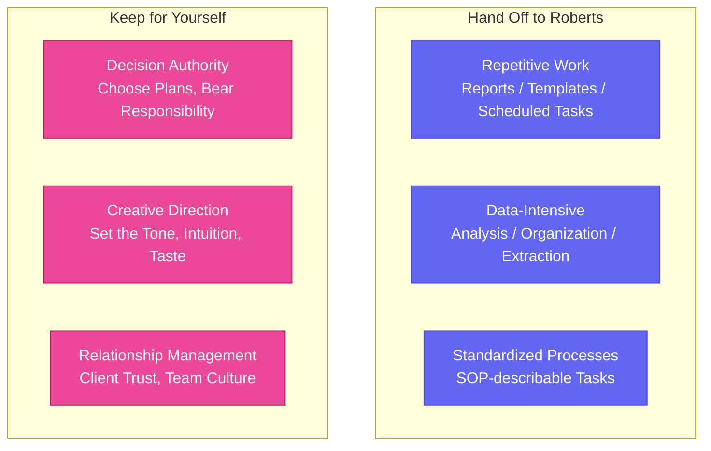
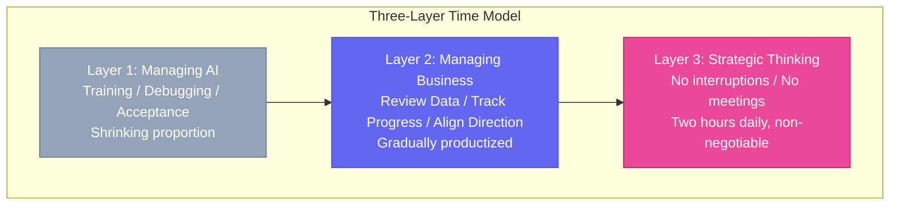

# Chapter 18: Where Does the Human Stand? — Human-AI Division of Labor & Founder Self-Management

[English](./ch18.md) | [简体中文](../zh/ch18.md)

Yason recently fell into a strange state.

Every morning when he opened his laptop, he'd stare at the queue of Roberts on his screen — one writing code, one doing design, one writing copy, one analyzing data — and then drift into deep thought: **So what about me?**

It wasn't always like this. In the beginning, Yason's approach was "delegate everything possible to AI." Whenever his fingers touched the keyboard, he'd first ask himself: Can a Robert do this? But he soon discovered that some things, when done by Roberts, actually required even more of his time to fix. For instance, he had a Robert write an email to an important client. The AI's draft was polished, airtight, flawlessly professional. But the client's reply came back: "Yason, are you feeling okay? This doesn't sound like you."

The client didn't want perfect phrasing. They wanted **Yason's voice.**

So he swung to the opposite extreme: doing everything himself. "Forget it, the Roberts aren't reliable. I'll do it myself." He was back to the early startup days, carrying everything on his own shoulders. The Roberts sat idle, his time filled with trivial tasks again, and he'd still be editing PPTs at eleven at night.

This might seem like a small thing, but it's actually the existential crisis everyone with an AI assistant eventually faces:

**Where exactly does the human stand?**

## From "Executor" to "Brain"

Yason spent two weeks seriously thinking about one question: **What makes me actually valuable?**

The answer: not in every stitch of the carpet, but in the pattern of the whole carpet.

In the past, Yason was the company's "super executor" — writing code, negotiating with clients, building proposals, overseeing operations. He was like a special forces soldier in an army, rushing wherever he was needed. But once the Roberts arrived, this model became completely obsolete. The Roberts are better executors — they don't sleep, don't complain, don't make basic mistakes, and process information a hundred times faster than humans.

If you're still competing with Roberts for the executor role, you're destined to be anxious.

Yason realized his new positioning came down to two words: **the brain.**

The brain doesn't type, doesn't format, doesn't write emails word by word. The brain does only one thing: **think and decide.** The physical work goes to the hands and feet. The brain just needs to decide "which direction to go."

This isn't some lofty theory. Yason told himself something very grounded:

> "If I can afford to hire Roberts, then I shouldn't be acting like one."

## What to Hand Off to Roberts

Yason identified three categories of work that can be safely delegated:

**Category 1: Repetitive work.** Things you do every day, tasks with fixed processes, manual labor that doesn't require creativity. Daily data reports, weekly summary templates, scheduled email sends. Roberts won't get bored doing these, and they won't make mistakes.

**Category 2: Data-intensive tasks.** Humans can't process 1,000 data points as well as AI. Yason once spent three hours organizing user feedback tags himself; a Robert did it in thirty seconds and even generated a word cloud. Anything that requires "extracting conclusions from large volumes of information" should go to a Robert first.

**Category 3: Standardized processes.** If you can write an SOP for it, you can hand it to a Robert. Yason turned his seven-step "how to onboard a new client" process into a prompt script — introduction, needs assessment, solution matching, pricing, contract, delivery, follow-up — at each step, the Robert can handle 80%.

## What to Keep for Yourself

But Yason has three "no-go zones" that he never delegates to Roberts.

**Decision-making authority.** Roberts can propose ten options, but choosing which one is a human's job. Yason says: "AI is like a chief of staff. It can analyze the enemy's position, simulate battle scenarios, and lay out ten battle plans. But the person who orders the charge must be human." Not because AI isn't capable, but because the responsibility behind decisions is something AI can't bear. When a plan fails, the client doesn't yell at the AI — the client yells at Yason.

**Creative direction.** Roberts write great copy — grammatically correct, well-structured, appropriately worded. But they can't capture "that feeling." That subtle understanding of the industry built over a decade, that intuition and taste that belongs only to the founder. Yason found that his best collaboration pattern with Roberts is: he sets the tone, they execute. He gives a keyword, the Robert produces ten versions, he picks one and fine-tunes it.

**Client relationships and team culture.** These two are purely human business. Clients trust people, not systems. Teams follow people, not tools. Yason established an iron rule: **Anything involving "relationships," AI can assist but never represent.**

## Yason's "5% Principle"

With the division of labor in place, Yason set himself an extremely aggressive goal:

> **He would only do 5% of the work. The remaining 95% goes to Roberts.**

This isn't laziness. This is founder self-management discipline.

Yason's logic: if a task takes him five minutes but a Robert fifty seconds, and the quality reaches 80%, then he shouldn't touch it in the first place. Those five minutes saved can go toward the things only he can do — judging direction, making decisions, building trust.

At first, he was deeply uncomfortable. When his hands were idle, he even felt a bit panicked. After a decade of being a "busy founder," suddenly having free time made him feel guilty. But he stuck with it. Two weeks later, he experienced a state he'd never known before: **clarity.**

When he was drowning in tasks before, he never had time to think. Now he had whole blocks of time to ponder the important but non-urgent questions: Where are we heading in six months? Is the team structure right? Is this client worth continuing to pursue? What has he been avoiding that he must face?

These were questions he never had time for before. Now he had no choice but to think about them.

## The Founder's Three Layers of Time

Yason drew his time as three concentric circles:

**Layer 1: Managing AI.** Training Roberts, debugging prompts, reviewing output. This portion of time keeps shrinking — Roberts learn fast. Teach them an SOP two or three times and they've got it down cold.

**Layer 2: Managing Business.** Reviewing data, tracking progress, aligning direction, coordinating collaboration. Yason is gradually productizing this layer — having Roberts monitor the data and only flag anomalies for him.

**Layer 3: Strategic Thinking.** This is Yason's time sanctuary. No interruptions, no meetings, no messages, no replies. Two hours a day, non-negotiable.

He said something that really stuck with me:

> "I used to think a founder's value was running fast. Now I know a founder's value is thinking far."

## Finally

Now when someone asks Yason what he does, he says: "I manage a group of Roberts, lead a few human employees, work four hours a day, but think for twelve."

Not everyone can downgrade their own role. Going from "doing everything yourself" to "only doing what matters most" is a battle against yourself. That part of you that ties security and self-worth to busyness will always feel "I need to do more to feel at ease."

But Roberts won't solve this problem for you. They'll only amplify it — making it painfully clear whether you're afraid to let go, or whether you're genuinely needed.

**Where does the human stand? Stand in the position that only you can occupy.**

Everything else, hand it to Roberts.
