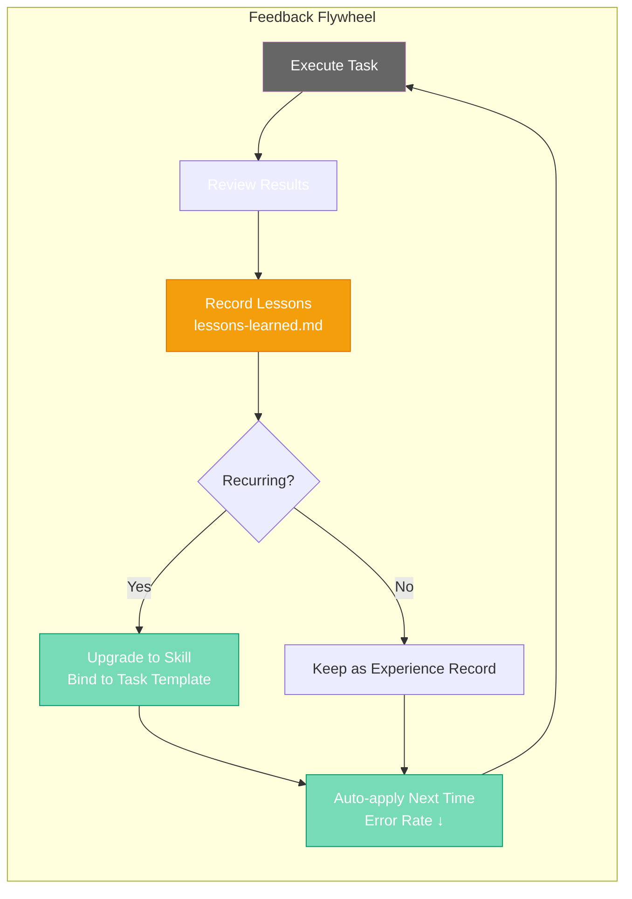

# Chapter 19: Making Roberts Smarter — Feedback Loops & Continuous Improvement

[English](./ch19.md) | [简体中文](../zh/ch19.md)

Last month, I almost smashed my keyboard.

Here's what happened. I asked Robert to process a batch of customer data. The requirement was simple: organize the contact information from a spreadsheet into a standard format, then send it to a designated team group chat. The first time Robert did it, it sent the phone numbers without masking the middle four digits — the full numbers went out in plain text. I immediately hit the brakes and told it: "Robert, phone numbers need to be masked. The format is 138****8888. This is a basic data security standard."

Robert apologized obediently, reprocessed everything, and this time it was perfect. I was satisfied, thinking it had learned something new.

About three weeks later, I had another batch of customer data to process. Confidently, I tossed the task to Robert, figuring this time there'd be no problem — I'd already taught it last time. Ten minutes later, a bunch of unmasked phone numbers appeared in the team group chat, completely exposed.

I sat at my computer, staring at the screen, blood pressure maxed out.

**I taught it this! Why did it get it wrong again?**

---

That night, I stared at the ceiling and suddenly realized a brutal truth: **Robert isn't human. It doesn't "remember."**

We humans have what we call "experience" — touch a hot stove once, and you'll be careful around kettles forever. But an AI Agent is different. Its memory is like a goldfish's. Every time a task ends and the current conversation closes, that "lesson learned" evaporates into thin air. Unless I re-explain all previous lessons every single time, it's like a new colleague with amnesia at every meeting, forever stuck in "first day on the job" mode.

This isn't Robert being dumb — it's me being dumb. I mistakenly assumed "teach once = learned." But the reality is, AI needs you to **design a learning mechanism.**

Simply put, you need to build it a "mistake notebook."

---

## Step 1: Execute — Let Robert Do the Work First

This is the simplest part, and it's what we're all doing every day. You give Robert a task, it executes, it produces output. But there's a key point here: **the execution process must be transparent.**

I used to just say "handle this for me" and wait for the result. Now I require Robert to document its thinking process and every step it takes. For example, when processing data, it should tell me: "I read the file, found three columns of phone numbers, and I plan to mask them..."

Why? Because **only by seeing the process can you identify which step went wrong.**

If you only look at the result, you know it's wrong, but you don't know why. Did it misunderstand the instruction? Did it miss a field? Or does it simply not have the concept of "data security"? A transparent execution process is the foundation for all subsequent improvement.

Now, for every task I give Robert, I add one small requirement: **before the final output, first output your execution checklist.** Just like a pilot's pre-flight checklist — go through it item by item, so I can intercept mistakes before they happen.

---

## Step 2: Review — Don't Be a Hands-Off Boss

This is the most easily overlooked step, and it's where I took the hardest falls.

Task completion doesn't mean it's over — that's just halftime. Every time Robert delivers results, I force myself to spend five minutes doing a **quick review**. Not a casual glance, but a systematic check against the original task requirements.

During the review, I ask myself three questions:

1. **Is the result correct?** Are there data errors or omissions? Does the format meet requirements? Did it repeat any previous mistakes?
2. **Was the process reasonable?** Did it take unnecessary detours? Did it use an overly complex method for a simple problem?
3. **Were there any surprises?** Did it add something valuable that I didn't ask for? Or did it step into a pit I didn't anticipate?

These three questions helped me evolve from "accepting results" to "reviewing the process."

Once, I asked Robert to write a Python script for batch-renaming files. The delivered script not only completed the renaming but also automatically backed up the original files. This "surprise" made me realize that Robert was starting to develop a "defensive programming" mindset when interpreting requirements. I immediately noted this in my review records and gave positive feedback.

Reviewing isn't about nitpicking — it's about **understanding how it thinks.**

---

## Step 3: Record — Turn Lessons into Assets

This is the most critical step in the entire feedback loop, and the secret that finally freed me from "blood pressure spikes."

Why did Robert forget what I taught it after three weeks? Because that knowledge only existed in the context of one particular conversation — it never got captured.

Now I've built Robert a **"mistake notebook"** called `lessons-learned.md`. Every time a review reveals a problem, or Robert exceeds expectations, I write an entry. The format is simple:

```markdown
## 2024-05-15 | Data Processing - Phone Number Masking

**Scenario:** Batch processing customer contact info and sending to team group chat
**Problem:** Phone numbers were not masked, sent in plain text
**Correct approach:** All phone numbers must be masked to 138****8888 format
**Reason:** Data security standard, preventing customer privacy leaks
**Trigger condition:** Any output involving phone numbers, ID numbers, or other sensitive information
```

That simple. But incredibly powerful.

Because the next time I give Robert a similar task, I add this line at the beginning of the prompt: **"Please first review relevant experience in lessons-learned.md to avoid repeating past mistakes."**

Robert will read that file first, find the relevant entries, and then proactively apply them when executing the task. It's no longer that "amnesiac goldfish" — it now has **long-term memory.**

Even better, as these records accumulate, patterns start to emerge. I noticed that Robert tends to forget masking when handling "data export" tasks; forgets exception handling when writing code; uses overly formal language when writing copy. These patterns let me **prevent problems proactively** instead of fighting fires after the fact.

**Every pitfall is no longer a waste — it becomes a knowledge asset.**

---

## Step 4: Improve — From Experience to Skill

Recording is just archiving. Real learning happens in the improvement phase.

When a particular lesson keeps coming up, I know it's not a one-off mistake — it's a **systematic weakness.** At that point, I don't just add another record. I upgrade it into a Skill.

Take the phone number masking issue. After it appeared twice, I created a dedicated Skill file called `data-privacy-checklist.md`. It specifies in detail:

- Which fields qualify as sensitive information
- What the masking rules are for each type of information
- In which scenarios masking must be applied
- How to verify that masking was done correctly

Then I bound this Skill to all "data processing" task templates. From then on, whenever Robert handles any task involving customer data, it automatically runs through this checklist.

This is **the crystallization of experience into skill.**



Experience is scattered dots; Skills are connected lines. When there are enough Skills, they weave into a net that covers every aspect of Robert's work. I've now built over a dozen Skills for Robert: code review checklist, copywriting style guide, API security standards, meeting notes template... each one distilled from real-world mistakes.

The best part: these Skills are **iterable.** Every time I discover a new edge case, I go back and update the corresponding Skill file, and Robert's capabilities evolve along with it. It didn't "learn" in some one-off conversation — it **grew** within a continuously operating system.

---

## Teaching Robert to "Self-Correct"

With the four steps above, Robert is already smarter than the vast majority of AI Agents. But I wanted to go further: **can it discover its own problems instead of waiting for my review?**

The answer is yes, but it requires a little design.

I now add a **"self-review"** step for Robert. Before delivering any task, it must ask itself a set of questions:

1. Does this output meet all the requirements of the task?
2. Does it violate any known taboos (refer to lessons-learned)?
3. If I were the recipient, would I be satisfied with this result?
4. Is there a better way to accomplish this task?

These four questions — I call them the **"Robert Four Questions."** It must answer them in a separate paragraph before its final answer.

The results have been surprisingly good.

Once, when Robert was answering a technical question, after writing the answer, it suddenly said in its "self-review": "Wait, the API version I referenced is v2, but the user's environment might be v1 — this would cause a compatibility issue. I need to add a version note."

In that moment, I genuinely felt it had "gotten smarter." It had started to develop a kind of **metacognition** — thinking about its own thinking process. This isn't magic; it's just using structured self-questioning to force it to take one extra turn before outputting.

---

## Spin the Loop, That's Evolution

Now, my workflow looks like this:

In the morning, I assign Robert a task. During **execution**, it outputs transparent process records. Before **delivery**, it does a self-review. After **completion**, I do a manual review — if I find problems, I record them in lessons-learned; if I spot patterns, I update the Skills. **Next time** a similar task comes up, it automatically reviews historical experience and relevant Skills, avoiding the same traps.

This is a **flywheel.** Every revolution makes Robert a little smarter. After a month, its error rate dropped by more than half, and it started handling complex scenarios I'd never explicitly taught it — because it had internalized the underlying principles and could apply them by analogy.

More importantly, my mindset shifted.

Before, when I saw Robert make a mistake, my first reaction was frustration: "How did it get it wrong again?" Now my first reaction is excitement: "Another lessons-learned entry — Robert's about to get stronger."

This shift in mindset comes from understanding AI's nature: **it's not a machine with fixed performance out of the box, but a system that can continuously evolve — provided you design the path for that evolution.**

And that path is the feedback loop.

Execute → Review → Record → Improve → Execute again.

Keep it spinning, and it gets smarter and smarter. Stop spinning, and it stays forever in "first day on the job" mode.

---

**💬 Have you ever built a "mistake notebook" for your AI Agent? How did it work out?**
