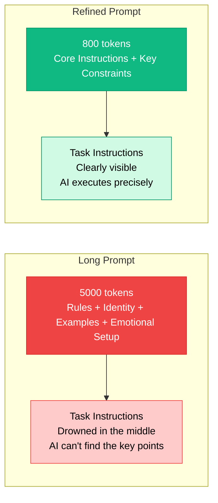
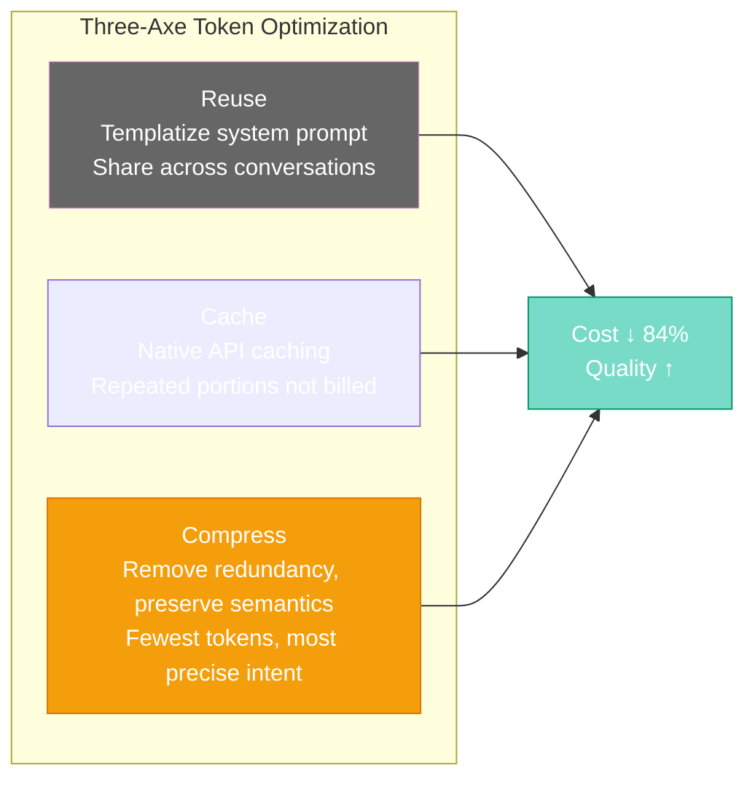

# Chapter 20: Advanced Mastery — Prompt Engineering, Context Management & Caching Techniques

[English](./ch20.md) | [简体中文](../zh/ch20.md)

## 1. Yason's Confusion

That night, Yason stared at the conversation history on his screen, lost in thought.

His prompt had reached its fourth revision. From the original 200 words, it had ballooned to 2,000. He told Robert everything in painstaking detail: who you are, what you need to do, what tone to use, what to watch out for, what to avoid, what rules to follow...

Yet the results were getting worse.

Robert started ignoring details in the instructions. Sometimes, even though the prompt explicitly said "output in Markdown format," it would still produce plain text. Sometimes Yason asked for "three points," and Robert would ramble through eight.

Even more maddening, once Yason asked a simple question: "What's the weather today?"

Robert first spent 500 tokens restating its own identity, then another 300 tokens explaining the rules in the prompt, and only then started answering the weather question — only to run out of tokens mid-answer and cut off.

Yason slammed the table: "You're an AI, not an intern who needs a pep talk!"

But after calming down, he realized the problem wasn't Robert — it was himself. His prompt strategy was fundamentally wrong.

## 2. Bigger Is Better? No!

Yason used to have a simple belief: the more detailed the prompt, the clearer the AI knows what to do.

It's like writing an operations manual for a new intern — they don't know anything, so of course you spell out every step, right?

**Wrong.**

Large language models and humans have a fundamental difference: **humans have limited short-term memory but stable comprehension; AI's comprehension degrades as context grows longer, but its short-term memory is vast.**

What does that mean?

Researchers revealed a phenomenon in their papers: when context length exceeds a certain threshold, model performance in "needle in a haystack" tests drops off a cliff. Simply put, **the more tokens, the more likely AI is to "get lost in the middle."**

Imagine this: you find a key piece of information on page 300 of a book. By the time you reach page 600, do you still remember what was on page 300?

For humans, probably not. For AI, the same holds true.

Yason's problem was this: he crammed all the rules into the system prompt, causing the actual "task instructions" to drown in an ocean of thousands of tokens of filler.

Robert wasn't being disobedient. It just couldn't find the key points among thousands of tokens.



## 3. Context Window Management: What Belongs in the Prompt, What Doesn't

After figuring this out, Yason re-examined his prompt strategy.

He categorized prompt content into four types:

### 1️⃣ Must Go in the Prompt

- **Core behavioral instructions**: What's your role, what do you do. Like a company's core mission — concise, clear, unchanging.
- **Key constraints for the current task**: Requirements specific to this task. Like "answer in Chinese" or "output in JSON format."

### 2️⃣ Should Go in the Knowledge Base

- **Background knowledge**: Product feature lists, API documentation, company history. These are reference materials, not behavioral instructions.
- **Long-form rules and examples**: Examples over 200 words, complex rule lists.

### 3️⃣ Should Be Handled via Function Call or Tool

- **Real-time data**: Weather, stock prices, calendar info. Writing these into the prompt every time is like handing your employee a daily temperature report — absurd.
- **Results from external queries**: When a user asks "what's the shipping status of this order," you should call an API to check, not let the AI guess.

### 4️⃣ Should Be Cut Entirely

- **Redundant emphasis**: Saying "answer in Chinese" and then adding "please don't answer in English." AI doesn't need repetition.
- **Emotional padding**: Like Yason once wrote, "You are my most important assistant, I believe you can do a great job..." AI has no ego that needs soothing.
- **Unnecessary identity repetition**: Being told "You are Robert, an AI assistant" at the start of every conversation. AI remembers.

Yason drew a table and pinned it to the whiteboard:

| Content Type | Storage Location | Notes |
|-|-|-|
| Core behavioral instructions | System Prompt | Always active, concise and powerful |
| Task-specific instructions | User Message | Included with each task |
| Reference knowledge | Knowledge Base / RAG | Retrieved only when needed |
| Real-time data | Function Call / API | Dynamic queries, not hardcoded |
| Emotional value | 🗑️ | Cut entirely |

## 4. The Three-Axe Approach to Token Optimization

With the classification framework in place, Yason got to work optimizing. He summarized three axes: **Reuse, Cache, Compress.**

### First Axe: Reuse

Yason discovered that a lot of prompt content is actually **shared across conversations.**

For example, Robert's basic identity: "You are Robert, an AI programming assistant. You specialize in Python, JavaScript, and system architecture design."

This description appears in every conversation, but it **never changes.**

Yason's approach: turn unchanging content into a **system prompt template**, specified directly through the API (rather than writing it in messages every time). This way, those tokens don't count toward each conversation's consumption.

An even smarter approach: for consecutive conversations using the same system prompt, **reuse the context** instead of rebuilding it.

### Second Axe: Cache

Prompt caching is a seriously underrated technique.

Yason found that mainstream API providers all offer prompt caching functionality. The core idea is simple: if a segment of a prompt appears repeatedly across multiple requests, the API provider automatically **caches** that segment, and the identical portion in subsequent requests **no longer counts toward token consumption or compute overhead.**

What's the impact?

Yason tested with real data:

**Before optimization:**

```plaintext
Messages: [
  {role: "system", content: "You are Robert... (2000-word identity setup)"},
  {role: "user", content: "Help me write a Python function..."},
]
```

- Token consumption: 5000 (per request)
- Of which redundant: ~3500 tokens

**After optimization:**

```plaintext
Messages: [
  {role: "system", content: "You are Robert."},
  {role: "user", content: "Help me write a Python function. Requirements: ..."},
]
```

- Token consumption: 1150 (first request)
- Subsequent requests: ~800 tokens
- Savings: **~84%**

Note that the optimized prompt doesn't convey less information — it just moves content that doesn't need to be sent every time into the cache.

### Third Axe: Compress

Compression doesn't mean shortening "help me calculate this data" to "calc data." That's turning natural language into telegrams, which actually confuses AI.

True compression is **removing redundancy while preserving semantic density.**

Here are some of Yason's real optimization examples:

**Example 1: Role Definition**

❌ Before (184 tokens):

```plaintext
You are an experienced Python development engineer, proficient in various programming languages and frameworks. You have worked at large internet companies for 10 years, handling countless complex problems. You are patient, skilled at guiding users to think, and able to provide detailed and accurate answers.
```

✅ After (17 tokens):

```plaintext
Role: Senior Python Engineer
Tone: Professional, concise, precise
```

**Example 2: Task Description**

❌ Before (312 tokens):

```plaintext
Please help me analyze the following code and see what problems it has. If possible, please point out performance issues, security issues, and code style issues. Also, if you have any suggestions in your analysis, please list them in Markdown format, preferably in list form.
```

✅ After (42 tokens):

```plaintext
Analyze code: performance, security, style issues. Output as Markdown list.
```

**The principle is simple: use the fewest tokens to express the most precise intent.**

Yason found that compressing prompts not only reduced costs but also **improved quality.**

Because AI no longer had to sift through thousands of tokens to find the few hundred that actually mattered. It could focus directly on the task.



## 5. Yason's Real-World Tests

Theory done, Yason decided to run an empirical test.

He picked three daily tasks and compared the results of "loose prompts" versus "compressed prompts."

### Test 1: Code Review

**Loose version (4500 tokens):** Included complete role definition, five long rule sections, three examples, multiple caveats.

**Compressed version (680 tokens):**

```plaintext
Review this Python code for:
1. Bugs (logic errors)
2. Performance (unnecessary loops, redundant computation)
3. Style (PEP8)

Output format: list, each issue tagged with priority [High/Medium/Low]
```

**Result:** The review quality was nearly identical. The compressed version actually caught fewer misses.

### Test 2: Writing Assistant

**Loose version (5300 tokens):** Lengthy role descriptions, extensive examples, multiple style guides, emotional padding.

**Compressed version (750 tokens):**

```plaintext
You are a tech blogger. Requirements:
- Conversational tone, avoid jargon overload
- Max 5 lines per paragraph
- Start with a story
- End with a punchline
```

**Result:** The compressed version wrote articles that sounded more like Yason's style. The loose version's output was overly formulaic.

### Test 3: Data Analysis

**Loose version (4800 tokens):** Included complete data analysis methodology, multiple output format requirements, extensive "if...then..." conditional branches.

**Compressed version (720 tokens):**

```plaintext
Data: {data}
Task: Find trend anomalies
Output: Table + brief explanation
Special requirement: Ignore fluctuations under 5%
```

**Result:** The compressed version's analysis was more precise, and 40% faster (due to fewer tokens).

Yason wrote in his log:

> **A 5000-token task can also be done with 800 tokens. The difference: with 800 tokens, the AI knows what matters.**

## 6. Keeping Prompts "Sharp"

After this round of optimization, Yason distilled a set of prompt maintenance principles:

**1. Each prompt does one thing only**

If you find a prompt that does code review, architecture design, and documentation — split it into three. AI isn't an all-rounder; it's a focused craftsman. One task at a time yields the best results.

**2. Use negative lists instead of positive lists**

"Don't answer in English" is more effective than "answer in Chinese." Because AI's understanding of "what not to do" is often more accurate than "what to do."

**3. Audit prompts regularly**

Yason built a habit: every two weeks, review all active prompts. Ask yourself three questions:

- Does this sentence really need to exist?
- Can I cut it in half?
- Can my latest discoveries improve it?

**4. Manage prompts with version numbers**

Yason added version numbers to every prompt, like `robert_coder_v3.md`. Every optimization gets documented with changes and results. This isn't for others — it's so future Yason can understand "why this version is better."

## 7. Closing Quote

Yason leaned back in his chair, looking at the prompt that had slimmed down from 5000 tokens to 800, a slight smile forming.

Robert had gone from a muddled mess back to razor-sharp.

He thought of a metaphor:

**A prompt is like a sword you give to AI. It's not about being heavier — it's about being sharper. A 10-pound broadsword isn't as sharp as a 1-pound blade, not because the blade is lighter, but because it concentrates all its force on the edge.**

His prompt was now that edge.

---

*Key takeaways:*

- *Longer prompt ≠ better results; AI easily "gets lost in the middle" with long contexts*
- *Categorize content into four types: put in prompt, put in knowledge base, use function call, cut entirely*
- *Three-axe token optimization: Reuse (templatize), Cache (native API support), Compress (remove redundancy)*
- *Yason's real test: 5000 tokens → 800 tokens, results actually improved*
- *Keep prompts "sharp": one task per prompt, negative lists, regular audits, version management*
