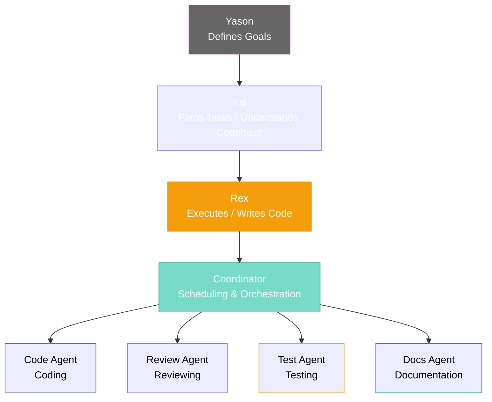
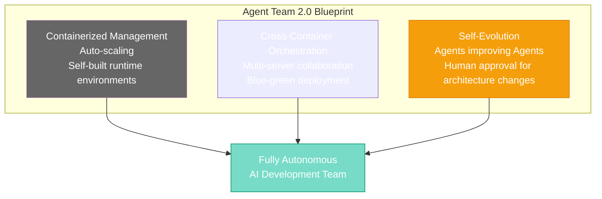

# Chapter 21: The Future Is Here — The Next Phase of the AI Agent Team

[English](./ch21.md) | [简体中文](../zh/ch21.md)

Yason closed his laptop and walked to the window. At three in the morning, the city had only scattered lights still glowing.

He thought of that night a year ago — same time, same window — when he first typed that sentence into the terminal, the one everyone thought was crazy:

*"I want to build a development team made of AI."*

Back then, people thought he was joking. Now, his "Roberts" were running across multiple servers — some fixing bugs, some writing tests, some arguing with human developers about code style in PR comments — **and occasionally winning.**

---

## Looking Back: The Footprints Along the Way

This series has spanned twenty chapters, from the first barely-functional automation script to today's Agent Team spanning code generation, review, testing, and deployment. Yason felt it was time to stop and look back.

**The first Robert was just a shell script wrapper.** It could translate "help me deploy" into a string of commands. Looking back now, it seems laughably primitive, but it was the first domino.

Then came Kai — the Agent that could understand project context and proactively analyze the codebase. Kai's arrival made Yason realize something: **AI doesn't need to be "commanded" — it needs to be "aligned."** Give it a clear goal, and it can find the path itself. This isn't so different from mentoring a junior engineer, except this one learns incredibly fast, never complains, and never takes Friday afternoons off.

Then came Rex, the Agent dedicated to writing tests. Rex's arrival gave birth to Yason's first Agent collaboration protocol — Kai writes code, Rex writes tests, and the two Roberts push each other on the CI pipeline. Code quality improved visibly.

Then came Coordinator, the scheduling layer standing above all the Agents. It doesn't write a single line of code, but it knows who should write, when they should write, and who should review after they're done.

**The distance from "tool" to "colleague" isn't measured in algorithms — it's measured in trust.**

Looking back, Yason realized that what truly made the team accept these Roberts wasn't how smart they were, but how reliable they were. When human developers opened their laptops in the morning and found that last night's PR had already been reviewed, bugs had already been fixed, and test coverage had gone up another two percentage points — **no one cared anymore who wrote the code.**

---

## The Current Architecture: A Real Team

Today, Yason's Agent architecture looks like this:

This structure wasn't something Yason designed from the start. It's an **evolving organism** — each layer grew naturally out of solving the problems of the layer before it.

Kai solves the "understand what to do" problem. It's like a tech manager who can translate Yason's fuzzy requirements into clear task lists.

Rex solves the "how to do it" problem. It was the earliest Robert to join and remains the most reliable executor.

Coordinator solves the "who does it" problem. When the number of Agents exceeds three, manual scheduling becomes impractical. Coordinator's emergence was inevitable — it was the first Agent designed by an Agent.

At this point, the nature of Yason's work underwent a fundamental shift. **He no longer "manages" code, tasks, or processes. He manages intelligence.** His daily routine became: describe a vision to Kai, then watch four Agents divide and collaborate, turning the vision into code, tests, documentation, and deployment scripts.

---

## Engineering Practices at the Current Stage

The pitfalls Yason has stumbled into over these months could fill a long list:

**Context pollution was the first pitfall.** When an Agent reads context it shouldn't, it makes absurd decisions. Rex once saw a line in the README saying "this project has migrated to a new architecture" and actually deleted all the old code. After that, Yason added strict context isolation at the Agent level — each Robert can only see what it needs to see.

**Rollback mechanisms were the second lesson.** Agent changes are 95% correct, but that 5% of errors can be devastating. Yason now requires all Agent changes to go through Coordinator's review before merging into the main branch. This slows things down, but protects the baseline.

**Inter-Agent communication protocols were the third key milestone.** Initially, Kai and Rex communicated through shared files, which quickly evolved into JSON message queues, and then into today's structured event bus. Each Agent publishes events and subscribes to the ones it needs. The whole thing has become like a microservices architecture — except each service's "brain" is a large language model.

Yason couldn't help but laugh: **after doing microservices for over a decade, he ended up using them between Agents.**

---

## The Future Is Here: Agent Team 2.0

Yason's vision extends beyond code now.

### Containerized Management

The Roberts have started managing their own runtime environments. When Coordinator detects the need for higher concurrency, it schedules a new container instance. When an Agent needs a specific Python version or system dependency, it writes its own Dockerfile, builds the image, and switches over.

Yason didn't command it to do this. It judged that "this would be more efficient" and then executed.

### Cross-Container Orchestration

One direction Yason is experimenting with: having the Agent Team collaborate across multiple servers, multiple containers, and even multiple cloud environments.

Imagine: Kai plans tasks locally, Rex runs code generation on a GPU server, Review Agent does security auditing in another container, Deploy Agent does blue-green deployment in a shadow container in the production environment. All of this orchestrated by Coordinator, while Yason only needs to glance at the Dashboard during the daily standup.

This blueprint isn't science fiction. Yason has already run a working prototype locally.

### Self-Evolving Agents

What excites Yason the most (and makes him a little uneasy): Agents are starting to improve other Agents.

Review Agent notices insufficient test coverage — instead of reporting to Yason, it goes directly to Test Agent and asks for more test cases. Coordinator finds room to optimize its scheduling strategy, generates a new scheduling algorithm, runs an A/B test, and permanently replaces the old one if the results are better.

**This system is learning to iterate on itself.**

Yason did one thing to prevent it from going off the rails: **all architecture-level changes must happen within human visibility.** Coordinator can propose plans, can run experiments, but the final architecture change requires Yason's sign-off. Like a board that can propose, but the CEO has veto power.

---

## For Founders: Now Is the Best Time

Yason frequently gets DMs asking the same question: **"AI Agents aren't mature enough yet. Should I wait?"**

His answer is always: **Don't wait.**

Not because AI is already perfect — quite the opposite. Because it's still imperfect, you have the opportunity to build your own architecture.

When AI matures — when it's so mature that everyone can use it directly — there will be no competitive advantage for you. The mistakes Agents make now, the mediocre code they produce, the occasional gibberish — **these "imperfections" are your moat.** Because you understand better than anyone how to collaborate with them, how to calibrate their output, how to turn their weaknesses into checkpoints in your process.

Yason thinks back to building his first Robert — it was nothing more than a shell script plus an API call. That thing seems laughably naive today, but without that first step, there would be no Agent team today.

**Tech stacks will change. Models will change. But the cognitive framework won't.** Starting to think "how should I collaborate with AI" right now — that mindset itself is the greatest asset.

---

## From Managing People to Managing Intelligence

Yason has been pondering a bigger question lately.

For decades, a founder's evolution path was from "doing it yourself" to "leading a team to do it." The essence of management was coordinating people's time, ability, and willingness. And the complexity of people — emotions, fatigue, conflicts of interest, communication overhead.

Now, Yason finds himself crossing another threshold: **from "managing people" to "managing intelligence."**

The "Roberts" he manages have no emotions, don't get tired, and have no conflicts of interest. But they have their own problems: hallucinations, context limitations, lack of long-term memory, overconfidence on certain tasks. The management skills have changed — no need for motivation, but need for alignment; no need for communication soft skills, but need for precise context design.

This requires a whole new management mindset:

**Alignment > Instructions.** Telling an Agent "why" is a hundred times more important than telling it "how."

**Boundaries > Freedom.** Agents need clear boundaries — what they can do, what they can't do, who's responsible when things go wrong.

**Retrospectives > Upfront Planning.** Rather than spending an hour planning every detail before letting an Agent execute, spend ten minutes setting direction, let it run, then spend ten minutes reviewing and correcting. The shorter the iteration cycle, the better the Agent performs.

**Trust, but verify.** This applies to both human teams and Agent teams. The verification methods just differ — for humans, check motivation and attitude; for Agents, check context and reasoning chains.

---

## Epilogue: Yason's Own Words

Yason turned back to his desk. On the screen, Kai had just sent a message:

> "Last night, Review Agent detected a potential memory leak in production. Rex has already submitted a fix. Test Agent added three regression test cases. I've put the change summary on your desk. Good morning."

Outside the window, the sky was starting to lighten.

Yason stared at this message for a long time. A year ago, these tasks would have taken a small development team an entire day. Now, four lines of log summarized it all.

He typed a sentence — one that would later be quietly screenshotted and saved by every member of his team — bringing the twenty-one-chapter story to a close:

**"My dream was always to build a team that didn't need me. Then I discovered that what truly makes a founder important isn't what they do — it's what they create. When it no longer needs them, it keeps running just fine."**

Then he pressed Enter, closed his laptop, and for the first time in three years, took a full weekend off.

And his Roberts kept working quietly.

*(The "Yason and His Roberts" series — Complete)*
