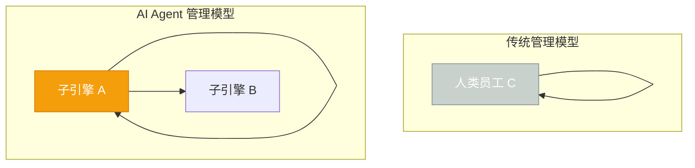
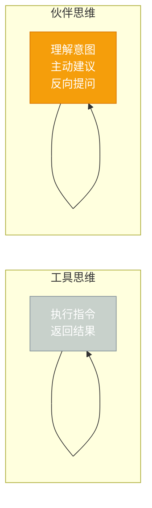

# 第一章：罗伯特初现 — 一个AI管理者的诞生

[English](../en/ch01.md) | [简体中文](./ch01.md)

> **核心观点：当一个技术创始人的团队变成了AI，管理就从"管人"变成了"管智能"——这需要一套全新的思维模型。**

---

凌晨两点，Yason 盯着屏幕上密密麻麻的日志，揉了揉眼睛。

他不是在 debug。他是在"管人"。

他的团队刚从三个活人变成了三个 AI Agent——Kai 负责全栈开发，Rex 负责测试与 SRE，他自己则成了这群"罗伯特"的 CEO。没有 OA 系统，没有周报模板，没有 KPI 看板，只有一行行即时消息和 CLI 命令。

这不是科幻电影的场景。这是 2025 年，一个技术创业者最真实的工作日常。

## 痛苦的转折点

时间拉回到三个月前。

Yason 的创业公司在经历了一轮快速扩张后，面临了一个所有创始人都会遇到的困境：**人力成本飙升，但产出没有线性增长。**

招人是最贵的。一个合格的工程师年薪不菲，加上社保、管理成本、办公场地，团队的负担远超创始人的预期。更痛苦的是跨时区协作——Yason 在国内，而他的目标市场在海外，这种异步沟通让管理效率打了好几个折扣。

"我雇三个人，但真正产出可能只有一个半人的量。"Yason 后来说起那段经历，语气里带着无奈。

就在这时，一条偶然的信息改变了一切。

有位朋友给他推荐了一篇关于 AI Agent 协作的文章，讲的是如何用多个 AI Agent 搭建一个虚拟团队。Yason 不以为然——市面上"AI 取代人类"的论调太多了，大多数都是噱头。

但当他真正动手试了之后，他发现自己错了。

**这个架构图揭示了一个残酷的事实**：传统管理中的"人"可以被解构为更小的智能单元。AI Agent 不需要睡觉、不需要加班费、不会因为同事的八卦分心。它们只会做一件事：执行任务。

## 罗伯特们的命名哲学

为什么叫"罗伯特"？

这是一个非常 Yason 式的幽默。在中文里，"罗伯特"（Roberts）是"robot"的音译，但比"机器人"多一点人情味——它听起来像一个人的名字，而不是一段代码。

"我不想叫它们'AI Agent'，那太机械了。叫'罗伯特'，它们就是我团队的一员，是我的同事，不是我的工具。"

这个命名背后，是 Yason 对 AI 协作的独特理解：**你把 AI 当工具，它就是个工具；你把 AI 当伙伴，它才能成为伙伴。**

这两种思维模式的区别，决定了你的"罗伯特"是天才还是累赘。

**工具思维**：你把 AI 当成一个高级计算器。你告诉它做什么，它做完了告诉你结果。你是指挥官，它是士兵。

**伙伴思维**：你把 AI 当成一个初级同事。你告诉它你想要什么，它会问你"为什么要这样做"、"有没有更好的方案"，甚至在你忙的时候主动提出建议。

Yason 选择的是后者。

## 踩过的坑

转型到 AI 团队管理的第一周，Yason 就踩了一个大坑。

他把所有任务一股脑全丢给 Kai，期待 Kai 能像人类同事一样自己梳理优先级、分配时间、按时交付。

结果？Kai 卡住了。

不是因为 Kai 不够聪明，而是因为 Yason 没给 Kai 搭好"脑子"——也就是后来被称为"记忆系统"和"任务管理系统"的组件。

**第一个教训：AI Agent 需要明确的边界和上下文。** 你给一个人类员工说"帮我优化一下产品的用户体验"，他大概知道你要什么。但给 AI Agent 说同样的话，它会把整个 UI 全改了——因为它没有"边界感"。

**第二个教训：AI Agent 需要反馈回路。** 没有反馈，AI 会重复同样的错误。Yason 发现，他需要定期"review"罗伯特们的输出，像项目经理 review 代码一样。

**第三个教训：不是所有事情都适合交给 AI。** 创意决策、客户谈判、团队文化建设——这些需要人类直觉的事情，目前还是 Yason 自己来。

## 结论前置：为什么你需要罗伯特们

写到这里，我想直接抛出结论：

> **AI Agent 团队不是人类的替代品，而是人类能力的放大器。当你能管理好一群"罗伯特"，你的人效可能是你同行的 3 倍。**

这不是空话。Yason 的团队在引入 AI Agent 之后，项目交付周期缩短了约 60%，而直接人力成本下降了约 70%。当然，这需要付出新的代价——你需要花时间"调教"你的罗伯特们，你需要建立一套适合 AI 的管理体系，你需要容忍一些只有 AI 才会犯的滑稽错误。

但如果你问 Yason 值不值得，他的回答永远是："值得。"

在下一章里，我们会聊聊 Yason 如何给罗伯特们分工——一个 AI 团队，到底需要哪些角色？

---

**💬 你觉得呢？AI Agent 是创业团队的未来，还是只是大公司实验室里的玩具？欢迎在评论区分享你的看法。**
