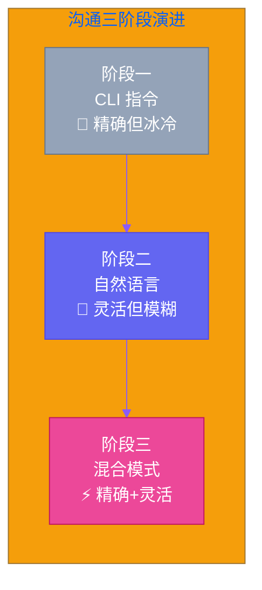

# 第三章：沟通体系 — 从 CLI 到大模型

[English](../en/ch03.md) | [简体中文](./ch03.md)
> **核心观点：AI Agent 的沟通能力决定了它的上限。从命令行指令到大模型对话，每一层通信方式都有它的最佳使用场景。**

---

"你直接跟 Kai 说'帮我写个 API'就行了？"

这是 Yason 被问得最多的问题之一。

在大多数人看来，跟 AI Agent 沟通应该像跟人类同事说话一样——你说一遍它就能理解。但现实是，Yason 跟罗伯特们的沟通经历了三个完全不同的阶段，每个阶段用的"语言"都不一样。

这不是因为 Yason 闲着没事折腾，而是因为**不同的任务需要不同的沟通方式**。

## 第一阶段：CLI 语言 — 精确但冰冷

在最开始的时候，Yason 跟 Kai 的"对话"是这样的：

```plaintext
kai --create-api user-auth --method POST --path /api/v1/auth
kai --review-code --branch feature/user-auth-v2
kai --deploy --env staging
```

这不是代码，这是 Yason 跟 Kai 的日常对话。

为什么不用自然语言？因为在最初的阶段，Yason 发现自然语言的模糊性是效率杀手。

他说"帮我改一下用户认证的 API"，Kai 回"改哪里？改什么？怎么改？"——一个简单的任务，光澄清需求就花了十分钟。

CLI 的指令精确到每一个参数，没有歧义，不存在"我以为你说的是……"的误解。但它也有明显的缺点：**学习成本高**。Yason 需要记住每个 Agent 支持哪些命令、参数怎么写、选项是什么。



## 第二阶段：自然语言 — 灵活但模糊

随着 Yason 跟 Kai 的配合越来越默契，他开始尝试更多使用自然语言。

"Kai，帮我看看用户反馈里提到最多的问题是什么。"

Kai 理解了，直接开始分析用户反馈数据。没有参数，没有命令行，就跟跟人类同事说话一样。

自然语言沟通的优势很明显：**灵活、不需要记忆命令、适合开放式问题**。Yason 可以直接跟 Kai 讨论架构方案、产品方向、代码质量——这些都是 CLI 命令无法表达的。

但自然语言也有坑，而且是大坑。

Yason 曾经说"这个功能尽快做"，Kai 理解成"现在立刻做"，直接中断了正在跑的仿真任务。Yason 说的"尽快"其实是"今天之内完成就行"。

**自然语言的模糊性在 AI Agent 沟通中会被放大。** AI 不会像人类一样结合上下文来理解"尽快"的具体含义——它会字面理解。

## 第三阶段：混合模式 — 该精确时精确，该灵活时灵活

经过两个月的磨合，Yason 总结出了一套**混合沟通模式**：

- **明确的任务（做什么、怎么做）** → CLI 指令
- **开放的问题（为什么、怎么样）** → 自然语言
- **优先级和时间** → 结构化描述（不是"尽快"，而是"4 小时内"）

这套模式的核心原则只有一句话：

> **精确的任务给精确的指令，开放的问题给开放的语言。用错沟通方式，等于鸡同鸭讲。**

```mermaid
%%{init: {'theme': 'base', 'themeVariables': {'primaryColor': '#6366f1','primaryTextColor': '#fff','primaryBorderColor': '#4f46e5','lineColor': '#8b5cf6','secondaryColor': '#ec4899','tertiaryColor': '#f59e0b'}}}%%
graph TB
    T[任务来了] --> D{任务类型？}

    D -->|"明确任务<br>做什么、怎么做"| CLI[CLI 指令<br>kai --create-api ...]
    D -->|"开放问题<br>为什么、怎么样"| NL[自然语言<br>"帮我分析一下..."]
    D -->|"时间/优先级"| SD[结构化描述<br>"4小时内完成<br>优先级 P0"]

    CLI --> R[高效执行 ✅]
    NL --> R
    SD --> R

    style T fill:#6366f1,stroke:#4f46e5,color:#fff
    style D fill:#f59e0b,stroke:#d97706,color:#fff
    style CLI fill:#c7d2fe,stroke:#6366f1,color:#000
    style NL fill:#fce7f3,stroke:#ec4899,color:#000
    style SD fill:#fef3c7,stroke:#f59e0b,color:#000
    style R fill:#10b981,stroke:#059669,color:#fff
```

## 跨 Agent 沟通：从"传话筒"到"协议栈"

沟通的另一个维度是跨 Agent 沟通。

一开始，Kai 和 Max 之间的沟通完全靠 Yason 传话。Kai 做完了告诉 Yason，Yason 再告诉 Max。Yason 变成了一个"高级传话筒"——每个工作日花 2-3 小时在转述信息上。

后来 Yason 尝试让 Agent 之间直接对话。结果是灾难性的：

- Kai 对 Max 说："那个 API 我改好了。"
- Max 理解成"API 已部署上线"——实际上 Kai 只是在本地改好了，还没推送。
- Max 直接发了公告，出现了严重的信息错误。

**问题根源：Agent 之间用自然语言沟通，但自然语言没有"状态语义"。**

Yason 的解决方案是建立了一套**跨 Agent 通信协议**——这套协议后来演变成了"CLI Provider"的核心设计。核心规则只有三条：

1. **任务派发用结构化消息**（谁、做什么、优先级、截止时间）
2. **状态同步用统一格式**（已完成/进行中/阻塞/等待中）
3. **异常通知用紧急通道**（直接通知 Yason，不经过协议栈）

这套规则把 Agent 间的沟通失误率从 40% 降到了接近零。

## 大模型在沟通中的角色

需要注意的是，上面说的"CLI 指令"和"结构化消息"并没有绕过 LLM 的执行能力。恰恰相反——CLI 指令在被 Agent 接收后，都会经过 LLM 的"语义理解层"。

```plaintext
Yason: kai --create-api user-auth --method POST --path /api/v1/auth
          ↓
Kai 的 LLM 理解: "用户想要创建一个用户认证的 API，POST 方法，路径是 /api/v1/auth"
          ↓
Kai: "明白，我来看一下现有代码结构，然后写代码。预计 30 分钟完成。"
```

CLI 指令只是**输入格式**，LLM 仍然是**执行引擎**。这就像你可以用中文写一个需求文档（输入格式），但执行这个需求的仍然是一个工程师（执行引擎），而不是一个只会读汉字的机器。

> **输入格式和执行引擎是两回事。好的沟通体系不是抛弃 LLM 的能力，而是让 LLM 在正确的框架下发挥能力。**

## Yason 的沟通黄金法则

经过几个月的实践，Yason 总结了几条沟通黄金法则：

1. **对事不对人** — 给 Agent 提需求的时候，说清楚"要什么"，不要说"怎么做"。Agent 自己知道怎么做到最好，你只需要告诉他目标。
2. **一次一件事** — 不要把三个任务塞在一句话里。Agent 会优先处理最后一个，忘记前两个。
3. **明确验收标准** — "写一个 API"和"写一个 API，JSON 格式返回，304 校验，带错误处理"是完全不同的沟通质量。
4. **确认收到** — 每次给 Agent 下达指令后，等它回复确认再去做下一件事。这个习惯能避免大量的"我以为你收到了"的场景。

下两章，我们来聊聊两个具体的工具——如何让 Yason 零成本用顶级模型，以及 CLI Provider 如何彻底解决 Agent 间的通信问题。

---

**💬 你是怎么跟你的 AI Agent 沟通的？用命令行还是自然语言？哪种方式效果更好？**
