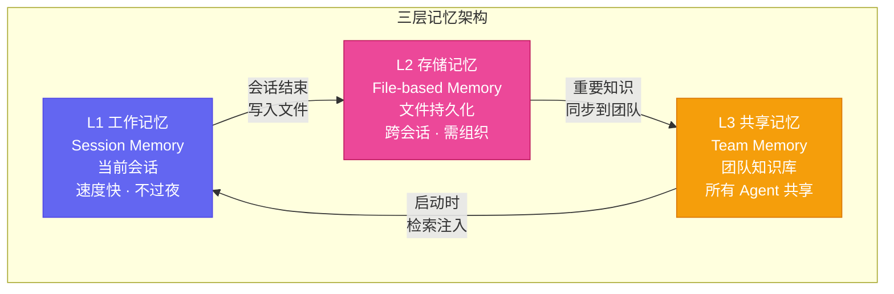
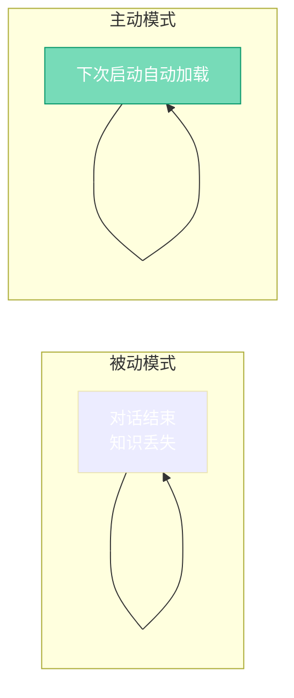

# 第四章：记忆系统 — 如何让 AI 记住一切

[English](../en/ch04.md) | [简体中文](./ch04.md)
> **核心观点：AI Agent 的"失忆"不是 bug，是设计。解决它需要一套分层记忆系统——就像人类的大脑分为短期记忆、长期记忆和肌肉记忆。**

---

Yason 第一次注意到"失忆"问题，是在一个非常尴尬的场景下。

那天下午，他给 Kai 安排了一个任务："把之前那个用户反馈的问题修复一下。"

Kai 回了一句："请指定具体是哪个用户反馈？我没有找到相关记录。"

Yason 愣住了——这就是他三天前让 Kai 亲自分析了一个小时的用户反馈。那些信息，Kai 已经"忘"得一干二净。

这一刻，Yason 明白了 AI Agent 管理中最残酷的真相：

> **AI Agent 没有长期记忆。每次对话结束，它们就像刚开机一样——全新的、干净的、对你一无所知的。**

这不是 Kai 的错。这是 AI 系统的底层设计决定的——每个对话（session）都是独立的，旧的历史不会带到新的会话里。如果你不给 Agent 搭一个"记忆系统"，它就是金鱼。

## 记忆系统的三个层次

Yason 花了很长时间研究和迭代，最终设计了一套三层记忆系统。

### 第一层：工作记忆（Session Memory）

这是 Agent 在当前会话中的记忆。电话打完了就消失。

- 内容：当前任务的上下文、刚才讨论的内容、最近几轮对话
- 容量：受限于上下文窗口（通常 8K-32K tokens）
- 特点：速度快、准确度高，但"不过夜"

**Yason 的用法**：把"当前任务的所有相关信息"一股脑塞进 session。比如让 Kai 改一个 API，就把 API 文档、需求说明、测试用例全部放在同一个对话里。

**关键教训**：千万别假设 Agent 会在下一个 session 还记得你刚才说了什么。它记不住的。

### 第二层：存储记忆（File-based Memory）

Agent 把自己的"经验"写进文件，下次启动时读取。

- 内容：系统提示词、工作日志、偏好设置、决策记录
- 存储：Markdown 文件、JSON 文件、配置文件
- 特点：数据不丢，但读取和管理需要好的组织结构

**Yason 的用法**：每个 Agent 有自己的 workspace 目录，里面按功能分文件。

- `MEMORY.md` — 长期记忆，记录 Agent 的核心身份和最重要的信息
- `memory/YYYY-MM-DD.md` — 每日日志，记录当天做了什么决策
- `TOOLS.md` — 本地工具配置，记录 Agent 的专属工具链
- `USER.md` — 用户信息，记录 Yason 的偏好和习惯

### 第三层：共享记忆（Team Memory）

整个团队共享的知识库。

- 内容：产品规范、项目进度、团队决策
- 存储：共享文档（主库）、代码仓库（备份）
- 特点：所有 Agent 可读，但只有 Yason 可写（避免 Agent 互相覆盖）

**Yason 的用法**：把所有"不应该丢"的信息放在共享文档里。

比如产品路线图、API 设计规范、团队沟通协议——这些都是让罗伯特们"对齐认知"的基础设施。任何一个新加入的 Agent，只要读了这些文档，就能跟上团队的节奏。

## 记忆的"写入"比"读取"更难

Yason 发现了一个反直觉的现象：**给 AI Agent 喂信息不难，难的是让它自己知道什么该记住。**

比如 Kai 做了一天的技术调研，产生了很多有用的洞察。但这些洞察并不会自动写入 MEMORY.md——除非有人在 Prompt 里明确说了"把重要的东西记下来"。

Yason 的解决方案是给每个 Agent 加了一条"铁律"：

> **如果你在对话中学到了什么重要的东西（用户偏好、项目决策、技术选型），必须在对话结束前写入对应的文件。不写就是你的错。**

这条规则看似简单，却彻底改变了 Agent 的记忆效率。从"等着被喂"变成了"主动吸收"。

## 那些"不该记住"的东西

记忆系统的另一个挑战是：**不是所有东西都值得记住。**

Yason 的 Agent 们曾经犯过一个经典错误——Kai 把上周三个调试失败的实验日志全部写进了 MEMORY.md，导致文件越来越庞大，启动加载越来越慢。

"这就是为什么 AI 也需要学会'忘记'。"Yason 说。

他加了一个**记忆淘汰机制**：

1. **时间淘汰** — 超过 30 天的信息自动归档到 `archive/` 目录
2. **重要性淘汰** — 低优先级的日常操作（"今天发了 3 封邮件"）不写进长期记忆
3. **关联性淘汰** — 完成的项目信息打包成一个文件，从主 MEMORY.md 中移除

这个机制让 Agent 的"记忆容量"从"金鱼级"提升到了"人类辅助级"——虽然不是完美的长期记忆，但足够用了。

> **好的记忆系统不是什么都记住，而是在对的时间记住对的东西。**

## 记忆系统的未来

Yason 对记忆系统的方向有更远的规划：

1. **自动摘要** — AI Agent 不再需要人工告诉它"记下来"。它能自己判断信息的重要性，自动产生摘要并归档
2. **跨 Agent 记忆共享** — Kai 学到的经验可以直接"教"给 Rex 和 Max。不是通过文件，而是通过实时的知识同步
3. **决策回溯** — 不仅仅是"记住发生了什么"，还要能回溯"为什么要做这个决策"。这需要记录决策的上下文和推理过程

但目前，Yason 觉得三层记忆系统已经足够支撑日常工作了。剩下的，交给时间。

毕竟，连人类自己都经常忘记带钥匙——我们也不能要求 AI 什么都能记住。

---

**💬 你的 AI 帮你有没有"失忆"过？你是怎么解决这个问题的？分享一下你的方案！**
