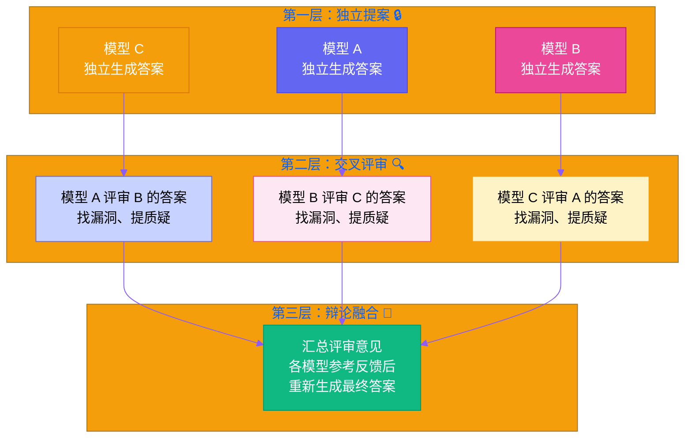
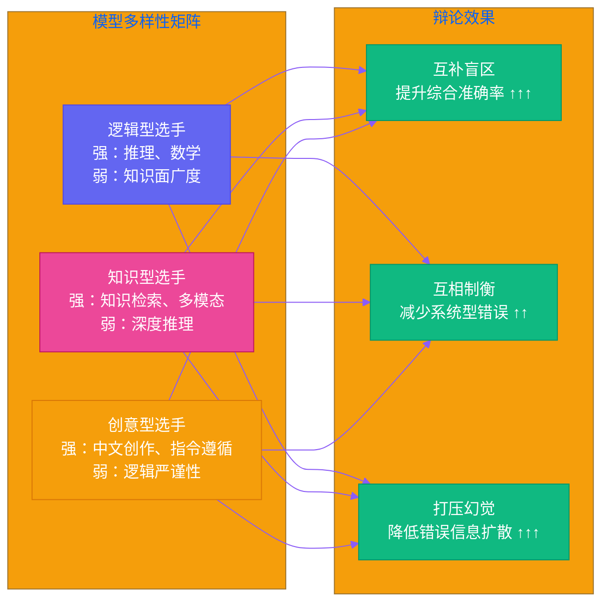
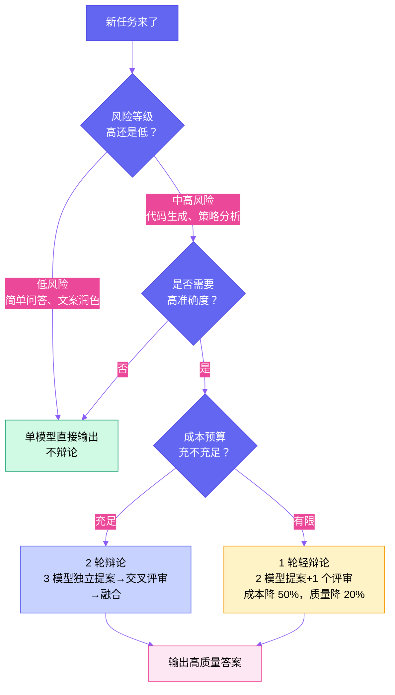

# 第五章：吵架的艺术 — 多模型辩论如何让 AI 输出更可靠

[English](../en/ch05.md) | [简体中文](./ch05.md)
> 一个模型说话，可能是错的。两个模型吵架，答案往往更靠谱。Yason 的多模型辩论机制，不是简单的"投票"，而是一场有规则的智力交锋。它解决的问题不是"哪个模型更强"，而是"怎么让模型少犯蠢"。

## 一个模型就够了？天真

2025 年，很多人还在争论"哪个模型最强"。ChatGPT 还是 Claude？DeepSeek 还是 Gemini？这场争论本身就已经暴露了问题——**如果有一个模型在所有场景下都碾压其他，那根本不需要选**。

现实是：每个模型都有自己的盲区。

你用 GPT-4o 写代码，它可能在一个简单的 SQL 查询上翻车。你用 Claude 做逻辑推理，它可能在数学计算上犯错。你切换 DeepSeek 写中文内容，它可能在需要英文知识的地方出现幻觉。就像你让一个最好的外科医生去修发动机——他再厉害也不行，不是因为笨，而是因为专业的边界。

Yason 搭建他的罗伯特军团时，很快就发现了这个残酷的现实。他做过一个实验：同一个技术问题，同一个 prompt，让 5 个不同的模型回答。结果让他很吃惊——5 个答案里，有 3 个核心结论是对的，但细节上每个模型都有不一样的问题。有的推理漏了一步，有的引用了一个不存在的论文，还有的在一个很明显的前提上犯了一个低级错误。

**关键洞察**：这些错误的分布不是随机的，而是跟模型的训练数据和架构高度相关。不同模型的问题往往出在不同的知识边界——这意味着如果一个模型检查另一个模型的输出，它很可能发现对方犯了什么错，因为那是它自己不容易犯的错。

Yason 的结论很直接：**不要选模型，让模型吵架**。不是因为哪个模型更好，而是因为一群不同背景的模型互相检查，可以大幅压缩盲区。

一个更深层的问题是：模型的"自信程度"几乎不可信。研究发现，语言模型在输出错误答案时，它的置信度表达跟正确时的差异并不显著。换句话说，模型自己都不知道自己什么时候在胡说八道。这让单模型输出的可靠性成了一个无法从输出本身判定的问题——你必须从外部找一个参照系来验证它。

这个参照系，Yason 选择了"其他模型"。

## 辩论机制：不是投票，是交锋

很多人以为"多模型"就是问同一个问题，然后取多数答案。这是投票，不是辩论。投票只能解决"哪个答案出现最多"，但解决不了"所有模型都错了"的问题——比如一个过时的常识问题，所有模型都学习了错误的训练数据，投票只会让错误更稳固。

Yason 的辩论机制，有三层递进结构：

**第一层：独立提案**

每个模型在隔离环境下生成自己的答案。没有互相干扰，没有"参照偏差"。这一步的关键是：给每个模型相同的原始提示词，但不告诉它有其他模型存在。

为什么要隔离？Yason 早期踩过一个坑——他让模型们在一个共享上下文里讨论，结果后面的模型明显受到了前面模型的影响。能力弱的模型会自觉不自觉地附和能力强的模型，或者跟着第一个发言的答案跑偏。这叫"锚定效应"在模型之间的表现形式。隔离提案就避免了这个问题。

**第二层：交叉评审**

每个模型拿到其他模型的答案，扮演"挑剔的审稿人"。注意，这里不是简单地打分，而是**找茬**。Yason 的提示词设计很精妙：不是问"这个答案对吗？"，而是问"这个答案在什么情况下会错？"。这种"假设错误"的思考方式，迫使模型主动寻找逻辑漏洞。

这里有一个有意思的发现：模型给别人挑错时，比自己检查自己的答案要严格得多。这跟人类行为高度相似——代码审查中，你给别人 code review 时能发现一堆问题，但自己写的时候觉得完美。模型也有类似的"自我盲点"。

**第三层：辩论融合**

各模型看到了评审意见后，再各自更新自己的答案。如果有两轮以上，就重复评审→更新。最终输出的不是简单"多数意见"，而是在交锋中沉淀下来的**共识区间**——那些经过多轮质疑仍然没有被推倒的结论。

Yason 说了一句话我觉得很到位：

> "不会吵架的模型，不配叫智能。真正可信的输出，是骂出来的。"

## 辩论质量的决定因素

不是随便几个模型凑一起就能辩的。Yason 摸爬滚打后总结出几个关键参数：

### 1. 模型多样性 > 模型绝对能力

两个同源模型实例辩论，效果远不如两个不同架构的模型。为什么呢？因为同源模型共享了训练数据和推理范式——它们的盲区是**重叠的**。你让两个同班同学互相检查作业，他们学的是同一套错误解法，发现不了彼此的问题。

但如果让一个数学系学生和一个物理系学生看同一道题，他们会从不同角度发现问题。Yason 管这叫**认知多样性溢价**——模型之间的"思维模式"差异越大，辩论的价值就越高。

### 2. 辩论轮数不是越多越好

直觉上，多辩论几轮效果更好。但 Yason 发现边际收益递减得非常快：

- **第 1 轮提案** → **第 2 轮评审**：效果提升最大，约 30-45%。这是从"无人质疑"到"有人挑刺"的质变
- **第 2 轮评审** → **第 3 轮融合**：提升约 15-20%。模型看到了批评后修正了答案
- **第 3 轮以后**：边际收益骤降，甚至出现"过度拟合"——模型们开始互相附和，失去批评精神

所以 Yason 的标准配置是 **2 轮辩论**，高风险任务最多 3 轮。再多就是浪费 token 还影响质量。

### 3. 评审阶段的提示词设计是核心机密

Yason 在评审阶段用了两种思维框架，这是他从"认知偏差"文献里学来的：

**"魔鬼代言人"（Devil's Advocate）框架**：要求模型不仅要找错误，还要为"错误的可能性"辩护。提示词大概意思是：

> "即使这个答案看起来是对的，请找出它在极端边界情况下可能出错的地方。"

这个框架的效果出乎意料的好。因为它强制模型转换视角——从"验证者"变成"怀疑者"。怀疑比验证更能发现漏洞，这在人类认知心理学中也是一个被反复验证的结论。

**"反向思考"（Reverse Thinking）框架**：要求模型从结论倒推前提，检验推理链条的一致性：

> "如果这个结论成立，那么哪些前提必须成立？这些前提是否都成立？"

这个框架的好处是能发现"跳跃式推理"——模型常常在推理过程中跳过一个关键步骤，直接得出看似合理的结论。反向思考迫使它把这个缺口暴露出来。

这两种框架不是为了"更精确"，而是为了**打破模型的确认偏误**（confirmation bias）——模型和人一样，倾向于相信自己已有的判断，找证据来支持它，而不是质疑它。

## 实战效果：什么场景值得辩论

不是所有任务都值得辩论。让两个模型花 5000 token 去讨论"今天天气怎么样"，纯属浪费。Yason 根据经验画出了辩论的 ROI 曲线——辩论有成本，必须用在刀刃上：

哪些场景 Yason 坚持要辩论：

- **决策类任务**：要给出建议而不是"输出"（比如选技术方案、评估策略、判断方向）
- **高风险代码生成**：涉及安全、性能、数据一致性的代码，错一条可能把整台机器搞崩
- **对外输出**：要发到公开渠道、社交媒体、客户面前的内容——错了丢脸
- **需要逻辑严谨的推理**：技术分析、竞品对比、因果分析，一步错步步错

哪些场景不需要辩论：

- **事实检索**：有明确答案且可以通过工具验证的，直接调 API 查证比辩论更便宜
- **简单润色**：改改语气、压缩字数之类的，一个模型足够
- **重复性任务**：每天做一遍的流水线工作，优化好 prompt 就行，没必要每次辩论

## 辩论的隐性成本

Yason 不会只吹辩论的好处。他说过一句大实话：

> "辩论最好的地方是它让结果更可靠。辩论最糟糕的地方是它让成本翻三倍。"

这个"三倍"不只是 token 成本。还有三个容易被忽略的成本：

**延迟成本**。单模型回答 3 秒，用户觉得很快。3 模型 2 轮辩论 18-30 秒，用户觉得"是不是卡了"。Yason 的解决方案是**异步辩论**——对于不需要实时响应的任务，让模型在后台慢慢吵。前台给用户一个"正在深度思考中..."的体验，实际上是三个模型在那里互怼。对于需要实时响应的场景，他采用"前置快速反应 + 后台深度验证"的双通道模式。

**上下文污染成本**。辩论回合多了，所有模型共享的上下文里充满了互相批评的记录。这些记录本身可能带偏后续的回答。Yason 发现，每轮辩论后需要做"上下文净化"——把无关的互相攻击部分去掉，只保留有价值的修正意见。

**"合群效应"成本**。还有一个更深层的问题：如果一个模型反复被其他模型纠正，它可能在长期运行中变得"过于保守"——本来正确的判断也被其他模型的质疑动摇了。Yason 的应对方法是定期重置每个模型的对话上下文，并轮换它们在辩论中的角色——这次你是提案者，下次你当评审，保持角色的新鲜感和独立性。

## 小结

多模型辩论不是万能的，但它是目前对抗模型幻觉最有效的手段之一。Yason 总结了三句话：

1. **辩论不是为了找出正确答案，而是为了排除错误答案** — 这是从医学诊断思维借来的理念。诊断不是直接告诉你得什么病，而是先排除不可能的病
2. **模型多样性比模型绝对能力更重要** — 三个臭皮匠真的顶个诸葛亮，前提是他们是"不同类型的臭皮匠"，而不是三个同款皮匠
3. **辩论的 ROI 取决于任务风险评估** — 不是所有问题都值得打官司，但生死攸关的问题值得来一场"世纪辩论"

从实践来看，辩论机制让 Yason 团队在高风险任务的输出可靠性上提升了约 30-40%。代价是成本翻了 3 倍——但因为只在约 20% 的高风险任务上用，整体成本只增加了约 15%。这是一个非常划算的交易。

下一章，我们来聊聊 Yason 的另一个秘密武器：他怎么把 API 账单砍到让人心虚——成本与质量的"走钢丝"艺术。

---

**💬 你试过多模型辩论吗？在你的场景里，效果如何？**
