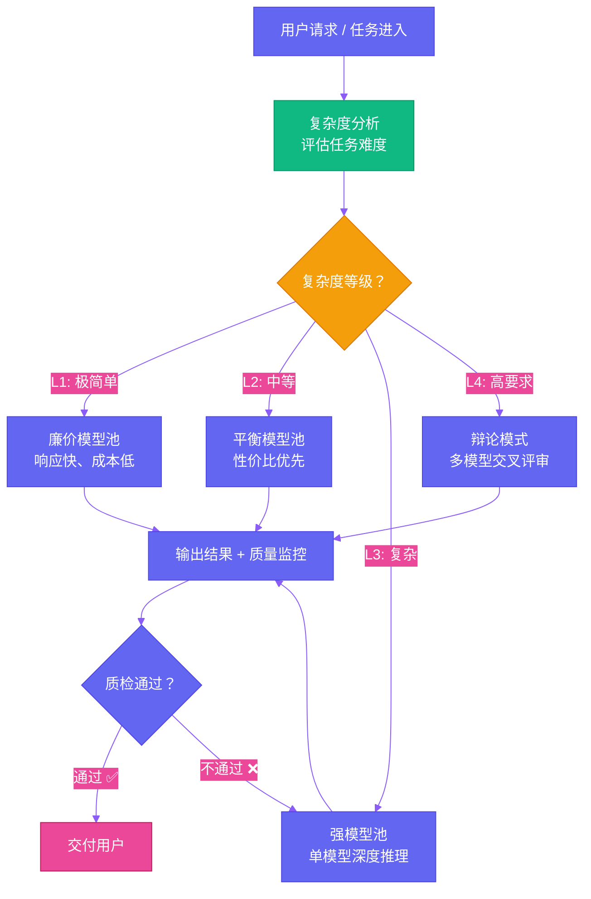
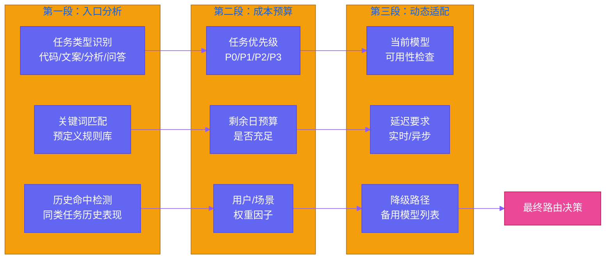
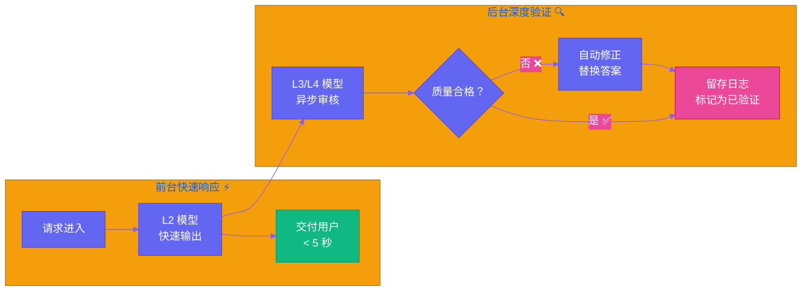
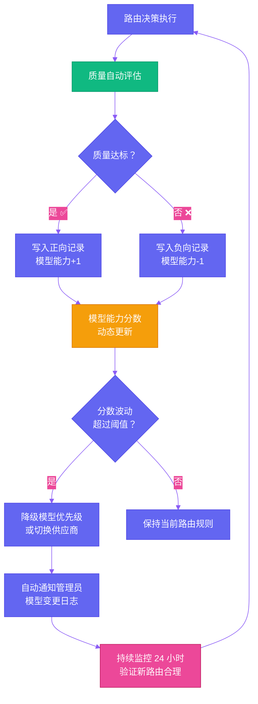

# 第六章：成本与质量的走钢丝 — 用路由经济学榨干每分钱

[English](../en/ch06.md) | [简体中文](./ch06.md)
> 很多人觉得"多模型"就是烧钱。Yason 的逻辑恰恰相反：正是因为用了多模型，他的账单才能砍到让人心虚的程度。不是因为模型更便宜，而是因为——让每个模型做它最擅长也最便宜的事。

## 最大的浪费不是钱，是把好模型用在了烂事上

大模型 API 的定价格局已经非常分化。最便宜的模型，每百万 token 只要几毛钱。最贵的旗舰模型，价格可以差几十倍甚至上百倍。很多人面对这个局面，选了最简单的策略：要么死磕便宜模型将就着用，要么直接上最贵的图个省心。

但 Yason 看到了另一个问题：

**同一个需求，可以用 5 种不同的模型来解决。关键在于——你能不能根据任务的真实需求，选到最合适的工具。**

比如写一封简单的邮件回复：你用旗舰模型来写，它确实能写得很好，但成本是入门模型的几十倍。问题是——收件人看得出来吗？看不出来。绝大多数日常任务，便宜模型的质量已经足够好。

反过来，如果是一个需要深度推理的技术方案评审：你用最便宜的模型去干，它可能给你输出一份表面光鲜、内部逻辑漏洞百出的方案，然后你照着执行了——结果出 bug 了，返工的成本是 API 费用的几百倍。

Yason 的核心洞察是：**模型选型错误的最大成本不是 API 账单，而是下游的"修复成本"**。一个错误决策导致的返工、客户投诉、数据修复，费用远超那点 API 差价。

## 路由引擎：帮你决定"谁该干这活"

Yason 的罗伯特军团里有一个核心组件——路由引擎。它的职责很简单：**判断一个请求该交给哪个模型处理**。

但"简单"不等于容易。路由引擎需要回答三个问题：

1. **这个任务需要多强的模型？** — 复杂度评估
2. **这个任务值得花多少钱？** — 预算匹配
3. **如果最合适的模型不可用怎么办？** — 降级策略



这个分级不是 Yason 拍脑袋定的。他花了两周时间，把手头几千条历史任务做了一个"模型-成本-质量"的三维分析。方法很简单：用每个任务实际执行的"最佳模型"答案作为基准，然后用其他模型去回答同一个问题，看看质量差异多大。

结果很有意思：

- **约 45% 的任务**，最便宜的模型和最贵的模型产出的质量差异 < 5% — 这些任务完全可以交给便宜模型
- **约 30% 的任务**，便宜模型有明显缺陷（15-25% 质量差距），需要中级模型
- **约 20% 的任务**，只有强模型才能给出可接受的答案
- **约 5% 的任务**，单个强模型都不够，必须上辩论

这 5% 辩论级任务虽然数量少，但它们的成本占据了总 API 开销的约 45%。Yason 把这个叫做"成本的不对称分布"——少数高要求任务消耗了多数预算。

## 路由策略的核心：三段式漏斗

Yason 的路由不是简单的一锤子买卖。他设计了一个**三段式漏斗**，每个请求通过三次判断来逐步确认适合它的模型等级：



**第一段：入口分析** —— 这不是简单的关键词匹配。Yason 做了一个"任务指纹"系统：每条历史任务执行后，记录任务特征（长度、领域、指令复杂度）与实际所需模型级别的关系。新任务进来时，先计算它的"指纹"，然后找最相似的历史任务。

**第二段：成本预算** —— 每个任务带一个"优先级"标签。P0 任务（用户直接请求、产品核心流程）无预算限制，直接走最高级。P1 任务（重要的后台分析）有合理预算。P2 任务（例行维护、批量处理）严格限流。P3 任务（实验性的、可放弃的）只用最便宜的资源。

**第三段：动态适配** —— 这是最实用的一层。因为 API 不稳定、模型不可用、响应超时都是家常便饭。动态适配层维护一个"模型健康度"表，记录每个模型最近的成功率和延迟。如果一个模型连续失败 3 次，自动降级到备选方案。

## 降级链：优雅地省更多钱

Yason 最得意的设计之一是**降级链**。每个高级别任务都默认有一个降级路径，在预算不足或模型不可用时自动触发：

```plaintext
L4（辩论）→ L3（单强模型）→ L2（平衡模型）→ L1（便宜模型）→ 失败告警
```

看起来是质量越来越差，但 Yason 加了一个巧妙的设计：**降级时要"通知"下游**。

当一个任务因为预算不足从 L4 降级到 L2 时，路由引擎会在任务上下文里标注"本任务已降级，置信度较低，请下游谨慎使用"。这样接收结果的 Agent 或者人就会知道：这个答案可能不够好，需要额外验证。

Yason 还有一个骚操作：**先降级，再补救**。对于非实时任务，先用 L2 模型快速给出一个答案，让流程不阻塞。然后在后台，用 L3 甚至 L4 模型去审核这个答案，如果发现重大问题，自动触发修正流程。



## 预算管理：让成本变得可预测

每个团队都有预算压力。Yason 的管理群里有句话：**"AI 成本失控是 AI 落地第一杀手"**。不是模型不够强，而是账单飞涨让老板慌了。

Yason 的预算管理系统有三个核心机制：

**日预算硬上限**。每个模型、每个 Agent、每天的 API 消耗都有上限。到了上限，路由引擎自动把该模型的所有请求降级到下一级。这不是"建议"，这是硬切断。

**按场景差异化预算**。对外客户交互的预算最高，因为客户的体验直接关系到收入。内部工具次之。实验和探索类任务预算最低。

**弹性预算池**。每个模型每天的未用预算会流入一个公共池。如果某个高级任务今天的预算不够了，可以从池子里借。但月底池子清零——"不花完的预算不是省下来的，是浪费掉的"。

## 一个真实的成本案例

在引入路由引擎和辩论机制之前，Yason 的罗伯特军团每天消耗大约 100 单位"成本基数"。做了分级路由之后，这个数字降到了约 40 单位。

降幅来源分解：

| 优化手段 | 成本降幅 |
|-|-|
| 复杂任务路由到合适模型（不再"杀鸡用牛刀"） | -25% |
| 简单任务全部走廉价模型 | -30% |
| 辩论模式精准使用（仅限约 5% 高要求任务） | -5% |
| 降级链和"先降级再补救"机制 | -10% |
| **合计** | **约 -60%** |

更关键的是，质量没有明显下降。Yason 用一套自动评测系统持续监控输出质量，关键指标波动在 ±5% 以内，完全可接受。

Yason 总结的精髓是一句话：**"省钱不是少用，而是用得聪明。"**

## 路由引擎的进化方向

路由引擎不是 Yason 的最终形态。他正在升级到第二代——**自适应路由**。核心变化是增加了反馈闭环：



第一代路由是"静态规则 + 历史指纹"。优点是稳定，缺点是遇到新型任务时可能误判。

第二代路由加入了两个新机制：

**实时质量反馈**：每个任务的输出质量会被自动评估。如果某个模型的最近输出质量下降，路由引擎会自动降低它的优先级。

**动态路由实验**：对于不确定的任务，路由引擎会做 A/B 测试——把任务同时发给两个不同级别的模型，比较输出质量。如果发现更便宜的模型也能达到同样的质量，就把这个"新指纹"写入路由规则库。

## 小结：经济学思维才是终极武器

Yason 的路由经济学，本质上不是技术问题，而是**经济学问题**。它的核心是两点：

1. **边际效用递减**：同样的钱花在不同任务上，产生的质量提升不一样。路由引擎要做的就是把钱花在"边际效用最高"的地方
2. **机会成本思维**：一个高级模型处理一个简单任务的机会成本，等于它因此没能处理的复杂任务的质量损失

**罗伯特军团里，最聪明的那个不是最贵的模型，而是那个知道"什么时候该找谁"的路由器。**

下一章预告：Yason 发现他的罗伯特们开始互相写提示词了——这引出了一个更有趣的问题：AI Agent 之间的协作，到底应该是"各干各的"还是"互相改造"？

---

**💬 你有没有算过你的 API 账单里有多少是"杀鸡用牛刀"的浪费？**
