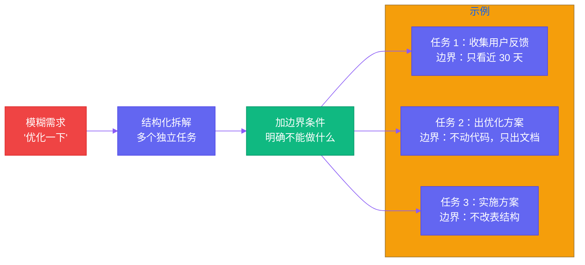

# 第七章：给罗伯特派活 — 任务拆解与追踪

[English](../en/ch07.md) | [简体中文](./ch07.md)
> **核心观点：把一个模糊需求扔给 AI Agent，等于让一个优秀员工在没有明确指令的情况下自由发挥——结果通常不是他太笨，而是他太聪明，聪明到把你的"随便弄一下"理解成了"重构整个系统"。**

## Yason 的踩坑故事

Yason 曾经犯过一个经典错误。

那是一个周二的下午，他收到一封客户邮件，说产品的一个功能"用起来不太顺手"。Yason 随手就在群里 @了 Kai，说："Kai，那个用户反馈的 XX 功能，你优化一下。"

半小时后，他收到 Kai 的回复——一个彻底重构的新版本。

界面改了，交互逻辑重写了，甚至底层数据结构都换了。Yason 看着那个全新的界面，沉默了十秒钟，然后缓缓打出一行字：

"我只是想让你改个按钮颜色。"

这个场景，每一个跟 AI Agent 协作过的人都会会心一笑。AI 不会问"你要不要改这么大"，它只会做一件事：**执行指令**。而"优化一下"这种模糊的指令，在 AI 眼里等于"尽情发挥你的想象力"。

## 问题的本质：AI 没有"边界感"

人类员工有一个天然的优势——**上下文理解**。当你对同事说"帮我把那个功能优化一下"，他会自动判断：

1. "优化"到什么程度合适（改颜色？改逻辑？还是重构？）
2. 有哪些已知的限制（客户预算？时间？技术债务？）
3. 哪些不能动（核心架构？数据库表结构？）

AI Agent 没有这个能力。它就像一台精密但缺乏常识的机器——你把方向盘交给它，它就真的会把车开到任何它能开到的地方去。

这就是 Yason 踩过的第一个大坑：**任务拆解不是 AI 的事，是人的事。**

## 阶段一：把需求从"一句话"变成"三步走"

Yason 后来总结出一套"三步拆解法"：

**第一步：说人话的原始需求（人类语言）**

> "帮我把用户反馈的那个功能优化一下"

**第二步：拆解成多个独立任务（结构化描述）**

**第三步：每个任务加边界条件（约束描述）**

> 任务 2：不出方案时不动代码，只输出方案文档
> 任务 3：不修改 user 表结构，不修改核心 API 路由
> 任务 4：回归测试覆盖率达到 85% 以上

这套方法的核心逻辑是：**你不需要告诉 AI 怎么做，但你必须告诉它不能做什么。**



## 阶段二：Checkpoint 机制——让过程可控

拆完任务只是第一步。Yason 发现，即使任务拆得再细，AI 在执行过程中还是会"跑偏"。原因很简单：**AI 的"注意力窗口"是有限的**——它记得你五分钟前说的"不改数据库"，但写代码写着写着就忘了。

解决方案是 **Checkpoint 机制**。

Yason 在每个任务中插入了 Checkpoint 节点——这不是给 AI 看的，是给人（Yason 自己）看的。每个 Checkpoint 要求 AI 输出当前进度，等 Yason 确认了再继续。

比如"出优化方案"这个任务：

```plaintext
Checkpoint 1：已收集 30 天反馈，这是用户痛点总结 → 等确认
Checkpoint 2：已出 2 个优化方案，附优缺点 → 等确认
Checkpoint 3：选定方案 A，开始实施 → 等确认
```

这套机制让 Yason 从"事后发现问题"变成了"过程中把控方向"。AI 不会偷懒，但它会跑偏。Checkpoint 就是追着 AI 喊"你看一眼这个对不对"的那个人。

## 阶段三：追进度——不追就是让下属摸鱼

Yason 还有一个让下属"痛苦"的习惯：**追进度**。

但不是那种"工作做完了吗？""还没""快点做"的无意义催命。Yason 的追进度有一套固定的节奏：

1. **派活时明确节奏**："3 小时后给我进度更新"
2. **到期主动问**："进度如何？卡在哪？"
3. **卡住了给解法**：不是催，是帮

这套节奏背后的逻辑是：**AI Agent 没有"时间感"**。它不会觉得自己"拖了"，因为它一直在处理任务——只是可能在一个无关紧要的细节上花了两个小时。需要有人给它一个"该交活了"的信号。

Yason 在罗伯特军团里定了一条铁律：**每 3-4 小时主动问一次进度，直到任务完成为止。**

听起来像是在"管"AI，实际上是在管理自己——**AI 不需要管理，但异步协作需要。** 当你的队友不坐在你旁边、你不知道它在干什么的时候，只有主动跟进才能保证任务不落空。

## 实践案例：一次完整的任务拆解

Yason 有一次需要 Kai 调研一个技术方案。他用了完整的三步法：

**原始需求：**

> "帮我调研一下我们用哪个 LLM 做知识库检索比较好"

**拆解后：**

```plaintext
任务 1：列出当前主流的知识库检索方案（限 5 个以内）
  → Checkpoint：等确认方案列表后再继续

任务 2：对比各方案的成本、性能、维护难度
  → Checkpoint：出对比表，等确认后再深入

任务 3：基于我们的使用场景，推荐最优方案
  → 边界：不考虑闭源模型，优先国产模型
```

结果？Kai 用了两个小时就把方案做完了。没有跑偏，没有过度设计，每到一个 Checkpoint 就停下来等 Yason 确认。整个过程像流水线一样丝滑。

## 结尾

一个很反直觉的事实：**AI 越强，任务拆解越重要。**

弱 AI 你不敢让它做太多——指令必须非常详细，像教小孩子一样一步步来。但强 AI 不一样——它理解能力强、执行能力强、创造力也强。这意味着如果你给了它一个模糊的需求，它真的能在错误的道路上走很远。

越强的工具，越需要明确的边界。

这也是 Yason 管理的核心哲学：**不是 AI 不听话，是你没把话说清楚。**

---

**💬 你知道还有什么是 AI Agent 管不了的？欢迎在评论区分享你跟 AI 协作时的"翻车"故事。**
