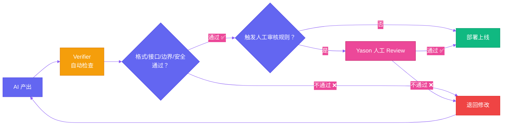

# 第八章：谁审罗伯特？ — 质量审查与验收机制

[English](../en/ch08.md) | [简体中文](./ch08.md)
> **核心观点：AI Agent 的产出不是"可用"和"不可用"的二分法，而是一个渐变的光谱——好的审查机制能把你从"每次都提心吊胆"变成"闭着眼睛放心用"。**

## Yason 的踩坑故事

有一天，Yason 让 Kai 写一个用户注册的 API 接口。

Kai 花了一个小时就写完了，跑起来也没问题。Yason 看了看代码结构——整洁、规范、注释写得比他自己写的还清楚。他很满意，直接部署上线了。

第二天，用户反馈来了：注册成功但登录失败，登录成功但数据丢失，数据不丢失但邮箱通知发了两遍。

Yason 查了一整天，最后发现问题出在 Kai 的代码里：数据一致性没有问题，但接口的行为与前端期望的恰好对不上——前端传 `email`，Kai 收的是 `user_email`；前端等的是 200，Kai 返的是 201。

每个问题单独看都微不足道，但加起来就是灾难。

Yason 后来总结了一个血泪教训：**AI 写的东西，看起来都对，用起来全错。** 它像是一个考试成绩满分但从来没上过班的新人——知识储备足够，实战默契为零。

## 问题：AI 的"幻觉"不止存在于内容里

大家聊 AI 的时候经常说"幻觉"——模型编造不存在的知识。但跟 AI Agent 协作久了，Yason 发现 AI 的"幻觉"不止存在于内容层面，还存在于工程和逻辑层面：

- **接口幻觉**：代码能跑，但接口约定的字段名、响应码、错误格式全对不上
- **边界幻觉**：正常流程走通了，但异常情况（超时、空值、并发）全没考虑
- **上下文幻觉**：以为自己记得你五分钟前说的"用 PostgreSQL"，但写出来的是 MySQL 的语法

这些不是 AI 不够聪明，而是 AI 缺少**"项目级的一致性"**——它能看到你当前的任务，但看不到整个项目的"潜规则"。

Yason 的结论是：**AI 的产出必须有审查机制，这跟信不信任 AI 无关，这是工程规范。**

## Verifier 机制：让机器审机器

Yason 在罗伯特军团里建了一个叫 **Verifier** 的组件。它的工作很简单：AI 产出完一个东西之后，不直接给 Yason 看，先给 Verifier 过一遍。

Verifier 做的事：

1. **格式检查**：代码风格、命名规范、注释格式
2. **接口一致性检查**：字段名、响应码、请求方法是否符合约定
3. **边界覆盖检查**：空值、异常、并发场景有没有处理
4. **安全扫描**：有没有硬编码密钥、SQL 注入风险、权限暴露

这些检查很多是自动化规则，不需要 AI 参与。但还有一些需要"人"来判断的：

**语义一致性检查**：比如，前端说的"用户信息"和后端说的"用户信息"是不是同一个东西。

对于这些，Yason 的做法是：**让另一个模型来审。**

他会在一个任务里同时派两个不同的 AI——一个干活，一个审查。Kai 写代码，Rex 看代码；一个设计架构方案，另一个挑方案的毛病。

这不是"不信任"，这是工程上的**冗余保障**。就像飞机的飞控系统都有三重冗余——不是为了防坠毁，而是为了防万一。



## 人工审核节点：什么时候需要人类介入

自动审查能解决 80% 的问题，但剩下的 20% 需要 Yason 亲自看。

Yason 定了一个"人工审核触发规则"：

**必须人工审核的场景：**

- 涉及资金/支付逻辑的改动
- 影响客户数据安全的设计
- 对外发布的宣传内容
- 架构级别的重大变更

**可以自动审核的场景：**

- 日常代码提交
- 接口文档更新
- 测试用例补充
- 日志和监控配置

"该我看的我不偷懒，不该我看的我不浪费时间。" Yason 的原则很简单：**AI 能做的事尽量让 AI 做，但天花板问题必须由人类来拍板。**

## Harness 系统：沙箱里的质检

除了 Verifier，Yason 还搭了一套 **Harness 系统**——一个沙箱环境，专门用来测试罗伯特们的产出。

Harness 系统的逻辑：

1. 罗伯特完成一个任务后，产出先不部署到生产环境
2. 在 Harness 沙箱里跑一遍自动化测试
3. 测试通过 → 推送到预发布环境
4. 预发布验证通过 → 再走人工审核节点（如果触发了规则）
5. 全部通过 → 部署到生产

这套流程看起来繁琐，但 Yason 发现，有了它之后，线上事故减少了约 90%。

原因很简单：**AI Agent 不会累，但也不会学乖。** 它不会因为上次"犯过错"就记住下次不要犯同样的错。除非你把审查机制写成了规则——不是教它"不要犯错"，而是让它"犯错就被拦住"。

## 实践：一次完整的审查流程

Yason 有一次让 Kai 写一个数据导出功能。正常的流程是这样的：

```plaintext
Kai 写完代码 → Verifier 自动检查通过 →
Harness 沙箱跑测试通过 →
触发了"涉及用户数据"的人工审核规则 →
Yason 人工 review →
确认没问题 → 部署上线
```

整个流程中，Yason 只在一处介入了——就是最后的人工 review。前面的每一步都是自动化的，加起来花了不到 10 分钟。而如果没有这套机制，Yason 可能要在线上出了问题之后花一整天排查。

## 结尾

一个有趣的现象是：**越成熟的 AI 团队，审查机制越严格。** 不是因为他们不信任 AI，而是因为他们太了解 AI 了。

新手会觉得"AI 能写代码就够了"，老手会追问"谁审 AI 的代码"。

Yason 说："信任是好事，但加上验证更好。"

---

**💬 你的团队怎么处理 AI 产出的质量审查？是全自动、全人工、还是混合模式？**
