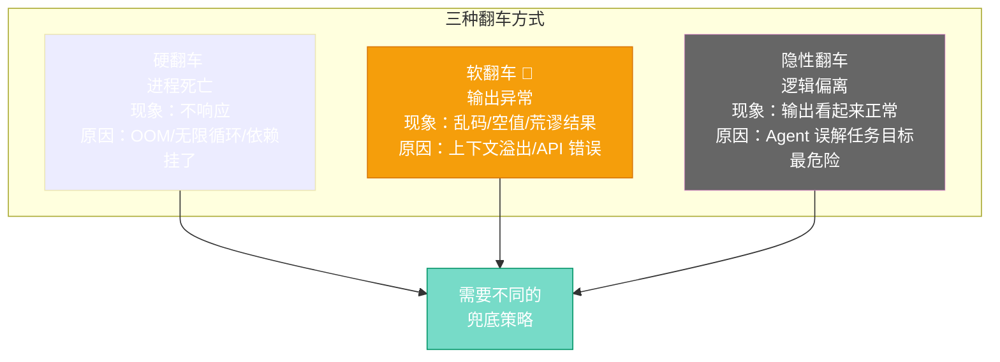

# 第十章：罗伯特翻车了怎么办 — 故障恢复与兜底

[English](../en/ch10.md) | [简体中文](./ch10.md)
> **核心观点：AI Agent 不会"累"，但会"崩"。它不会抱怨，不会请病假，但会在你毫无防备的时候突然给你一记"沉默的暴击"——进程挂了，输出为空，或者更糟糕的：输出了一堆看起来正确但实际上是胡说八道的东西。**

## Yason 的踩坑故事

那是一个周六的凌晨三点。

Yason 被手机震醒了——不是闹钟，是监控告警。他迷迷糊糊地打开手机，看到一行让他瞬间清醒的消息：

"Trace Collector 已停止响应，已有 4 小时未收到 span 数据。"

Trace Collector 是 Yason 搭的链路追踪系统，用来收集所有罗伯特的工作日志。它挂了，意味着过去 4 小时里，所有罗伯特的工作记录全部丢失了。

Yason 立刻登录服务器检查，发现进程确实死了——不是被 kill 的，是自己挂掉的。日志里的最后一条记录是一个 out-of-memory 错误。

"4 个小时，我的罗伯特们都在干什么？不知道。干了什么？也不知道。"

他花了两个小时恢复服务，然后又花了一个小时回看日志，试图拼凑出那 4 小时里发生了什么。最后发现：Kai 执行了一个大任务，占用了大量内存，把 Collector 挤爆了。

"我的罗伯特团队有了工业化的产出，但没有工业化的容错。就像一台没有安全阀的蒸汽机——能干活，但随时可能炸。"

## 问题：AI 系统的"寂静崩溃"

人类团队出问题了，会有人喊"出事了"。AI Agent 出问题了，它什么都不会说——它只是安静地停下来，或者更糟糕地：安静地做错事。

Yason 总结了 AI Agent 的三种"翻车"方式：



**1. 进程死亡（硬翻车）**

- 现象：进程挂了，不响应了
- 原因：内存溢出、无限循环、依赖服务挂了
- 后果：任务中断，需要手动重启

**2. 输出异常（软翻车）**

- 现象：进程还在跑，但输出的是乱码、空值、或者荒谬的结果
- 原因：上下文溢出、模型输出异常、API 返回错误格式
- 后果：更危险——看起来正常，实际上是错的

**3. 逻辑偏离（隐性翻车）**

- 现象：输出看起来没问题，但方向完全错了
- 原因：Agent 自己"误解"了任务目标
- 后果：最危险——可能要等到下游发现时才意识到问题

每种翻车都需要不同的兜底策略。

## 兜底策略一：Fallback 链

Yason 给罗伯特军团设计了一套 **Fallback 链**——不是"如果 A 不行就用 B"，而是一条有优先级的降级路径：

```plaintext
第一选择：Coordinator（协调器）
  ↓ 不可用
第二选择：代码 Agent
  ↓ 不可用
第三选择：通用 Agent
  ↓ 不可用
第四选择：通知 Yason 人工介入
```

这条链的逻辑是：**越上层的越聪明但越容易挂，越下层的越稳定但不一定适合复杂任务。**

Yason 不在每个任务里都跑整条链——那太慢了。他只在第一个选择失败时才快速降级，降级过程控制在 3 秒内。

## 兜底策略二：熔断机制

Fallback 链能解决 Agent 挂了的问题，但没办法解决"Agent 没挂但一直在做错事"的问题——也就是软翻车和隐性翻车。

对于这些问题，Yason 设计了**熔断机制**：

- **时间熔断**：一个任务超过预期时间 N 倍还没完成 → 自动中断，报告给 Yason
- **质量熔断**：Verifier 连续 3 次检查不通过 → 自动中断，不是重试，是停下来分析原因
- **成本熔断**：单任务消耗超过预算 → 自动中断，等 Yason 确认

熔断不是"失败"，而是"安全停靠"。就像飞机发动机起火时，不是继续飞，而是找一个最近的地方迫降。

Yason 说："告诉罗伯特'做不完不要停'，是错的。应该告诉它'如果遇到问题解决不了，停，告诉我为什么停'。"

## 兜底策略三：状态恢复

Agent 挂了之后，最难的不是重启，而是**恢复状态**。

假设 Kai 执行一个多步骤任务：下载数据 → 清洗数据 → 分析数据 → 生成报告。结果在"清洗数据"这步挂了。重启之后，它应该：

- (A) 从头开始
- (B) 从"清洗数据"这步开始
- (C) 先检查数据状态再决定从哪步开始

Yason 选的是 (C)。

他的做法是：**每个任务执行前先记录状态快照（State Snapshot），标明"哪些步骤已经完成，哪些还待完成"。** Agent 重启后先读 Checkpoint，判断当前状态，接着干。

Checkpoint 文件很小——几十个字节，但作用巨大。没有它，Agent 挂了就是一场灾难。有了它，Agent 挂了就是一次"插曲"。

```yaml
task: data-pipeline-2026-05-21
status: in_progress
completed_steps:
  - download_data (OK, output: /tmp/raw/2026-05-21.csv)
  - clean_data (OK, output: /tmp/cleaned/2026-05-21.csv)
current_step: analyze_data (in_progress, started_at: 14:32:15)
```

## 自动恢复 vs 人工介入

Yason 给不同的故障设了不同的恢复策略：

**自动恢复（无需人类介入）：**

- 进程挂了 → 自动重启，读取 Checkpoint 继续
- API 超时 → 自动重试（最多 3 次）
- 临时性错误 → 等待 30 秒后重试

**需要通知人类：**

- 连续 3 次自动恢复都失败
- 触发了成本熔断
- 涉及安全问题的故障
- 超过 30 分钟没有进度更新

Yason 的哲学是：**能自动恢复的自动恢复，不能自动恢复的及时叫人。** 机器处理常见问题，人类处理异常情况。

## 结尾

Yason 有一次跟朋友聊到 AI Agent 的可靠性，他说了一句特别精辟的话：

**"人类团队出 bug 的时候会主动说'搞砸了'，AI 不会——它只会安静地把下一个命令也搞砸。"**

所以故障恢复不是 AI Agent 的额外功能，而是标配。你不需要一个永远不会出错的系统——你需要一个出错了也能快速恢复的系统。

---

**💬 你的 AI Agent 出过什么让你猝不及防的"翻车"？你是怎么兜底的？**
