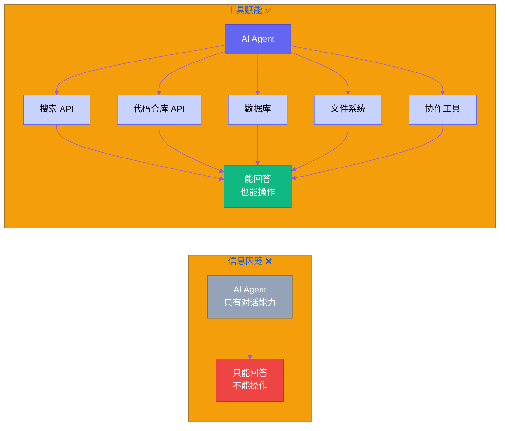
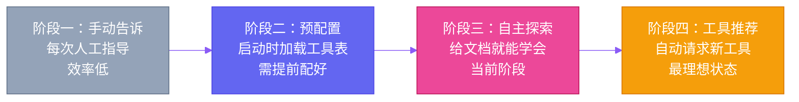

# 第十一章：给罗伯特一把好工具 — 工具生态与 API 集成

[English](../en/ch11.md) | [简体中文](./ch11.md)
> **核心观点：一个只会对话的 AI Agent，就像一把没有子弹的枪——看起来很厉害，但真正要用的时候你会发现它什么都干不了。罗伯特们的真正价值，不是它们有多聪明，而是它们能调用多少工具。**

## Yason 的踩坑故事

Yason 早期跟罗伯特们协作时，遇到一个很尴尬的问题。

他让 Kai "去查一下代码仓库里有多少个未处理的 bug"。Kai 说："好的，我正在查。"然后过了 30 秒，Kai 说："我查完了，但我只能告诉你，请你自己打开浏览器去看。"

Yason 愣住了。

他意识到一个问题：**Kai 只是一个会说话的大脑，没有手和脚。** 它可以推理、分析、给出建议，但不能做任何实际操作——不能发 HTTP 请求、不能读写文件、不能执行 Shell 命令。它被困在了对话框里。

就像一个顶尖的程序员被关在一个没有电脑的房间里——你问他任何技术问题他都能答如流，但你让他"修一下这个 bug"，他只能摊摊手。

Yason 后来开玩笑说："我招了一个'纸上谈兵'的罗伯特，它什么都知道，什么都干不了。"

## 问题：AI 的"信息囚笼"

大部分 AI Agent 有一个共性：**它们活在训练数据的时代里，不知道现实世界正在发生什么。** 你问它们"今天的天气怎么样"，它们只能告诉你它训练数据里最后一次看到"天气"这个词是什么时候。

这不是它们笨，这是它们的**信息边界**——没有外部输入，它们只能靠自己的训练数据"猜"。

要打破这个囚笼，只有一种方式：**给 Agent 接上外部工具。**

- 接上搜索 API → 它知道最新新闻
- 接上代码仓库 API → 它能操作代码
- 接上数据库 → 它能查询业务数据
- 接上文件系统 → 它能读写文件
- 接上团队协作工具 → 它能发消息

每一根"线"都拓展了罗伯特的能力边界。



## 工具注册：给罗伯特一张"地图"

Yason 的早期做法是：在每次任务里手动告诉 Kai "你可以用这些工具"。后来他发现这太蠢了——每次都要重复说一遍，而且还可能漏掉。

他建了一个叫 **工具注册表（Tool Registry）** 的东西。它实际上就是一个配置文件，列出了所有罗伯特能用的工具：

```yaml
tools:
  - name: code_repo_api
    description: "访问代码仓库的 Issues、PR、代码"
    endpoint: "https://api.example.com"
    auth: "token"
    methods: ["GET", "POST"]
    rate_limit: 5000/hour

  - name: file_manager
    description: "读写和管理本地文件"
    scope: "/home/kai/workspace"
    operations: ["read", "write", "list", "delete"]
    max_size: "100MB"

  - name: shell_exec
    description: "执行 Linux 命令"
    allowlist: ["python3", "node", "git", "ls", "cat", "grep"]
    timeout: 30s

  - name: team_messaging
    description: "发送团队消息"
    scope: "channels: #general, #dev-team"
    methods: ["send_message", "read_thread"]
```

这个注册表就是罗伯特的"工具地图"。它们不再需要在每个任务里被告知"你能用什么"，而是启动时自动加载，自己根据任务需求选择合适的工具。

## API 集成：让罗伯特学会"打电话"

工具注册表只是目录，真正的能力来自于 **API 集成**。

Yason 发现，罗伯特最强大的能力不是推理，而是**编排**——它能像交响乐指挥一样，把多个 API 调用串联起来完成一个复合任务。

一个典型的多步骤任务：

```plaintext
→ 调用代码仓库 API 获取 issue 列表
→ 调用数据库 API 查询问题对应客户
→ 调用团队协作 API 发送通知给客户
→ 调用消息 API 在团队群里更新进度
```

整个过程对罗伯特来说就是：按顺序调用几个 API，把上一个 API 的输出作为下一个 API 的输入。没有一步是需要"聪明才智"的，但组合起来就是实实在在的生产力。

Yason 说："罗伯特的价值不在于它能回答多难的问题，而在于它能一个人干完三个人的活——而且不用开会。"

## 工具学习的进化

Yason 的罗伯特们使用工具的方式在四个阶段里不断进化：



**阶段一：手动告诉（零级）** — "Kai，你用 API 查一下 issues，用这个 token，请求这个 URL……" → 效率低，每次都要人工指导

**阶段二：预配置工具（初级）** — Kai 启动时就加载了工具注册表，知道它能用哪些工具 → 不需要人工指导，但必须提前配好

**阶段三：自主探索（中级）** — 罗伯特在执行任务中可以自己发现和理解新工具 → 给它一个 API 文档链接，它能自己学会调用

**阶段四：工具推荐（高级）** — 罗伯特根据任务上下文，自动推荐它需要的工具 → 最理想的状态，但需要完善的安全策略兜底

Yason 目前卡在阶段三——罗伯特能学会新工具，但它不会主动告诉 Yason"我需要一个新工具"。这不是技术问题，而是设计问题：**AI 不会要东西，你需要主动给它。**

## 实践：一次完整的工具链调用

Yason 有一次让 Kai "把今天所有新用户的注册信息整理好，发到团队群里"。

Kai 执行的过程：

```plaintext
1. 调用数据库 API → 查询今天的注册记录（返回 47 条）
2. 调用数据处理脚本 → 统计出：新用户数、来源渠道分布、注册完成率
3. 调用团队协作 API → 把整理好的报告发到运营群
4. 调用消息 API → 在海外团队群也发一份英文版
```

整个过程不超过 5 分钟。所有操作都是自动化的，Kai 只是按顺序调用了 4 个 API——没有任何一步需要"思考"，但完成了需要一个人半天才能做完的工作。

这就是工具赋予罗伯特的力量：**不靠聪明，靠生态。**

## 结尾

Yason 有一次在复盘时说了一句话，我印象特别深刻：

**"不要问 AI 能做什么，要问你能给 AI 提供什么工具。一个 AI + 一个工具 = 一个员工。一个 AI + 十个工具 = 一支团队。"**

你的罗伯特懒、笨、效率低？大概率不是它的问题——是你给它的工具太少了。

---

**💬 你的 AI Agent 接入了哪些工具？最常用的工具箱是什么？**
