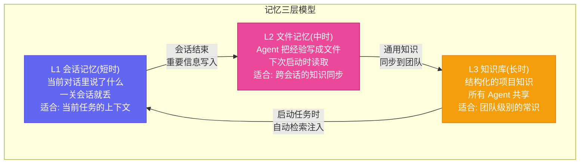

# 第十二章：罗伯特的大脑 — 知识库与记忆体系升级

[English](../en/ch12.md) | [简体中文](./ch12.md)

> **核心观点：罗伯特的能力上限，不取决于它用了什么模型，而取决于它的记忆系统有多强。一个没有知识库的 AI Agent，就像一个读过万卷书但失忆了的人——什么都学过，什么都不记得。**

## Yason 的踩坑故事

Yason 曾经反复教 Kai 同一件事。

第一次，他告诉 Kai："我们项目的 API 风格是 RESTful，URL 路径用 kebab-case，响应格式统一用 `{code, data, message}`。"

Kai 说："明白了。"然后写了一整周符合规范的代码。

第二周，Yason 让 Kai 写一个新接口。Kai 写出来的代码风格完全不一样——camelCase 的 URL，`{success, result}` 的响应格式。Yason 问："你忘了上周我说的规范了？"

Kai 说："我没忘，但这次的任务描述里没有提到规范，我就用了默认风格。"

Yason 崩溃了。

他跟 Kai 说的是"你知道了"，但 Kai 的理解是"你在这个任务里知道了"——跨任务的知识传递，对 AI 来说是默认不发生的。每个任务都是一个新的世界，它不会自动把上个任务学到的"常识"带过来。

这就是 Yason 遇到的**记忆断层问题**：AI Agent 在单次会话里表现完美，跨会话就变成了"第一次见面"。

## 问题：AI 的记忆层级

Yason 后来画了一张图，把罗伯特的记忆分为三层：



Yason 早期只有 L1——所以 Kai 才"每周失忆一次"。后来他加了 L2——文件记忆——Kai 终于能记住上周的 API 规范了。但还不够——因为每个 Agent 只记得自己的文件，Kai 记得的 Rex 不知道，Rex 记得的 Kai 不知道。

最终搭建 L3 知识库的时候，才真正解决了问题。

## 文件记忆：让罗伯特"记笔记"

Yason 给每个罗伯特配了一个"日记本"——一个结构化的记忆文件，放在罗伯特的 workspace 里。

记忆文件的内容：

```yaml
# Kai 的记忆文件
last_session: 2026-05-21
projects:
  - name: user-api
    status: active
    api_style: RESTful, kebab-case, {code, data, message}
    current_tasks: []
  - name: data-pipeline
    status: done
    output: /data/processed/2026-05-21.csv
learnings:
  - "用户注册流程的 email 字段不要用 camelCase"
  - "数据库连接池默认 10 不够，要设成 20"
```

每次会话开始，罗伯特先读这个文件。每次会话结束，罗伯特更新这个文件。

这套机制让 Kai 从一个"每周失忆症患者"变成了一个"有工作笔记的工程师"。它不需要重新学一遍项目上下文，因为它在"笔记"里已经记过了。

## 知识库：让整个团队共享记忆

文件记忆解决了"单个 Agent 的跨会话失忆"，但没解决"多个 Agent 之间的知识孤岛"。

Kai 发现了一个很好的模型调参经验——写进了自己的记忆文件。Rex 不知道，下个月又踩了同一个坑。

Yason 的解法是**团队知识库**——一个独立于任何 Agent 的共享存储空间，所有罗伯特都能读写。

知识库的结构：

```plaintext
wiki/
├── api-standards.md        # API 规范
├── deployment-guide.md     # 部署指南
├── model-benchmarks/       # 模型评测
│   ├── 2026-05-01.md
│   └── 2026-05-15.md
└── runbooks/               # 操作手册
    ├── restart-server.md
    └── rollback-release.md
```

知识库的核心设计原则：

1. **谁都能写**：任何罗伯特发现新知识，直接写入知识库
2. **谁都能读**：任何罗伯特启动任务时，自动检索相关知识
3. **版本管理**：每次更新都是 Git 提交，可追溯可回滚

这个知识库后来成了罗伯特军团的"集体大脑"。Kai 昨天学到的东西，Rex 今天就能直接用。不再有"知识孤岛"。

## 检索增强：让知识"主动浮现"

知识库建好之后，Yason 发现了一个新问题：**罗伯特不知道什么时候该查知识库。**

它写 API 的时候，不会主动去查 API 规范文档。除非你在任务里明确说"先查 api-standards.md"。

Yason 的解决方案是**自动检索**：

1. 罗伯特接到一个任务
2. 系统自动提取任务关键词
3. 在知识库里搜索最相关的 3-5 条记录
4. 把搜索结果作为上下文注入到罗伯特的 prompt 里
5. 罗伯特开始执行任务

这个过程对罗伯特是透明的——它不需要自己"记得去查"，因为知识已经提前铺到它面前了。

Yason 说："知识库就像一个自动化的同事，每次都提前把你需要的资料放在桌子上。你不用自己去翻，它已经摆好了。"

## 实践：一次记忆系统驱动的任务

Yason 让 Kai "写一个新的数据导出接口"。

系统自动执行：

```plaintext
1. 读 Kai 的记忆文件（L2）
   → 找到"上次项目的数据表结构"
2. 查知识库（L3）
   → 找到 API 规范、导出格式标准、相关代码示例
3. 注入到 prompt
   → Kai 的 prompt 里已经包含了所有需要的上下文
4. Kai 开始写代码
   → 规范的 API 风格、正确的数据格式、标准的错误处理
```

整个过程不需要 Yason 手动输入任何上下文。记忆系统自动完成了"把知道的东西送到需要的地方"这个工作。

## 结尾

Yason 后来总结过一句话：

**"模型决定了罗伯特的下限，记忆系统决定了罗伯特的上限。给我一个中等模型配上完美的记忆系统，它比一个顶级模型配上空白记忆要强十倍。"**

这不是比喻。一个知道自己该做什么的 AI，比一个什么都会但不知道从哪开始的 AI 强太多了。

---

**💬 你的 AI Agent 有记忆系统吗？是文件记忆还是知识库，还是两者都有？**
