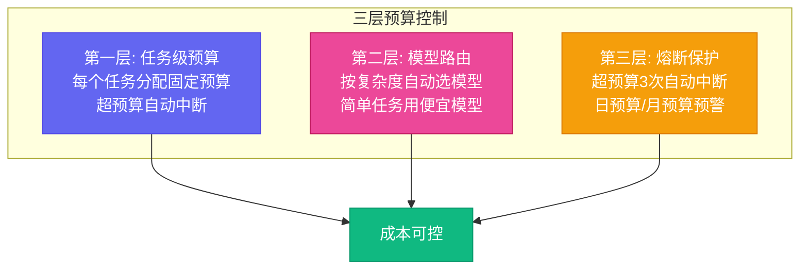

# 第十四章：别烧冤枉钱 — 预算管理与成本控制

[English](../en/ch14.md) | [简体中文](./ch14.md)
> **核心观点：让一个顶级模型写一封"你好"的邮件，就像用航天飞机送外卖——能到，但没必要。罗伯特军团的成本控制，不是"省钱"，而是"让每一分钱花对地方"。**

## Yason 的踩坑故事

月底，Yason 收到了 API 账单。

他看了一眼数字，以为自己看错了。再看一眼，确认没看错。然后他默默地打开了一个电子表格，开始算账。

账单上最大的几笔支出：

1. 一个顶级模型在某天跑了数百万 token — 但那天做的任务只是"整理产品文档"
2. 某个非高峰时段，三个不同的罗伯特同时调用同一个高级模型做差不多的任务
3. 一个模型在无意义的循环里反复调用自己，消耗了大量 token

Yason 盯着账单看了十分钟，说了一句话："我不是在管理罗伯特，我是在烧钱。"

他回想了一下这些支出是怎么产生的：

- "整理产品文档" — 他用默认配置启动了任务，没指定模型优先级
- "三个罗伯特同时调用" — 他开了三个并行任务，没做模型共享
- "无意义循环" — 某个任务卡住了，模型在反复重试同一个操作

核心问题只有一个：**他没有给罗伯特设定成本预算，罗伯特也不知道自己"花了多少钱"。**

## 成本意识：罗伯特没有，你必须有

AI Agent 跟人类有一个很大的不同：**人类知道自己做的事"值不值"。**

一个人类员工，你让他"写一封邮件"，他不会想着用最贵的纸和笔来写。他有天然的"成本直觉"——什么值得花时间，什么不值得。

AI Agent 没有这个直觉。它会用最好的模型去写最简单的邮件，因为"最好的"和"最合适的"对 AI 来说是两个不同的概念。AI 不知道成本的存在，除非你告诉它。

Yason 后来总结了一句话：**"罗伯特不会帮你省钱，你需要帮罗伯特省钱。"**

## 三层预算控制

Yason 给罗伯特军团设计了三层预算体系：



### 第一层：任务级别预算

每个任务分配固定预算：

```plaintext
任务：整理产品文档
预算：10 万 token 或极低成本
模型：优先使用免费模型
策略：超预算自动中断，不要继续
```

### 第二层：模型路由

Yason 建了一个**模型路由表**，根据任务复杂度自动选择模型：

| 任务类型 | 推荐模型级别 | 相对成本 |
|-|-|-|
| 简单回复、文本格式化 | 免费模型 | 极低 |
| 常规编程、内容生成 | 中等模型 | 中等 |
| 深度推理、架构设计 | 顶级模型 | 较高 |
| 技术方案评审 | 多模型混合 | 视情况 |

路由表的逻辑很简单：**把简单任务交给便宜模型，把复杂任务交给贵模型。** 不浪费。

### 第三层：熔断保护

当预算超出预期时，不继续硬跑，而是停下来：

```plaintext
如果单任务消耗 > 预算 × 2 → 自动中断，通知 Yason
如果单日总消耗 > 日预算 → 暂停所有非关键任务
如果单月总消耗 > 月预算的 80% → 预警通知
```

熔断不是"没钱了"，而是"该看看为什么花这么多了"。

## 薅羊毛指南：免费模型怎么用

Yason 发现，免费模型的性价比比他想象的要高得多。很多日常任务，免费模型已经够用了。

他的经验是：

- **简单任务（约 80%）**：免费模型就够了 — 回复邮件、整理文档、简单编程
- **中等任务（约 15%）**：用便宜的中端模型 — 内容创作、代码审查、数据分析
- **复杂任务（约 5%）**：才需要用顶级模型 — 架构设计、深度推理、战略分析

Yason 说："80% 的任务都应该用免费模型解决。不是因为免费的好，而是因为这 80% 的任务不值得花一分钱。"

## 实践：一次成本优化的案例

Yason 发现自己的 API 账单每月在涨，于是做了一次审计：

**优化前：**

- 每天大量 token 消耗
- 约 80% 跑在顶级模型上
- 月账单：较高

**优化后：**

- 每天 token 消耗更多了（任务更多了）
- 约 15% 跑在顶级模型上，70% 免费模型，15% 中端模型
- 月账单：降至原来的约 1/5

成本下降了约 80%，产出反而增加了——因为省下来的钱被重新投到了更多的免费模型任务上。

Yason 说："省钱本身不是目的。目的是用同样的钱，让罗伯特干更多的活。"

## 结尾

Yason 后来把预算管理总结成了一条铁律，贴在墙上：

**"每次让罗伯特干活之前，先问自己：这个任务，值多少钱？"**

如果你愿意为一个任务付 1 美元，那就用 1 美元的模型。如果你只愿意付 1 分钱，那就去找免费的方案。AI 不会抱怨工资低，但你的账单会。

---

**💬 你的 API 账单一个月多少钱？有没有发现过"拿航天飞机送外卖"的任务？**
