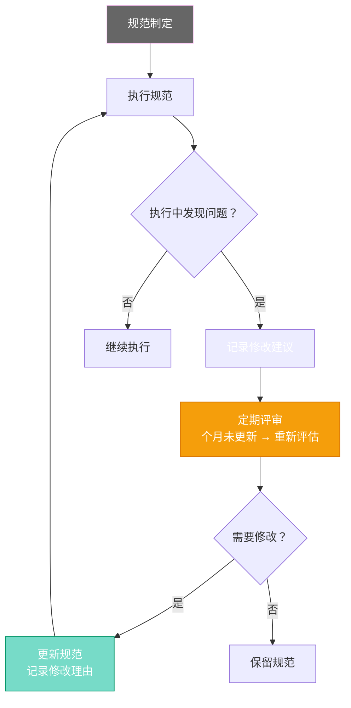

# 第十五章：罗伯特的文化建设 — 团队规范与行为准则

[English](../en/ch15.md) | [简体中文](./ch15.md)

> **核心观点：AI Agent 不需要企业文化，但它们需要行为规范。不叫"文化"，叫"约束"——但你得承认，一个好的约束体系，就是 AI 时代的"企业文化"。**

## Yason 的踩坑故事

Yason 的罗伯特团队一开始没有"规矩"。

每个罗伯特的行为方式不一样。Kai 喜欢把所有信息写在一个长长的 markdown 文件里。Rex 更喜欢分文件、分目录、加备注。另一个罗伯特的输出风格又不一样——它习惯在每段后面加 emoji。

一开始 Yason 觉得"这是个性，挺好的"。两周后，他开始抓狂了：

- 找 Kai 的历史记录，要在 10 个 markdown 文件里翻
- 找 Rex 的历史记录，要在一个文件夹树里慢慢爬
- 看另一个罗伯特的报告，满屏的 emoji 让他眼花

而且更严重的问题是：当 Kai 和 Rex 要协作时——Kai 看不懂 Rex 的目录结构，Rex 读不懂 Kai 的总结方式。它们效率很高，但在"共同语言"上完全没有对齐。

Yason 后来反思："我给罗伯特配了个性，但没给他们配共同的'语法'。"

## 规范一：输出格式标准化

Yason 做的第一件事，是给所有罗伯特定了一套输出格式标准。

**报告结构：**

```plaintext
## 任务概述
- 任务名称：[名称]
- 执行时间：[时间]
- 状态：[完成/进行中/失败]

## 执行过程
[执行步骤，按时间顺序]

## 输出结果
[核心输出]

## 备注
[异常、发现、建议]
```

**文件命名规则：**

```plaintext
YYYY-MM-DD_task-name_v1.md
YYYY-MM-DD_task-name_v2.md
```

**通信规范：**

- 报告问题：先写现象，再写原因，再写建议
- 请求确认：明确写"需要你确认：是/否"
- 进度更新：只说"完成了什么"和"卡在哪里"

Yason 没有花时间教罗伯特"什么是好的输出风格"。他直接写了一份规范文件，放在知识库里，让每个罗伯特在启动时自动加载。

效果立竿见影——Kai 和 Rex 的输出格式统一了，Yason 不再需要在不同的格式之间"翻译"。

## 规范二：命名哲学——让名字有意义

Yason 的罗伯特名字是有含义的，但他发现罗伯特自己不理解这些含义。

"Kai" — 开发（开发者的开）"Rex" — 质量（QA / SRE）"Max" — 管理（最大/最高）

Yason 在规范里加了一条：**每个罗伯特在自我介绍时必须说明自己的职责范围。** 这样当 Kai 和 Rex 协作时，Kai 知道 Rex 负责测试与运维相关的任务，不会把代码审查的活错派给 Rex。

听起来很简单，但 Yason 发现这个"自我介绍"机制解决了很多协作混乱——当罗伯特知道"谁是干什么的"之后，任务分派出错率下降了约 60%。

## 规范三：反馈回路——让规范自我进化

最让 Yason 意外的是：**规范本身也需要被规范。**

他定了一套输出格式，用了一个月后，发现很多地方不适用了。改了一次。又过了一个月，又要改。

后来他加了这样一条规则：**每条规范都附带"最后更新日期"和"修改理由"。** 如果某个规范超过 3 个月没有更新，系统自动提议重新评估这个规范是否需要保留。

罗伯特自己也可以提建议修改规范——如果它在执行任务时发现某个规范不合理，允许它记录一条"规范修改建议"。



Yason 的规范体系最终变成了一个活的东西——不是静态的规则，而是随着实践不断进化的"团队宪法"。

## 结尾

Yason 有一次被问到"AI Agent 需要企业文化吗"，他想了想说：

**"AI Agent 不需要企业文化，它们需要的是可执行的规范。但如果你问我会不会给罗伯特们讲'我们的使命和愿景'——不会。它们不需要信仰，它们需要知道怎么做。"**

---

**💬 你的 AI Agent 之间有统一的行为规范吗？还是各做各的？**
