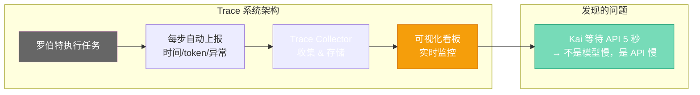

# 第十六章：看穿罗伯特 — 可观测性与性能监控

[English](../en/ch16.md) | [简体中文](./ch16.md)
> **核心观点：一个看不见内部运行状态的 AI 系统，就像一个黑箱——你知道它输入了什么、输出了什么，但中间发生了什么你一无所知。当它出错时，你只能猜。**

## Yason 的踩坑故事

Yason 有一天发现，Kai 最近几天的"效率"好像下降了。

以前一个任务 30 分钟搞完，现在要 1 个小时。Yason 问了 Kai："你最近是不是变慢了？"

Kai 回答："没有，我一直在正常工作。"

Yason 又问："那为什么这个任务花了 60 分钟？"

Kai 说："我不确定，我的时间感知不准确。"

Yason 发现自己陷入了一个经典的困境：**他想排查问题，但没有任何数据。** 没有日志、没有指标、没有调用链。他只知道"变慢了"，但不知道是因为：

- 模型变慢了（API 延迟增加）？
- 任务变复杂了（prompt 更长）？
- 系统负载高了（其他任务抢资源）？
- 还是 Kai 在某个步骤上卡住了？

没有数据，所有推测都是猜。

## 问题：AI 系统的"可观测性黑洞"

传统软件系统有日志、指标、追踪。出问题了你看日志、查监控、看调用链——几分钟就能定位。

AI Agent 系统不是这样的。Agent 的"工作过程"发生在模型的黑箱里——它想了什么、推理了哪几步、在哪个节点犹豫了——这些信息如果不主动记录，就永远丢失了。

Yason 后来形容："传统软件像是透明的房子——你能看到里面每个房间在干什么。AI Agent 像是一个神秘的黑箱——你只能敲门问'干完了吗'。"

## Trace 系统：给罗伯特装一个"行车记录仪"

Yason 搭了一套 **Trace 系统**——核心功能是记录罗伯特执行任务时的每一步。

Trace 记录的信息：

- 每个任务的开始时间和结束时间
- 每步调用了哪个模型、用了多少 token
- 从上一步到下一步的耗时
- 任何异常或错误

这套系统有点像飞机的黑匣子——它不干预飞行，但记录一切，出了事就能回放。

Yason 用了一个开源的链路追踪工具来做这件事。每个罗伯特在执行任务时，自动把每一步的"痕迹"发送到 Collector。Collector 把数据存起来，做成可视化看板。

装上 Trace 系统的第一周，Yason 就发现了一个问题：Kai 在某个步骤上平均要等 45 秒——不是因为 Kai 在思考，而是因为它在等待一个外部 API 返回。不是模型的问题，是 API 太慢了。

如果没有 Trace 系统，Yason 可能会花一周时间调模型参数，而实际问题是 API 调用。



## 健康检查：给罗伯特"量体温"

除了 Trace，Yason 还建了一个健康检查系统——每隔一段时间检查罗伯特是否"活着"并且"正常"。

健康检查的指标：

- **存活检查**：进程是否在运行？
- **响应检查**：能正常接收和回复消息吗？
- **性能检查**：任务完成时间是否在正常范围内？
- **质量检查**：最近的输出有没有出现异常模式？

如果某个检查连续三次不通过，系统自动执行恢复流程——先重启，再通知 Yason。如果 Yason 没回复，发短信。

Yason 说："罗伯特不需要体检，但它需要监控。它不会告诉你它不舒服，但它会安静地坏掉。"

## 看板：一张图看全队状态

Trace 和健康检查的数据最终汇总到一个 **监控看板**上。Yason 每天早上打开看板，用 30 秒扫一眼全队状态：

```plaintext
Kai      ● 正常  | 今日已完成 5 个任务 | 平均耗时 12 分钟
Rex      ● 正常  | 今日已完成 2 个任务 | 平均耗时 28 分钟
工作流    ● 正常  | 管线已运行 7 小时
Collector ● 正常 | 存储使用 45%
```

**绿色** = 一切正常，不用管
**黄色** = 有异常但自动恢复处理了，看一眼
**红色** = 有问题需要手动介入

这个看板让 Yason 从"被动响应"变成了"主动查看"。他不再等罗伯特出问题了来找他，而是每天扫一眼状态，心里有数。

## 结尾

Yason 后来把"可观测性"这件事总结得很简单：

**"如果你不能看到罗伯特的内部状态，你就不是在管理一个团队，你是在养一个猜不透的宠物。"**

它可能很能干，也可能在偷懒耍滑——而你永远不知道。

---

**💬 你有监控你的 AI Agent 吗？还是只管派活，不管过程？**
