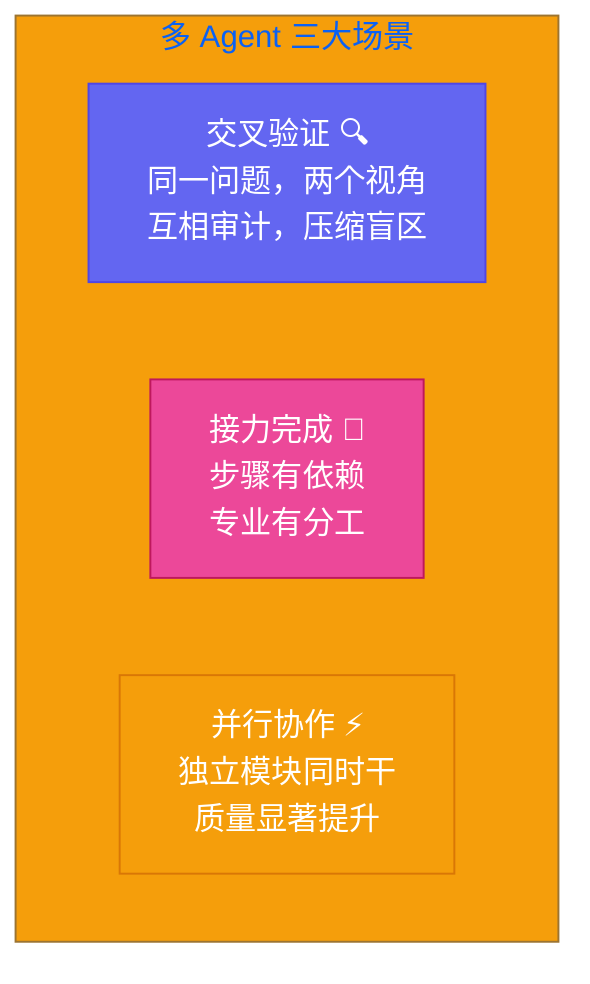
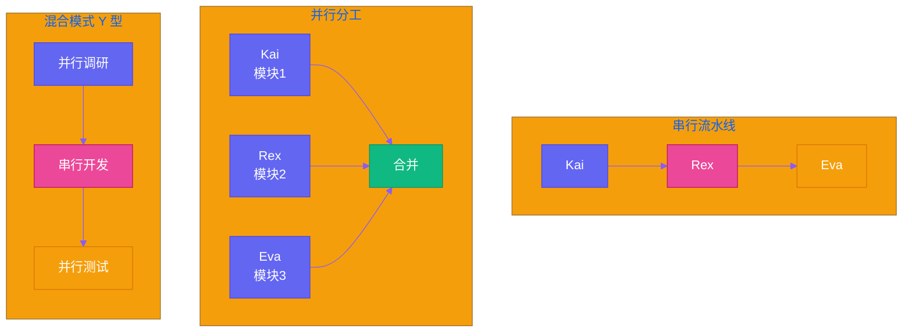

# 第十七章：罗伯特的"复仇者联盟" — 多 Agent 协同作战

[English](../en/ch17.md) | [简体中文](./ch17.md)
Yason 做了一个大胆的决定——让 Kai 和 Rex 同时做一个项目。结果第一天就出事了。

事情是这样的：Yason 接了一个 SaaS 的后端+前端项目，想着两个罗伯特一起干效率翻倍，就让 Kai 负责后端 API，Rex 负责前端界面。安排得明明白白，晚上安心睡觉去了。

第二天醒来一看代码仓库——好家伙，Kai 写了一个用户认证接口，返回的是 `{user_id: 123, token: "xxx"}`，Rex 在前端等着接 `{id: 123, accessToken: "xxx"}`。字段名对不上，接口调不通。这还不算完，Kai 在数据库里把用户状态字段叫 `status`，Rex 的界面里判断的是 `userState`。两个罗伯特各干各的，完全没有沟通过。

Yason 当时就悟了：不是把多个 Agent 扔到一起就能"协同"的，那是群殴，不是团队作战。

## 一个 Agent 搞不定的三种场景

先说清楚，什么时候需要多个 Agent？Yason 总结了三个必须上多 Agent 的场景。

**第一，交叉验证。** 比如你要写一段金融交易代码，Kai 写完逻辑，Rex 去审计。同一个需求，两个 Agent 各自理解一遍，互相检查对方的结果。这不光是代码 review，而是从不同角度验证同一个问题。一个 Agent 写出来的东西，它自己永远觉得是对的——它没有"怀疑自己"这个能力。

**第二，接力完成。** 最典型的例子：Kai 写一个数据清洗脚本，把脏数据处理成结构化数据，然后 Rex 拿着这批数据做分析和可视化。这两个步骤依赖关系明确，但需要不同的专业知识。Kai 懂数据工程，Rex 懂数据展示，一个人（一个 Agent）很难在两个领域都做到最好。

**第三，并行协作。** Yason 踩过的最大的坑就是让一个 Agent 同时搞前端和后端。不是不行，但上下文一长，它就开始串——前端代码里混进后端 import，后端代码里出现 DOM 操作。把不同职责分给不同 Agent，各自专注自己的领域，质量明显提升。



## 通信协议：Agent 之间怎么说话

多 Agent 的第一个问题：他们怎么知道对方的存在？

Yason 试过第一种方案——**直接通信**。让 Kai 干完活直接给 Rex 发一条消息说"我搞定了，接口返回格式是 xxx"。听起来很自然对吧？实际跑起来全是坑。Kai 说"接口写好了"，Rex 问"参数是什么"，Kai 说"你自己看代码"，Rex 说"我看不懂你的代码"——两个 Agent 在对话里来回拉扯了十几轮，最后 Yason 发现他们在争论一个根本不存在的问题。

直接通信的问题是：Agent 之间天然有"信任但验证"的矛盾。Kai 说"我测试过了"，Rex 该不该信？信了可能出 bug，不信就要去验证，验证又要花时间。而且 Agent 之间的对话质量高度不可控，你永远不知道两个 LLM 聊着聊着会拐到什么奇怪的方向去。

Yason 最终换成了**通过中间件通信**。

中间件是什么？说白了就是一个共享的消息总线。Kai 做完一件事，把结果写成结构化消息发到中间件，不指定给谁。Rex 从中间件订阅自己需要的消息。双方不直接对话，都跟中间件对话。

```plaintext
Kai 完成 API 开发 → 发布消息 {type: "api.ready", schema: {...}} → 中间件
Rex 订阅 "api.*" → 收到消息 → 按 schema 生成前端代码
```

这个模式的好处是：解耦。Kai 不需要知道 Rex 的存在，Rex 也不需要知道 Kai。他们只需要遵守同一个消息协议。出了问题也很好排查——看看中间件的消息日志，就知道哪一步出了偏差。

Yason 定义了一套最简单的消息协议，就四个字段：

```json
{
  "event": "task.completed",
  "task_id": "user-auth-api",
  "output": { ... },
  "schema": { ... }
}
```

不多，够用。复杂的协议只会让 Agent 更困惑。

## 共享上下文：让 Kai 知道 Rex 在做什么

通信协议解决的是"怎么说话"，共享上下文解决的是"大家都知道什么"。

Yason 做的第一件事：**建了一个共享的"事实清单"**。这个文件不是什么详细设计文档，就是一个 Markdown 文件，几行字，记录当前项目的关键决策：

```plaintext
# 项目上下文 v3
- 用户认证接口路径: /api/v1/auth/login
- 返回字段: {id, email, token}
- 用户状态字段名: status (取值: active/inactive/suspended)
- 前端使用: React + Tailwind
- 数据库: PostgreSQL
```

每个 Agent 启动时，先读这个文件。每次做出关键决策，更新这个文件。所有人都以这个文件为准。

你可能觉得——这太原始了吧？对，原始但有效。Yason 试过更复杂的方案，比如把上下文存到数据库里、用向量检索、自动摘要……全试过。最后发现，Agent 理解复杂系统的能力有限，你给它们一个结构复杂的上下文系统，它们花在"理解上下文系统怎么用"上的时间比干活还多。

简单到极致，就是可靠。

共享上下文里还有很重要的一块：**当前任务依赖图**。Yason 维护了一个简单的 DAG（有向无环图），告诉每个 Agent 当前任务的先后关系：

```plaintext
用户登录API ← 用户数据库设计 ← 需求确认
用户注册页面 ← 用户登录API
仪表盘页面 ← 用户登录API ← 数据模型设计
```

Kai 看到这个图就知道：我必须先做完数据库设计，才能做登录 API。Rex 看到这个图就知道：我得等 Kai 的登录 API 做完才能开始做注册页面。

## 编排模式：串行、并行、混合

有了通信和上下文，下一步是：怎么安排这群罗伯特干活？

Yason 在实践中摸索出三种模式。



**串行流水线**：A 做完 → B 做 → C 做。适合有明确依赖关系的任务。优点是简单，每个 Agent 的输入输出都很清晰。缺点也明显——慢，后面的 Agent 得等前面的。

**并行分工**：A 做模块 1，B 做模块 2，C 做模块 3，最后合并。适合没有依赖的独立模块。并行模式最考验共享上下文——如果两个 Agent 对同一个概念理解不一致，合并的时候就会翻车。

**混合模式**：大部分时候 Yason 用的是混合模式。先并行做独立的前期调研和设计，然后串行走核心开发流程，最后再并行做测试和优化。像一个 Y 型：分岔 → 汇合 → 再分岔。

Yason 把这种编排写成了一个简单的 JSON 配置：

```json
{
  "pipeline": [
    {"phase": "design", "mode": "parallel", "agents": ["kai", "rex"]},
    {"phase": "implementation", "mode": "serial", "agents": ["kai", "rex"]},
    {"phase": "testing", "mode": "parallel", "agents": ["kai", "rex", "eva"]}
  ]
}
```

同样，简单到极致。复杂的编排引擎 Yason 也写过，最后发现——你越是想让编排自动化，就越需要处理各种边缘情况。所以 Yason 选择了半自动编排：他制定计划，Agent 执行，他调整。

## 实战中的三个大坑

Yason 在多 Agent 协同上踩的坑，三个最值得说。

**死锁**。有一次 Kai 在等 Rex 提供前端组件定义，Rex 在等 Kai 提供后端数据结构。两个 Agent 都在"等待对方先动"，项目停滞了整整半天。Yason 后来加入了一条规则：在任何等待状态下，超过 5 分钟没有进展，Agent 必须上报，不能自己干等。同时引入了一个"协调者"角色，主动检查有没有死锁。

**资源竞争**。两个 Agent 同时修改同一个文件。Kai 改第 50 行，Rex 改第 80 行，git merge 没冲突，但逻辑冲突了——Kai 改了一个函数签名，Rex 在同一函数里加了新逻辑，用的还是老签名。Yason 的解决方案是：在共享上下文中加了一个"文件锁"列表。谁在改什么文件，写进去。其他人如果要改同一个文件，先读一下，确认没有冲突再动手。

**状态不一致**。最头疼的问题。Kai 以为用户注册流程结束了就发欢迎邮件，Rex 以为注册结束后还要走一个审核流程。两个 Agent 对"注册完成"的定义不一样。这个问题没有完美的技术解法，Yason 的做法是在共享上下文中加了一个"术语表"，明确定义每个业务概念的状态和边界。

## 金句时间

写到这里，Yason 想说几句掏心窝子的话。

多 Agent 协同的本质不是什么高深的分布式系统理论，而是**让一群各有所长的机器人学会——闭嘴、听别人说、然后把事情做对**。

单 Agent 拼的是上限——这个罗伯特有多聪明。多 Agent 拼的是下限——最弱的那个环节决定了整个系统的质量。你协调得再好，如果一个 Agent 产出的质量拉胯，整个项目都会被拖下水。

所以多 Agent 协同不是解决了"一个 Agent 太弱"的问题，而是让"多个 Agent 各尽其才"成为可能。前提是——你得让它们能对上话。

Yason 现在每次启动多 Agent 项目前，都会问自己三个问题：

1. 它们知道彼此的"方言"吗？（共享上下文有没有配好）
2. 它们吵架了谁来说了算？（死锁和冲突怎么解决）
3. 它们做出的东西能拼在一起吗？（接口和协议有没有对齐）

三个问题都答得上来了，才敢按下启动键。

---

*下一章预告：第18章「人往哪儿站」——当 AI Agent 包揽了大部分执行工作，创始人的价值到底在哪里？*
