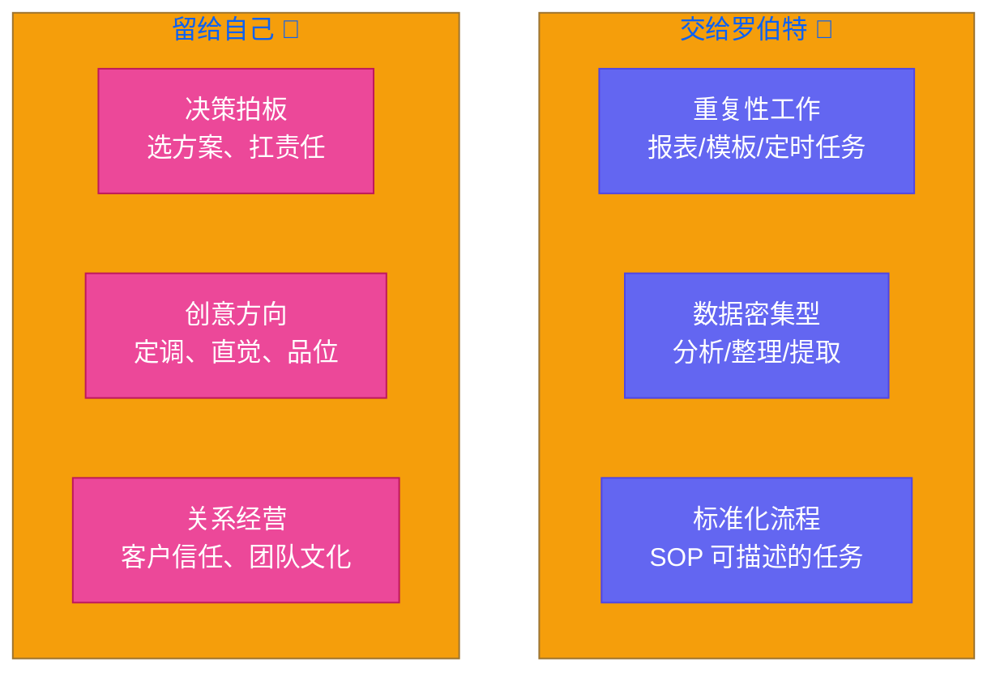

# 第十八章：人往哪儿站 — 人机分工与创始人的自我管理

[English](../en/ch18.md) | [简体中文](./ch18.md)
Yason 最近陷入了一种奇怪的状态。

每天早上打开电脑，他盯着屏幕上排着队的罗伯特们——有写代码的、有做设计的、有写文案的、有分析数据的——然后陷入沉思：**那我呢？**

起初不是这样的。最开始 Yason 是"能交给 AI 的全都交"。但凡手指碰到键盘，他就要先想：这事儿罗伯特能干吗？结果发现，有些事罗伯特干了之后，他反而要花更多时间去改。比如让罗伯特写一封给重要客户的邮件，AI 写得四平八稳、滴水不漏，但客户看了之后的回复是："Yason，你是不是身体不舒服？这不像你。"

客户要的不是完美的措辞，是**Yason 的语气**。

于是他走到了另一个极端：什么都自己干。"算了，罗伯特不靠谱，我自己来。" 又回到了创业初期那个一个人扛所有事的状态。罗伯特们闲置了，他的时间又被琐事填满了，晚上十一点还在改 PPT。

这件事看起来很小，但其实是每一个"有了 AI 助理"的人都会遇到的灵魂拷问：

**人到底往哪儿站？**

## 从「执行官」到「大脑」

Yason 花了两周时间认真想了一个问题：**我自己到底值钱在哪？**

答案是：不在地毯的每一针每线上，而在整张地毯的图案上。

在过去，Yason 是公司的"超级执行者"——写代码、谈客户、做方案、盯运营，他就像一支军队里的特种兵，哪儿需要就往哪儿冲。但罗伯特来了之后，这种模式就彻底过时了。罗伯特们是更好的执行者——它们不睡觉、不抱怨、不犯低级错误、处理信息的速度是人类的上百倍。

如果你还在跟罗伯特抢执行者的角色，你注定会焦虑。

Yason 意识到，他的新定位只有两个字：**大脑**。

大脑不负责打字，不负责排版，不负责逐字逐句地写邮件。大脑只负责一件事：**思考和决策**。肌肉活交给手脚，大脑只需要决定"往哪个方向走"。

这不是什么高大上的理论。Yason 对自己说了一句很朴实的话：

> "我请得起罗伯特了，那我就不该再当罗伯特。"

## 什么交给罗伯特

Yason 总结了三类可以放心交出去的事：

**第一类：重复性工作。** 每天都要做的事、流程固定的事、不需要创造力的体力活。比如每日数据报表、周报模板生成、定时邮件发送。这些活儿罗伯特不会烦，也不会出错。

**第二类：数据密集型任务。** 人类处理 1000 条数据的能力远远不如 AI。Yason 曾经自己花了三个小时整理用户反馈标签，罗伯特三十秒就做完了，还画了词云图。任何需要"从大量信息里提取结论"的事，优先给罗伯特。

**第三类：标准化流程。** 如果你能写出 SOP，那这件事就能交给罗伯特。Yason 把自己"如何接待新客户"的七步流程写成了提示词脚本——开场、需求了解、方案匹配、报价、合同、交付、回访——每一步罗伯特都能完成 80%。

## 什么留给自己

但 Yason 心里有三个"禁区"，绝不交给罗伯特。

**决策拍板。** 罗伯特可以给十个方案，但选哪个是人的事。Yason 说："AI 就像参谋长，它可以给你分析敌情、推演战局、列出十种作战方案。但下令冲锋的那个人，必须是人。" 不是因为 AI 不行，而是因为决策背面的责任，AI 扛不了。当方案失败的时候，客户不会骂 AI，客户会骂 Yason。

**创意方向。** 罗伯特写的文案很好——语法正确、结构清晰、措辞得体。但它写不出"那种感觉"。那种只有 Yason 才知道的、对行业十几年的微妙理解，那种只属于创始人的直觉和品位。Yason 发现，他和罗伯特最好的协作方式是他来定调、罗伯特来执行。他给一个关键词，罗伯特产出十个版本，他选一个再调一调。

**客户关系和团队文化。** 这两件事是纯人类的生意。客户信任的是人，不是系统。团队追随的是人，不是工具。Yason 定了一条铁律：**凡是涉及"关系"的事，AI 可以辅助但不能代理。**

## Yason 的「5% 原则」

有了分工之后，Yason 给自己定了一个极其激进的目标：

> **他只做 5% 的事。剩下 95%，全都交给罗伯特。**

这不是懒。这是创始人的自我管理纪律。

Yason 的逻辑是这样的：如果一件事花五分钟、罗伯特花五十秒，且质量能到 80 分，那一开始就不该碰。那五分钟省下来，去做那件只有他能做的事——判断方向、拍板决策、构建信任。

最开始他很不习惯。手闲下来的时候，他甚至有点慌。做了十年"忙碌的创业者"，突然闲下来让他觉得罪恶。但他坚持住了。两周后他感受到了一种从未有过的状态：**清醒**。

以前被事务淹没的时候，他根本没时间思考。现在他每天有整块的时间去想那些重要但不紧急的问题：半年后我们往哪走？团队结构合不合理？这个客户值不值得继续跟？有什么自己一直在回避但必须面对的事？

这些问题以前他没空想，现在他不得不想了。

## 创始人的时间三层

Yason 把自己的时间画成了三个圈：

**第一圈：管理 AI。** 训练罗伯特、调试提示词、验收输出结果。这部分时间会越来越少——罗伯特学得很快，一个 SOP 教两三遍它就熟透了。

**第二圈：管理业务。** 看数据、盯进度、对方向、沟通协作。这部分 Yason 正在逐渐把它产品化——让罗伯特替他看数据，只把异常报给他。

**第三圈：思考战略。** 这是 Yason 的时间禁区。不被打扰、不开会、不看消息、不回复。每天两小时，雷打不动。

他跟我说了一句话让我印象很深：

> "以前我以为创始人的价值是跑得快，现在我知道创始人的价值是想得远。"

## 最后

现在有人问 Yason 在做什么，他说："我管理一群罗伯特，带几个真人员工，每天工作四小时，但思考十二小时。"

不是每个人都能降维自己的角色。从"什么都要自己干"到"只做最重要的事"，背后是一场和自己的较量。那个把安全感和忙碌感绑定在一起的自己，永远觉得"我多做一点才放心"。

但罗伯特不会帮你解决这个问题。它只会把这个问题放大——让你更清楚地看到，你到底是不敢放手，还是真的需要你。

**人往哪儿站？站在你独一无二的那个位置。**

其他的，交给罗伯特。
