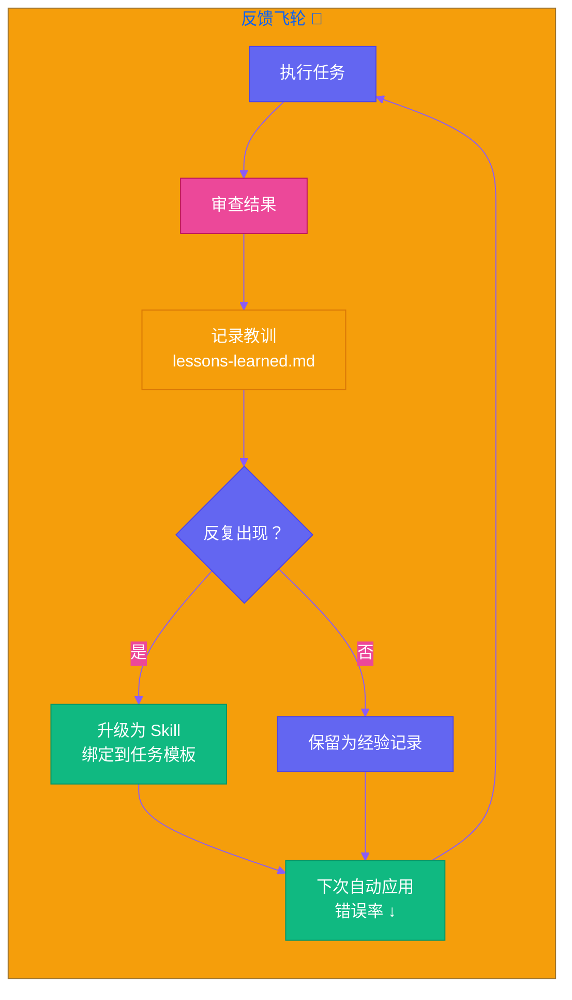

# 第十九章：让罗伯特变聪明 — 反馈循环与持续改进

[English](../en/ch19.md) | [简体中文](./ch19.md)
上个月，我差点把键盘砸了。

事情是这样的。我让罗伯特帮我处理一批客户数据，要求很简单：把表格里的联系方式整理成标准格式，然后发到指定的团队群里。罗伯特第一次做的时候，把手机号中间四位没有脱敏，直接明文发出去了。我赶紧叫停，跟它说："罗伯特，手机号要脱敏，格式是 138\*\*\*\*8888，这是基本的数据安全规范。"

罗伯特乖巧地道歉，重新处理了一遍，这次完美。我挺满意，觉得它又学到了新东西。

过了大概三周，我又有一批新的客户数据需要处理。我信心满满地把任务丢给罗伯特，心想这次肯定没问题了，上次都教过了嘛。结果十分钟后，团队群里出现了一堆完整的手机号，全部裸奔。

我坐在电脑前，盯着屏幕，血压直接拉满。

**我教过它的啊。为什么又错了？**

---

那天晚上，我对着天花板发呆，突然意识到一个残酷的真相：**罗伯特不是人，它不会"记住"。**

我们人类有所谓的"经验"——被开水烫过一次，下次看到水壶会小心。但 AI Agent 不一样，它的记忆就像金鱼，每次任务结束，当前对话一关闭，那次"被教育"的经历就烟消云散了。除非我每次都把之前的教训重新讲一遍，否则它就像一个每次见面都失忆的新同事，永远停留在"第一天上班"的状态。

这不是罗伯特笨，是我笨。我误以为"教一次=学会"，但现实是，AI 需要你**设计一套学习机制**。

说白了，你得给它造一个"错题本"。

---

## 第一步：执行——让罗伯特先干活

这是最简单的部分，也是我们现在每天都在做的。你给罗伯特一个任务，它去执行，输出结果。但这里有个关键点：**执行过程要透明。**

以前我习惯说"帮我把这个处理了"，然后等结果。现在我会要求罗伯特把它的思考过程、执行的每一步都记录下来。比如处理数据时，它要告诉我："我读取了文件，发现有三列手机号，我打算对它们进行脱敏处理……"

为什么？因为**只有看见过程，才能发现错误出在哪一步。**

如果只看结果，你知道它错了，但不知道为什么错。是理解错了指令？是遗漏了某个字段？还是根本没有"数据安全"这个概念？透明的执行过程，是后续所有改进的基础。

我现在给罗伯特的每个任务都加了一个小小的要求：**在最终输出之前，先输出你的执行清单（Checklist）。** 就像飞行员起飞前的检查单一样，一项一项过，这样我能在它犯错之前及时拦截。

---

## 第二步：审查——别当甩手掌柜

这是最容易被忽略的环节，也是我之前摔得最惨的地方。

任务完成不代表结束，那只是中场休息。每次罗伯特交付成果后，我会强迫自己花五分钟做一个**快速审查**。不是粗略扫一眼，而是对照最初的任务要求，逐项核对。

审查的时候，我会问自己三个问题：

1. **结果对吗？** 数据有没有错漏，格式符不符合要求，有没有出现之前犯过的错误？
2. **过程合理吗？** 它有没有走弯路？有没有用更复杂的方法解决了一个简单问题？
3. **有没有意外？** 它有没有做出我没要求但很有价值的补充？或者有没有踩到我没预料到的坑？

这三个问题，帮我从"验收结果"进化到了"复盘过程"。

有一次，我让罗伯特写一个 Python 脚本来批量重命名文件。结果它交付的脚本不仅完成了重命名，还自动备份了原文件。这个"意外"让我意识到，罗伯特在理解需求时，开始具备了一种"防御性编程"的意识。我立刻在审查记录里标注了这一点，并给了正向反馈。

审查不是为了挑错，而是为了**理解它是怎么想的。**

---

## 第三步：记录——把教训变成资产

这是整个反馈循环中最核心的一步，也是让我彻底告别"血压飙升"的秘诀。

我之前教罗伯特的东西，为什么三周后就忘了？因为那些知识只存在于某一次对话的上下文中，没有沉淀下来。

现在我给罗伯特建了一个**"错题本"**，名字叫 lessons-learned.md。每次审查发现问题，或者它表现超出预期，我都会写一条记录进去。格式很简单：

```markdown
## 2024-05-15 | 数据处理-手机号脱敏

**场景：** 批量处理客户联系方式并发送到团队群
**问题：** 手机号未脱敏，直接明文发送
**正确做法：** 所有手机号必须脱敏为 138\*\*\*\*8888 格式
**原因：** 数据安全规范，防止客户隐私泄露
**触发条件：** 任何涉及手机号、身份证号等敏感信息的输出
```

就这么简单。但威力巨大。

因为下次我再给罗伯特类似的任务时，我会在提示词开头加上一句：**"请优先查阅 lessons-learned.md 中的相关经验，避免历史错误。"**

罗伯特会先去读这个文件，找到相关的记录，然后在执行任务时主动应用。它不再是那个"失忆的金鱼"了，它有了**长期记忆**。

更妙的是，这些记录积累多了，开始呈现出模式。我发现罗伯特在处理"数据导出"类任务时容易忽略脱敏；在处理"代码编写"类任务时容易忘记异常处理；在处理"文案撰写"类任务时容易用太正式的语气。这些模式让我能**提前预防**，而不是事后灭火。

**每一次踩坑，都不再是浪费，而是变成了一条知识资产。**

---

## 第四步：改进——从经验到技能

记录只是存档，真正的学习发生在改进环节。

当某条经验教训反复出现时，我就知道，这不是一次性的失误，而是一个**系统性短板**。这时候，我需要做的不是再加一条记录，而是把它升级成一个 Skill。

比如手机号脱敏这件事，出现过两次后，我创建了一个专门的 Skill 文件，叫 `data-privacy-checklist.md`。里面详细规定了：

- 哪些字段属于敏感信息
- 每种信息的脱敏规则是什么
- 在什么场景下必须执行脱敏
- 脱敏后的校验方法

然后我把这个 Skill 绑定到了所有"数据处理"类的任务模板里。从那以后，罗伯特在处理任何涉及客户数据的任务时，都会自动执行这个检查清单。

这就是**从经验到技能的沉淀。**



经验是散落的点，Skill 是连成的线。当 Skill 足够多时，它们会交织成一张网，覆盖罗伯特工作的方方面面。现在我给罗伯特建立了十几个 Skill：代码审查清单、文案风格指南、API 安全规范、会议纪要模板……每一个都是从真实的踩坑经历中提炼出来的。

最棒的是，这些 Skill 是可以**迭代**的。每次发现新的边界情况，我就回去更新对应的 Skill 文件，罗伯特的能力就会跟着进化。它不是在某个对话里"学会"的，而是在一个持续运转的系统中**生长**出来的。

---

## 让罗伯特学会"自我纠错"

做到上面四步，罗伯特已经比绝大多数 AI Agent 聪明了。但我还想更进一步：**能不能让它自己发现问题，而不是等我审查？**

答案是，可以，但需要一点点设计。

我现在给罗伯特加了一个**"自我审查"**的环节。在任务交付之前，它必须先问自己一组问题：

1. 这个输出是否符合任务的所有要求？
2. 有没有触犯任何已知的禁忌（参考 lessons-learned）？
3. 如果我是接收方，看到这个结果会满意吗？
4. 有没有更好的方式可以完成这个任务？

这四个问题，我称之为**"罗伯特四问"**。它必须在最终答案之前，先用独立的段落回答这四个问题。

效果出人意料地好。

有一次，罗伯特在回答一个技术问题时，写完答案后突然在"自我审查"里说："等等，我引用的那个 API 版本是 v2，但用户的环境可能是 v1，这会导致兼容性问题。我需要补充一个版本说明。"

那一刻，我真的感觉它"变聪明"了。它开始具备了一种**元认知**——对自己思考过程的思考。这不是什么魔法，只是通过结构化的自我提问，逼它在输出前多转一个弯。

---

## 循环起来，才叫进化

现在，我的工作流是这样的：

早上，我给罗伯特布置一个任务。**执行**过程中，它输出透明的过程记录。**交付**前，它先做自我审查。**完成后**，我做人工审查，发现问题就记录到 lessons-learned，发现模式就更新到 Skill。**下次**类似任务，它会自动查阅历史经验和相关 Skill，避免重蹈覆辙。

这是一个**飞轮**。每转一圈，罗伯特就聪明一点。一个月下来，它的错误率下降了一大半，而且开始能处理一些我之前没教过的复杂场景——因为它已经掌握了底层的原则，可以触类旁通了。

更重要的是，我的心态变了。

以前我看到罗伯特犯错，第一反应是烦躁："怎么又错了？"现在我的第一反应是兴奋："又来了一条 lessons-learned，罗伯特又要变强了。"

这种心态的转变，来自于我理解了 AI 的本质：**它不是一台买来就性能固定的机器，而是一个可以持续进化的系统——前提是你得给它设计进化的路径。**

而这条路径，就是反馈循环。

执行 → 审查 → 记录 → 改进 → 再执行。

转起来，它就会越来越聪明。不转，它就永远是那个"第一天上班"的新人。

---

**💬 你有没有给你的 AI Agent 建过"错题本"？效果怎么样？**
