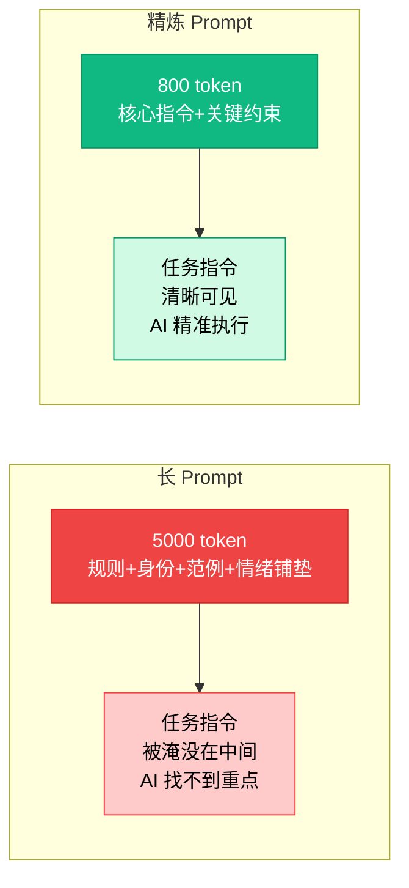
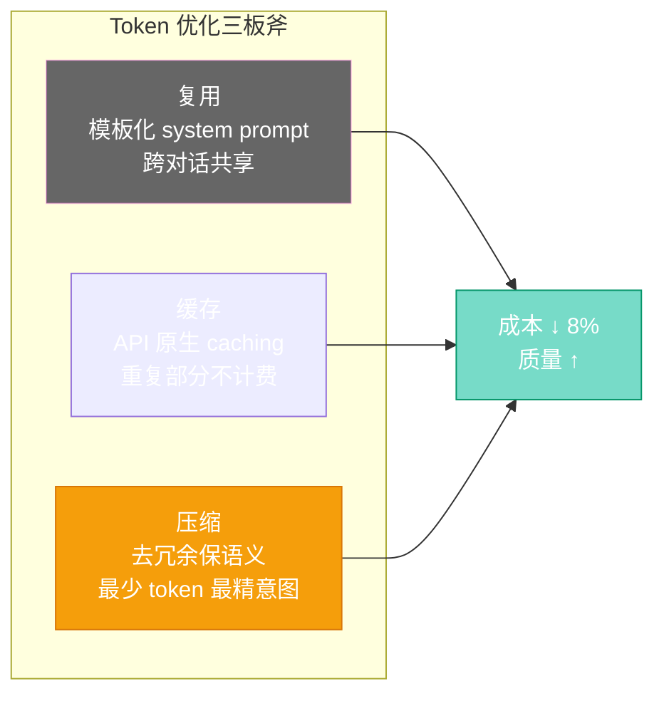

# 第二十章：高手进阶 — Prompt 工程、上下文管理与缓存技巧

[English](../en/ch20.md) | [简体中文](./ch20.md)
## 一、Yason 的困惑

那天晚上，Yason 盯着屏幕上的对话记录，陷入了沉思。

他的 prompt 已经写到了第四版。从最初的 200 字，扩充到了现在的 2000 字。他事无巨细地告诉罗伯特：你是谁、你要做什么、你要用什么语气、你要注意什么、你要避免什么、你要遵循什么规则……

然而，效果却越来越差了。

罗伯特开始忽略指令中的细节。有时候，它明明在 prompt 里写了"用 Markdown 格式输出"，结果还是一段纯文本。有时候，Yason 要求"分三点说明"，罗伯特洋洋洒洒写了八点。

更让人崩溃的是，有一次 Yason 问了一个简单的问题："今天天气怎么样？"

罗伯特先花了 500 token 复述自己的身份设定，又花了 300 token 解释 prompt 中的规则，最后才开始回答天气问题——结果因为 token 不够，回答到一半就断了。

Yason 一拍桌子："你是个 AI，不是个需要心理建设的实习生！"

但冷静下来后，他意识到问题不在罗伯特，在自己。他的 prompt 策略，从根本上就是错的。

## 二、越大越好？不！

Yason 以前有个朴素的想法：prompt 写得越详细，AI 就越清楚该怎么做。

这就像给实习生写操作手册——新来的员工什么都不懂，你当然要把每一步都写清楚，对不对？

**不对。**

大语言模型和人类有一个根本区别：**人类的短期记忆有限，但理解能力稳定；AI 的理解能力随着上下文变长而衰减，但短期记忆却很长。**

什么意思呢？

研究者在论文中揭示了一个现象：当上下文长度超过某个阈值时，模型在"大海捞针"测试中的表现会断崖式下跌。简单说就是，**token 越多，AI 越容易"迷失在中间"。**

想象一下：你在一本书的第 300 页找到了某个关键信息。但当你读到了第 600 页时，你还记得第 300 页的内容吗？

对于人类来说，可能不记得了。对于 AI 来说，同样如此。

Yason 的问题在于：他把所有规则都塞进了 system prompt，导致真正的"任务指令"被淹没在了数千个 token 的废话海洋里。

罗伯特不是不听话。它是在数千个 token 里，找不到重点了。



## 三、上下文窗口管理：什么该放 prompt，什么不该放

搞清楚这个问题后，Yason 重新审视了自己的 prompt 策略。

他把 prompt 内容分成了四类：

### 1️⃣ 必须放 prompt 的

- **核心行为指令**：你的角色是什么，你要做什么。这就像公司的核心使命——简洁、明确、不变。
- **当前任务的关键约束**：这个任务特有的要求。比如"用中文回答"、"输出 JSON 格式"。

### 2️⃣ 应该放知识库的

- **背景知识**：产品功能列表、API 文档、公司历史。这些都是参考资料，不是行为指令。
- **长篇幅的规则和范例**：超过 200 字的示例、复杂的规则列表。

### 3️⃣ 应该靠 function call 或 tool 实现的

- **实时数据**：天气、股价、日历信息。每次都写进 prompt，就像每天给员工发一份今天的气温表——太蠢了。
- **外部查询的结果**：用户问"这个订单的发货状态"，你应该调用接口查，而不是让 AI 猜。

### 4️⃣ 应该直接砍掉的

- **重复强调**：说了"用中文回答"又说"请不要用英语回答"。AI 不需要重复强调。
- **情感铺垫**：像 Yason 曾经写的"你是我最重要的助手，我相信你可以做得很好……"。AI 没有自尊心需要安抚。
- **不必要的身份重复**：每次对话都重新被告知"你是罗伯特，一个 AI 助手"。AI 记得。

Yason 画了一张表格贴在白板上：

| 内容类型 | 存放位置 | 说明 |
|-|-|-|
| 核心行为指令 | System Prompt | 始终有效，简洁有力 |
| 任务特定指令 | User Message | 每次任务时带上 |
| 参考知识 | Knowledge Base / RAG | 只在需要时检索 |
| 实时数据 | Function Call / API | 动态查询，不写死 |
| 情绪价值 | 🗑️ | 直接砍掉 |

## 四、Token 优化三板斧

有了分类框架，Yason 开始动手优化。他总结了三板斧：**复用、缓存、压缩。**

### 第一板斧：复用

Yason 发现，很多 prompt 内容其实是**跨对话共享**的。

比如罗伯特的基本身份设定："你是罗伯特，一个 AI 编程助手。你擅长 Python、JavaScript 和系统架构设计。"

这个设定在每一次对话中都会出现，但它**从来不变**。

Yason 的做法是：把不变的内容做成**system prompt 的模板**，通过 API 直接指定（而不是每次都写在 messages 里）。这样，这些 token 就不计入每次对话的消耗了。

更聪明的做法：对于使用相同 system prompt 的连续对话，**复用上下文**而不是重建。

### 第二板斧：缓存

Prompt caching 是目前被严重低估的技巧。

Yason 发现，主流 API 提供商都提供了 prompt caching 功能。核心思想很简单：如果一段 prompt 在多个请求中重复出现，API 提供商会自动**缓存**这段 prompt，后续请求中相同的部分**不再计入 token 消耗和计算开销**。

效果是什么？

Yason 实测了一组数据：

**优化前：**

```plaintext
Messages: [
  {role: "system", content: "你是罗伯特...（2000 字身份设定）"},
  {role: "user", content: "帮我写一个 Python 函数..."},
]
```

- Token 消耗：5000（每次请求）
- 其中冗余：约 3500 token

**优化后：**

```plaintext
Messages: [
  {role: "system", content: "你是罗伯特。"},
  {role: "user", content: "帮我写一个 Python 函数，要求：..."},
]
```

- Token 消耗：1150（首次请求）
- 后续请求：约 800 token
- 节省：**约 84%**

注意优化后的 prompt 并没有少说信息——只是把不需要每次都传的内容，放到了缓存里。

### 第三板斧：压缩

压缩不是说把"帮助我计算一下这个数据"缩写成"帮我算数据"。这是把人话变成电报，反而会让 AI 迷惑。

真正的压缩，是**去除冗余，保留语义密度**。

来看几个 Yason 的实际优化案例：

**案例 1：角色设定**

❌ 优化前（184 token）：

```plaintext
你是一个经验丰富的Python开发工程师，精通各种编程语言和框架。你在大型互联网公司工作过10年，处理过无数复杂的问题。你有耐心，善于引导用户思考，并且能够给出详细而准确的回答。
```

✅ 优化后（17 token）：

```plaintext
Role: 资深Python工程师
Tone: 专业、简洁、精准
```

**案例 2：任务描述**

❌ 优化前（312 token）：

```plaintext
请帮我分析下面这段代码，看看它有什么问题。如果可能的话，请指出性能方面的问题、安全方面的问题，以及代码风格方面的问题。另外，如果你的分析中有任何建议，请用Markdown格式列出来，最好用列表的形式。
```

✅ 优化后（42 token）：

```plaintext
分析代码：性能、安全、风格问题。用Markdown列表输出。
```

**原则很简单：用最少的 token 表达最精确的意图。**

Yason 发现，压缩 prompt 不仅降低了成本，还**提高了质量**。

因为 AI 不需要在数千个 token 里翻找真正重要的那几百个 token 了。它可以直接聚焦在任务上。



## 五、Yason 的实战测试

理论说完了，Yason 决定做一个实证。

他选了三个日常任务，分别用"松散 prompt"和"压缩 prompt"来对比效果。

### 测试 1：代码审查

**松散版本 (4500 token)**：包含完整的角色设定、五个大段的规则说明、三个示例、多条注意事项。

**压缩版本 (680 token)**：

```plaintext
Review this Python code for:
1. Bugs (逻辑错误)
2. Performance (不必要的循环、重复计算)
3. Style (PEP8)

Output format: 列表，每个问题标优先级 [High/Medium/Low]
```

**结果**：两个版本的审查质量几乎一样。压缩版本反而更少漏检。

### 测试 2：写作助手

**松散版本 (5300 token)**：长篇大论的角色说明、大量范例、多个风格指南、情绪铺垫。

**压缩版本 (750 token)**：

```plaintext
你是科技博主。要求：
- 口语化，避免术语堆砌
- 每段不超过5行
- 用故事开头
- 结尾加一句金句
```

**结果**：压缩版本写的文章更像 Yason 的风格。松散版本写的反而过于模板化。

### 测试 3：数据分析

**松散版本 (4800 token)**：包含了完整的数据分析方法论、多种输出格式要求、大量的"如果……那么……"条件分支。

**压缩版本 (720 token)**：

```plaintext
数据：{data}
任务：找趋势异常点
输出：表格 + 简要说明
特别要求：忽略小于5%的波动
```

**结果**：压缩版本的分析更精准，而且速度快了 40%（因为 token 少了）。

Yason 在日志里写道：

> **5000 token 的任务，800 token 也能完成。区别在于：800 token 的那个，AI 知道什么重要。**

## 六、让 prompt 保持"锋利"

经过这一轮的优化，Yason 总结出了一套 prompt 维护原则：

**1. 每个 prompt 只做一件事**

如果你发现一个 prompt 既要做代码审查、又要做架构设计、还要写文档——那就拆成三个。AI 不是全能选手，它是专注的工匠。每次交代一件事，效果最好。

**2. 用负面清单代替正面清单**

"用中文回答"不如"不要用英文回答"有效。因为 AI 对"不要做什么"的理解，往往比"请做什么"更准确。

**3. 定期审计 prompt**

Yason 养成了一个习惯：每两周检查一次所有活跃的 prompt。问自己三个问题：

- 这段话真的必须存在吗？
- 能不能删掉一半？
- 我的最新发现能不能优化它？

**4. 用版本号管理 prompt**

Yason 给每个 prompt 加了版本号，比如 `robert_coder_v3.md`。每次优化都记录改动和效果。这不是为了给别人看——是为了让未来的自己能知道"为什么这个版本更好"。

## 七、金句收尾

Yason 靠在椅背上，看着屏幕上那个从 5000 token 瘦身到 800 token 的 prompt，嘴角微微上扬。

罗伯特从糊成一团的状态，重新变得锋利无比。

他想起了一个比喻：

**Prompt 就像给 AI 的利剑。不是越重越好，而是越锋利越好。一把 10 斤的重剑不如一把 1 斤的刀锋利，不是因为刀更轻，而是因为刀把力量集中在了刀刃上。**

他的 prompt 现在就是那把刀刃。

---

*本章要点速览：*

- *Prompt 越长 ≠ 效果越好，AI 在长上下文中容易"迷失在中间"*
- *把内容分四类：放 prompt、放知识库、用 function call、直接砍掉*
- *Token 优化三板斧：复用（模板化）、缓存（API 原生支持）、压缩（去冗余）*
- *Yason 实测：5000 token → 800 token，效果反而更好*
- *让 prompt 保持"锋利"：一事一议、负面清单、定期审计、版本管理*
